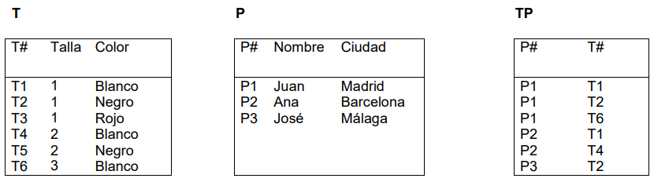
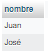
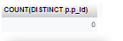
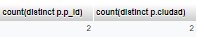
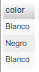
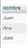
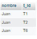
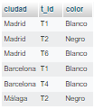
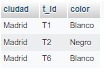

<style>
  /* title */
    h1{
      text-align: center;
      font-weight: bold;
    }

  /* images */
    img{
      border: 1px solid black;
    }
</style>

<!-- title -->
  <h1>CÁLCULO RELACIONAL</h1>

<!-- database creation -->
  <p>Dadas las siguientes tablas:</p>

  

  1. Crea la base de datos.
  2. Crea las tablas correspondientes.
  3. Introduce los datos que se adjuntan en las tablas.

---

<!-- activities -->
  <!-- apt1 -->
  <p><b>1. Nombres de los proveedores que suministran la pieza "T2".</b></p>

  - Con producto cartesiano:

  ```sql
  select nombre from p,t,tp where t.t_id='T2' and t.t_id = tp.t_id and p.p_id = tp.p_id;
  ```

  - Con join:

  ```sql
  select nombre from p join tp on p.p_id=tp.p_id and tp.t_id='T2' join t on tp.t_id=t.t_id;
  ```

  - Resultado:

  


  <!-- apt2 -->
  <p><b>2. Número de los proveedores que suministran al menos una pieza roja.</b></p>

  - Con producto cartesiano:

  ```sql
  
  ```

  - Con join:

  ```sql
  select count(distinct tp.p_id) from p join tp on p.p_id=tp.p_id join t on tp.t_id=t.t_id where t.color='Rojo';
  ```

  - Resultado:

  


  <!-- apt3 -->
  <p><b>3. Nombres de los proveedores que suministran todas las piezas.</b></p>

  - Con producto cartesiano:

  ```sql
  
  ```

  - Con join:

  ```sql
  select nombre from p join tp on p.p_id=tp.p_id where not exists(select 1 from t where not exists(select 1 from tp where t.t_id=tp.t_id and tp.p_id=p.p_id));
  ```

  <p>Esta consulta filtra solo los proveedores que suministran todas las piezas existentes, es decir, aquellos proveedores cuyo ID no aparece en la tabla "t" con una pieza no suministrada.</p>

  - Resultado:

  


  <!-- apt4 -->
  <p><b>4. Número de los proveedores llamados "José" y que vivan en Madrid.</b></p>

  - Con producto cartesiano:

  ```sql

  ```

  - Con join:

  ```sql

  ```

  - Resultado:

  


  <!-- apt5 -->
  <p><b>5. Número de proveedores y ciudades que suministran la pieza "T2".</b></p>

  - Con producto cartesiano:

  ```sql

  ```

  - Con join:

  ```sql

  ```

  - Resultado:

  


  <!-- apt6 -->
  <p><b>6. Colores de las piezas de los partes de la tabla "TP" suministrados por "P1".</b></p>

  - Con producto cartesiano:

  ```sql

  ```

  - Con join:

  ```sql

  ```

  - Resultado:

  


  <!-- apt7 -->
  <p><b>7. Nombre de los proveedores de Málaga o que suministran piezas de color blanco.</b></p>

  - Con producto cartesiano:

  ```sql

  ```

  - Con join:

  ```sql

  ```

  - Resultado:

  


  <!-- apt8 -->
  <p><b>8. Nombres de los proveedores de Madrid junto a los códigos de los productos que suministran.</b></p>

  - Con producto cartesiano:

  ```sql

  ```

  - Con join:

  ```sql

  ```

  - Resultado:

  


  <!-- apt9 -->
  <p><b>9. Ciudades de los proveedores junto a los códigos de los productos que suministran y el correspondiente color.</b></p>

  - Con producto cartesiano:

  ```sql

  ```

  - Con join:

  ```sql

  ```

  - Resultado:

  


  <!-- apt10 -->
  <p><b>10. Igual que el apartado anterior pero para el proveedor "P1".</b></p>

  - Con producto cartesiano:

  ```sql

  ```

  - Con join:

  ```sql

  ```

  - Resultado:

  

---

<!-- anexo -->
  <h2><b>Anexo</b></h2>

  ```sql
  -- phpMyAdmin SQL Dump
  -- version 5.2.0
  -- https://www.phpmyadmin.net/
  --
  -- Host: 127.0.0.1:3306
  -- Generation Time: Jan 11, 2023 at 11:37 PM
  -- Server version: 8.0.31
  -- PHP Version: 8.0.26

  SET SQL_MODE = "NO_AUTO_VALUE_ON_ZERO";
  START TRANSACTION;
  SET time_zone = "+00:00";


  /*!40101 SET @OLD_CHARACTER_SET_CLIENT=@@CHARACTER_SET_CLIENT */;
  /*!40101 SET @OLD_CHARACTER_SET_RESULTS=@@CHARACTER_SET_RESULTS */;
  /*!40101 SET @OLD_COLLATION_CONNECTION=@@COLLATION_CONNECTION */;
  /*!40101 SET NAMES utf8mb4 */;

  --
  -- Database: `ejercicio1`
  --

  -- --------------------------------------------------------

  --
  -- Table structure for table `p`
  --

  DROP TABLE IF EXISTS `p`;
  CREATE TABLE IF NOT EXISTS `p` (
    `p_id` varchar(2) NOT NULL,
    `nombre` varchar(20) NOT NULL,
    `ciudad` varchar(25) NOT NULL,
    PRIMARY KEY (`p_id`)
  ) ENGINE=MyISAM DEFAULT CHARSET=utf8mb4 COLLATE=utf8mb4_0900_ai_ci;

  --
  -- Dumping data for table `p`
  --

  INSERT INTO `p` (`p_id`, `nombre`, `ciudad`) VALUES
  ('P1', 'Juan', 'Madrid'),
  ('P2', 'Ana', 'Barcelona'),
  ('P3', 'José', 'Málaga');

  -- --------------------------------------------------------

  --
  -- Table structure for table `t`
  --

  DROP TABLE IF EXISTS `t`;
  CREATE TABLE IF NOT EXISTS `t` (
    `t_id` varchar(2) NOT NULL,
    `talla` int NOT NULL,
    `color` varchar(10) NOT NULL,
    PRIMARY KEY (`t_id`)
  ) ENGINE=MyISAM DEFAULT CHARSET=utf8mb4 COLLATE=utf8mb4_0900_ai_ci;

  --
  -- Dumping data for table `t`
  --

  INSERT INTO `t` (`t_id`, `talla`, `color`) VALUES
  ('T1', 1, 'Blanco'),
  ('T2', 1, 'Negro'),
  ('T3', 1, 'Rojo'),
  ('T4', 2, 'Blanco'),
  ('T5', 2, 'Negro'),
  ('T6', 3, 'Blanco');

  -- --------------------------------------------------------

  --
  -- Table structure for table `tp`
  --

  DROP TABLE IF EXISTS `tp`;
  CREATE TABLE IF NOT EXISTS `tp` (
    `p_id` varchar(2) NOT NULL,
    `t_id` varchar(2) NOT NULL,
    KEY `p_id` (`p_id`),
    KEY `t_id` (`t_id`)
  ) ENGINE=MyISAM DEFAULT CHARSET=utf8mb4 COLLATE=utf8mb4_0900_ai_ci;

  --
  -- Dumping data for table `tp`
  --

  INSERT INTO `tp` (`p_id`, `t_id`) VALUES
  ('P1', 'T1'),
  ('P1', 'T2'),
  ('P1', 'T6'),
  ('P2', 'T1'),
  ('P2', 'T4'),
  ('P3', 'T2');
  COMMIT;

  /*!40101 SET CHARACTER_SET_CLIENT=@OLD_CHARACTER_SET_CLIENT */;
  /*!40101 SET CHARACTER_SET_RESULTS=@OLD_CHARACTER_SET_RESULTS */;
  /*!40101 SET COLLATION_CONNECTION=@OLD_COLLATION_CONNECTION */;
  ```