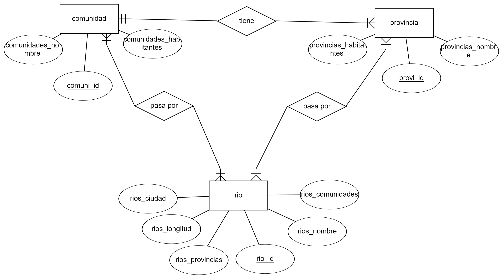

<!-- style -->
  <style>
    /* título */
      h1{
        text-align: center;
        font-weight: bold;
      }

    /* subtítulos */
      h3{
        font-weight: bold;
      }
  </style>

<!---------------------------------------------------->

<!-- title -->
  <h1>RÍOS DE ESPAÑA</h1>

<!-- modelo conceptual -->
  <h3>MODELO CONCEPTUAL</h3>

  

  <hr>

<!------------------------------------------->

<!-- modelo relacional -->
  <h3>MODELO RELACIONAL</h3>


  <hr>

<!------------------------------------------->

<!-- modelo físico -->
  <h3>MODELO FÍSICO</h3>


  <hr>

<!------------------------------------------->

<!-- inserts de ríos -->
  <h3>INSERTS DE RÍOS</h3>


  <hr>

<!------------------------------------------->

<!-- ejercicios -->
  <!-- ej1 -->
  <p><b>1. Muestra el nombre de todos los ríos.</b></p>

  - Con producto cartesiano:

  ```sql

  ```

  - Sin producto cartesiano:

  ```sql

  ```

  - Resultado:

  


  <!-- ej2 -->
  <p><b>2. Muestra las provincias por las que pasa uno de los ríos.</b></p>

  - Con producto cartesiano:

  ```sql

  ```

  - Sin producto cartesiano:

  ```sql

  ```

  - Resultado:

  


  <!-- ej3 -->
  <p><b>3. Muestra las provincias por las que pasa cada uno de los ríos.</b></p>

  - Con producto cartesiano:

  ```sql

  ```

  - Sin producto cartesiano:

  ```sql

  ```

  - Resultado:

  


  <!-- ej4 -->
  <p><b>4. Muestra las regiones por las que pasa un río que al menos pase por 2 comunidades autónomas.</b></p>

  - Con producto cartesiano:

  ```sql

  ```

  - Sin producto cartesiano:

  ```sql

  ```

  - Resultado:

  


  <!-- ej5 -->
  <p><b>5. Muestra las regiones por las que pasa cada río.</b></p>

  - Con producto cartesiano:

  ```sql

  ```

  - Sin producto cartesiano:

  ```sql

  ```

  - Resultado:

  


  <!-- ej6 -->
  <p><b>6. Muestra los ríos que pasan por cada comunidad y provincia agrupados por las provincias.</b></p>

  - Con producto cartesiano:

  ```sql

  ```

  - Sin producto cartesiano:

  ```sql

  ```

  - Resultado:

  


  <!-- ej7 -->
  <p><b>7. Muestra los ríos que pasan por cada comunidad agrupados por comunidad.</b></p>

  - Con producto cartesiano:

  ```sql

  ```

  - Sin producto cartesiano:

  ```sql

  ```

  - Resultado:

  


  <!-- ej8 -->
  <p><b>8. Muestra el nombre del río con mayor longitud.<b></p>

  - Con producto cartesiano:

  ```sql

  ```

  - Sin producto cartesiano:

  ```sql

  ```

  - Resultado:

  


  <!-- ej9 -->
  <p><b>9. Calcula la longitud de todos los ríos ordenados alfabéticamente.</b></p>

  - Con producto cartesiano:

  ```sql

  ```

  - Sin producto cartesiano:

  ```sql

  ```

  - Resultado:

  


  <!-- ej10 -->
  <p><b>10. Calcula la longitud de todos los ríos ordenados de menor a mayor longitud. Muestra el nombre del río y la longitud de cada uno.</b></p>

  - Con producto cartesiano:

  ```sql

  ```

  - Sin producto cartesiano:

  ```sql

  ```

  - Resultado:

  


  <!-- ej11 -->
  <p><b>11. Calcula la longitud de todos los ríos que corresponden a cada provincia. Se deben mostrar de mayor a menor, teniendo en cuenta la suma de los kilómetros que cada río recorre en cada provincia.</b></p>

  - Con producto cartesiano:

  ```sql

  ```

  - Sin producto cartesiano:

  ```sql

  ```

  - Resultado:

  

  <hr>

<!---------------------------------------------------->

<h2><b>Anexo</b></h2>

```sql

```