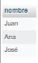

<style>
  /* title */
    h1{
      text-align: center;
      font-weight: bold;
    }


  /* images */
    img{
      border: 1px solid black;
      width: 20%;
    }

    /* tables */
      #tables{
        width: 100%;
        border: none;
      }

    /* apt5 */
      #apt5-img{
        height: 45px;
      }


  /* paragraphs */
    p{
      text-align: justify;
    }
</style>

<!-- title -->
  <h1>CÁLCULO RELACIONAL</h1>

<!-- database creation -->
  <p>Dadas las siguientes tablas:</p>

  

  1. Crea la base de datos.
  2. Crea las tablas correspondientes.
  3. Introduce los datos que se adjuntan en las tablas.

---

<!-- activities -->
  <!-- apt1 -->
  <p><b>1. Nombres de los proveedores que suministran la pieza "T2".</b></p>

  - Con producto cartesiano:

  ```sql
  select nombre from p, t, tp where t.t_id='T2' and t.t_id=tp.t_id and p.p_id=tp.p_id;
  ```

  <p>Esta consulta busca el contenido del campo "<b>nombre</b>" de la tabla "<b>p</b>", estableciendo como condiciones que el "<b>t_id</b>" de la tabla "<b>t</b>" debe ser igual a "<b>T2</b>", además de ser igual que el campo "<b>t_id</b>" en la tabla "<b>tp</b>", y que el campo "<b>p_id</b>" de la tabla "<b>p</b>" tiene que ser igual que el campo con el mismo nombre de la tabla "<b>tp</b>".</p>

  - Sin producto cartesiano:

  ```sql
  select nombre from p join tp on p.p_id=tp.p_id and tp.t_id='T2' join t on tp.t_id=t.t_id;
  ```

  <p>Esta otra realiza <b>la misma acción</b>, pero de una forma más <b>eficiente</b>.</p>
  <p>Para empezar selecciona el campo "nombre" de la tabla "p". Seguidamente, une la tabla "tp" con la tabla anterior ("p") estableciendo como condición en la cláusula "on" que el campo "p_id" debe ser igual en las dos tablas.</p>
  <p>A continuación, con una cláusula "<b>and</b>" incluye una condición más, que establece que el campo "<b>t_id</b>" en la tabla "<b>tp</b>" debe ser igual a "<b>T2</b>, para después unirlo con otro "<b>join</b>" con la tabla "<b>t</b>", con la condición en el "<b>on</b>" de que el campo "<b>t_id</b>" debe ser igual en las dos tablas.</p>

  - Resultado:

  

  <!----------------------------------->

  <!-- apt2 -->
  <p><b>2. Número de los proveedores que suministran al menos una pieza roja.</b></p>

  - Con producto cartesiano:

  ```sql
  select count(distinct tp.p_id) from p, tp, t where p.p_id=tp.p_id and tp.t_id=t.t_id and t.color='Rojo';
  ```

  <p>La cláusula "<b>select count(distinct tp.p_id) from p, tp t</b>" muestra el número de coincidencia <b>únicas</b> (debido al "<b>distinct</b>") en el campo "<b>tp.p_id</b>" de las tablas "<b>p</b>" y "<b>t</b>".</p>
  <p>El "<b>where</b>" especifica que las condiciones que se deben cumplir son:</p>

  1. Que el campo "<b>p_id</b>" sea igual en las tablas "<b>p</b>" y "<b>tp</b>"
  2. Que el campo "<b>t_id</b>" sea igual en las tablas "<b>tp</b>" y "<b>t</b>"
  3. Que el campo "<b>color</b>" sea igual a "<b>Rojo</b>"

- Sin producto cartesiano:

  ```sql
  select count(distinct tp.p_id) from p join tp on p.p_id=tp.p_id join t on tp.t_id=t.t_id where t.color='Rojo';
  ```

  <p>La cláusula "<b>distinct</b>" establece que se seleccione el número de entradas <b>únicas</b> en el campo "<b>tp.p_id</b>".</p>
  <p></p>

  - Resultado:

  

  <!----------------------------------->

  <!-- apt3 -->
  <p><b>3. Nombres de los proveedores que suministran todas las piezas.</b></p>

  - Con producto cartesiano:

  ```sql
  select distinct nombre from p where not exists(select * from t where not exists(select * from tp where t.t_id=tp.t_id and tp.p_id=p.p_id));
  ```

  <p>Esta consulta selecciona, para empezar, los nombres <b>de forma única</b>. A continuación, con la cláusula "<b>where not exists</b>" especifica que solo entrarán las entradas en la tabla "<b>p</b>" donde <b>no existen</b> entradas relacionadas en la tabla "<b>t</b>" que no tengan relación con entradas en la tabla "<b>tp</b>" utilizando el campo "<b>t_id</b>".</p>

  - Sin producto cartesiano:

  ```sql
  select nombre from p join tp on p.p_id=tp.p_id where not exists(select 1 from t where not exists(select 1 from tp where t.t_id=tp.t_id and tp.p_id=p.p_id));
  ```

  <p>Aquí se utiliza la cláusula "<b>join</b>" para relacionar las tablas "<b>p</b>" y "<b>tp</b>" mediante el campo "<b>p_id</b>" y luego se utiliza la cláusula "<b>where not exists</b>" para filtrar los resultados de la tabla "<b>p</b>" en base a una <b>subconsulta</b>.</p>
  <p>Esta subconsulta ("<b>(select 1 from t where not exists(select 1 from tp where t.t_id=tp.t_id and tp.p_id=p.p_id))</b>") selecciona las entradas de la tabla "<b>t</b>" donde <b>no existen</b> entradas relacionadas en la tabla "<b>tp</b>" mediante los campos "<b>t_id</b>" y "<b>p_id</b>", lo que permite seleccionar solo los proveedores que suministran todas las piezas, es decir, aquellos que están relacionados con todas las entradas de la tabla "<b>t</b>" y "<b>tp</b>".</p>

  - Resultado:

  

  <!----------------------------------->

  <!-- apt4 -->
  <p><b>4. Número de los proveedores llamados "José" y que vivan en Madrid.</b></p>

  - Con producto cartesiano:

  ```sql
  select count(distinct p.p_id) from p, tp, t where p.p_id=tp.p_id and tp.t_id=t.t_id and p.nombre='José' and p.ciudad='Madrid';
  ```

  

  <p>Esta consulta muestra los proveedores llamados "José" <b>Y</b> que viven en Madrid. Para mostrar los proveedores llamados "José" <b>O</b> que vivan en Madrid, se utiliza la siguiente:</p>

  ```sql
  select count(distinct p.p_id) from p where(p.nombre='José' or p.ciudad='Madrid');
  ```

  

  - Sin producto cartesiano:

  ```sql
  select count(distinct p.p_id) from p where p.nombre='José' and p.ciudad='Madrid';
  ```

  - Resultado:

  

  <!----------------------------------->

  <!-- apt5 -->
  <p><b>5. Número de proveedores y ciudades que suministran la pieza "T2".</b></p>

  - Con producto cartesiano:

  ```sql
  select count(distinct p.p_id) , count(distinct p.ciudad) from p, tp, t where t.t_id='T2' and t.t_id=tp.t_id and p.p_id=tp.p_id;
  ```

  <p>Primero se cuentan las <b>entradas únicas</b> del campo "<b>p.p_id</b>" y del campo "<b>p.ciudad</b>".</p>
  <p>Después, se establecen la tablas de donde se saca la información y las condiciones para que el "<b>t_id</b>" sea "<b>T2</b>" y se establecen las relaciones mediante los campos "<b>t_id</b>" y "<b>p_id</b>".</p>

  - Sin producto cartesiano:

  ```sql
  select count(distinct p.p_id) , count(distinct p.ciudad) from p join tp on p.p_id=tp.p_id join t on tp.t_id=t.t_id where t.t_id='t2';
  ```

  <p>Este código realiza una consulta para contar el número de <b>elementos únicos</b> en <b>dos campos específicos</b> de las tablas relacionadas "<b>p</b>", "<b>t</b>" y "<b>tp</b>".</p>
  <p>Utiliza "<b>join</b>" para relacionar las tablas "<b>p</b>" con "<b>tp</b>" mediante el campo "<b>p_id</b>", y "<b>tp</b>" con "<b>t</b>" mediante el campo "<b>t_id</b>" y luego se utiliza una cláusula "<b>where</b>" para filtrar los resultados con el campo "<b>t_id='t2'</b>". La consulta selecciona el número de elementos únicos en los campos "<b>p.p_id</b>" y "<b>p.ciudad</b>" y los contabiliza.</p>

  - Resultado:

  

  <!----------------------------------->

  <!-- apt6 -->
  <p><b>6. Colores de las piezas de los partes de la tabla "TP" suministrados por "P1".</b></p>

  - Con producto cartesiano:

  ```sql
  select t.color from t,tp,p where p.p_id='p1' and t.t_id=tp.t_id and p.p_id=tp.p_id;
  ```

  <p>En esta otra consulta, primero se selecciona el campo "<b>color</b>" de la tabla "<b>t</b>".</p>
  <p>Después de esto, se utiliza la cláusula "<b>from</b>" para establecer las tablas de la consulta, además de la cláusula "<b>where</b>" para especificar las condiciones de que el <b>ID del proveedor</b> sea igual a "<b>P1</b>" y que los campos "<b>t_id</b>" y "<b>p_id</b>" sean iguales en sus respectivas tablas.</p>

  - Sin producto cartesiano:

  ```sql
  select t.color from t join tp on t.t_id=tp.t_id join p on tp.p_id=p.p_id where p.p_id='p1';
  ```

  <p>Este otro código realiza una consulta en varias tablas relacionadas para obtener una <b>lista de colores</b> de una tabla específica "<b>t</b>" en base a una condición específica en otra tabla "<b>p</b>". Utiliza "<b>joins</b>" para relacionar las tablas "<b>t</b>" y "<b>tp</b>" mediante el campo "<b>t_id</b>", las tablas "<b>tp</b>" y "<b>p</b>" mediante el campo "<b>  p_id</b>".</p>
  <p>Para terminar, aplica una cláusula "<b>where</b>" para filtrar los resultados con el campo "<b>p.p_id='p1'</b>".</p>

  - Resultado:

  

  <!----------------------------------->

  <!-- apt7 -->
  <p><b>7. Nombre de los proveedores de Málaga o que suministran piezas de color blanco.</b></p>

  - Con producto cartesiano:

  ```sql
  select distinct p.nombre from p,tp,t where(p.ciudad='Málaga' or t.color='Blanco') and t.t_id=tp.t_id and p.p_id=tp.p_id;
  ```

  - Sin producto cartesiano:

  ```sql
  select distinct p.nombre from p join tp on p.p_id=tp.p_id join t on tp.t_id=t.t_id where p.ciudad='Málaga' or t.color='Blanco';
  ```

  - Resultado:

  

  <!----------------------------------->

  <!-- apt8 -->
  <p><b>8. Nombres de los proveedores de Madrid junto a los códigos de los productos que suministran.</b></p>

  - Con producto cartesiano:

  ```sql
  select p.nombre, t.t_id from p,tp,t where p.ciudad='Madrid' and t.t_id=tp.t_id and p.p_id=tp.p_id;
  ```

  - Sin producto cartesiano:

  ```sql
  select p.nombre, t.t_id from p join tp on p.p_id=tp.p_id join t on tp.t_id=t.t_id where p.ciudad='Madrid';
  ```

  - Resultado:

  

  <!----------------------------------->

  <!-- apt9 -->
  <p><b>9. Ciudades de los proveedores junto a los códigos de los productos que suministran y el correspondiente color.</b></p>

  - Con producto cartesiano:

  ```sql
  select p.ciudad, t.t_id, t.color from p,tp,t where t.t_id=tp.t_id and p.p_id=tp.p_id;
  ```

  - Sin producto cartesiano:

  ```sql
  select p.ciudad, t.t_id, t.color from p join tp on p.p_id=tp.p_id join t on tp.t_id=t.t_id;
  ```

  - Resultado:

  

  <!----------------------------------->

  <!-- apt10 -->
  <p><b>10. Igual que el apartado anterior pero para el proveedor "P1".</b></p>

  - Con producto cartesiano:

  ```sql
  select p.ciudad, t.t_id, t.color from p,tp,t where p.p_id='P1' and t.t_id=tp.t_id and p.p_id=tp.p_id;
  ```

  - Sin producto cartesiano:

  ```sql
  select p.ciudad, t.t_id, t.color from p join tp on p.p_id=tp.p_id join t on tp.t_id=t.t_id where p.p_id='P1';
  ```

  - Resultado:

  

---

<!-- anexo -->
  <h2><b>Anexo</b></h2>

  ```sql
  -- phpMyAdmin SQL Dump
  -- version 5.2.0
  -- https://www.phpmyadmin.net/
  --
  -- Host: 127.0.0.1:3306
  -- Generation Time: Jan 11, 2023 at 11:37 PM
  -- Server version: 8.0.31
  -- PHP Version: 8.0.26

  SET SQL_MODE = "NO_AUTO_VALUE_ON_ZERO";
  START TRANSACTION;
  SET time_zone = "+00:00";


  /*!40101 SET @OLD_CHARACTER_SET_CLIENT=@@CHARACTER_SET_CLIENT */;
  /*!40101 SET @OLD_CHARACTER_SET_RESULTS=@@CHARACTER_SET_RESULTS */;
  /*!40101 SET @OLD_COLLATION_CONNECTION=@@COLLATION_CONNECTION */;
  /*!40101 SET NAMES utf8mb4 */;

  --
  -- Database: `ejercicio1`
  --

  -- --------------------------------------------------------

  --
  -- Table structure for table `p`
  --

  DROP TABLE IF EXISTS `p`;
  CREATE TABLE IF NOT EXISTS `p` (
    `p_id` varchar(2) NOT NULL,
    `nombre` varchar(20) NOT NULL,
    `ciudad` varchar(25) NOT NULL,
    PRIMARY KEY (`p_id`)
  ) ENGINE=MyISAM DEFAULT CHARSET=utf8mb4 COLLATE=utf8mb4_0900_ai_ci;

  --
  -- Dumping data for table `p`
  --

  INSERT INTO `p` (`p_id`, `nombre`, `ciudad`) VALUES
  ('P1', 'Juan', 'Madrid'),
  ('P2', 'Ana', 'Barcelona'),
  ('P3', 'José', 'Málaga');

  -- --------------------------------------------------------

  --
  -- Table structure for table `t`
  --

  DROP TABLE IF EXISTS `t`;
  CREATE TABLE IF NOT EXISTS `t` (
    `t_id` varchar(2) NOT NULL,
    `talla` int NOT NULL,
    `color` varchar(10) NOT NULL,
    PRIMARY KEY (`t_id`)
  ) ENGINE=MyISAM DEFAULT CHARSET=utf8mb4 COLLATE=utf8mb4_0900_ai_ci;

  --
  -- Dumping data for table `t`
  --

  INSERT INTO `t` (`t_id`, `talla`, `color`) VALUES
  ('T1', 1, 'Blanco'),
  ('T2', 1, 'Negro'),
  ('T3', 1, 'Rojo'),
  ('T4', 2, 'Blanco'),
  ('T5', 2, 'Negro'),
  ('T6', 3, 'Blanco');

  -- --------------------------------------------------------

  --
  -- Table structure for table `tp`
  --

  DROP TABLE IF EXISTS `tp`;
  CREATE TABLE IF NOT EXISTS `tp` (
    `p_id` varchar(2) NOT NULL,
    `t_id` varchar(2) NOT NULL,
    KEY `p_id` (`p_id`),
    KEY `t_id` (`t_id`)
  ) ENGINE=MyISAM DEFAULT CHARSET=utf8mb4 COLLATE=utf8mb4_0900_ai_ci;

  --
  -- Dumping data for table `tp`
  --

  INSERT INTO `tp` (`p_id`, `t_id`) VALUES
  ('P1', 'T1'),
  ('P1', 'T2'),
  ('P1', 'T6'),
  ('P2', 'T1'),
  ('P2', 'T4'),
  ('P3', 'T2');
  COMMIT;

  /*!40101 SET CHARACTER_SET_CLIENT=@OLD_CHARACTER_SET_CLIENT */;
  /*!40101 SET CHARACTER_SET_RESULTS=@OLD_CHARACTER_SET_RESULTS */;
  /*!40101 SET COLLATION_CONNECTION=@OLD_COLLATION_CONNECTION */;
  ```