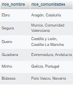

<!-- style -->
  <style>
    /* título */
      h1{
        text-align: center;
        font-weight: bold;
      }

    /* subtítulos */
      h3{
        font-weight: bold;
      }

      /* imágenes */
        img{
          border: 1px solid black;
          width: 20%;
        }

        /* excepciones */
          .ex{
            border: none;
          }
  </style>

<!---------------------------------------------------->

<!-- title -->
  <h1>RÍOS DE ESPAÑA</h1>

<!-- modelo conceptual -->
  <h3>MODELO CONCEPTUAL</h3>

  

  <hr>

<!------------------------------------------->

<!-- modelo relacional -->
  <h3>MODELO RELACIONAL</h3>

  

  <hr>

<!------------------------------------------->

<!-- modelo físico -->
  <h3>MODELO FÍSICO</h3>

  ```sql
  create database tema4_ej1;

  use tema4_ej1;

  create table comunidades(
      comuni_id int primary key auto_increment,
      comunidades_nombre varchar(255) not null,
      comunidades_habitantes int not null
  );

  create table provincias(
      provi_id int primary key auto_increment,
      provincias_nombre varchar(255) not null,
      provincias_habitantes int not null,
      comuni_id int not null,
      foreign key(comuni_id) references comunidades(comuni_id)
  );

  create table rios(
      rio_id int primary key auto_increment,
      rios_nombre varchar(255) not null,
      rios_longitud int not null,
      rios_ciudad varchar(255) not null,
      rios_provincias varchar(255) not null,
      rios_comunidades varchar(255) not null,
      rios_km_comunidad int not null,
      comuni_id int not null,
      foreign key(comuni_id) references comunidades(comuni_id)
  );
  ```

  <hr>

<!------------------------------------------->

<!-- inserts de ríos -->
  <h3>INSERTS DE RÍOS</h3>

  ```sql
  insert into comunidades(comuni_id, comunidades_nombre, comunidades_habitantes) values 
    (1, "Andalucía", 8382999),
    (2, "Cataluña", 7555044),
    (3, "Galicia", 2719600),
    (4, "País Vasco", 2179000),
    (5, "Castilla y León", 2475000);

  insert into provincias(provi_id, provincias_nombre, provincias_habitantes, comuni_id) values 
      (1, "Málaga", 1743000, 1),
      (2, "Barcelona", 5460000, 2),
      (3, "A Coruña", 1039000, 3),
      (4, "Vitoria-Gasteiz", 233000, 4),
      (5, "Valladolid", 2341000, 5);

  insert into rios(rios_nombre, rios_longitud, rios_ciudad, rios_provincias, rios_comunidades, rios_km_comunidad, comuni_id) values
      ("Ebro", 910, "Zaragoza", "Zaragoza, Tarragona, Teruel", "Aragón, Cataluña", 200, 2),
      ("Segura", 480, "Murcia", "Murcia, Albacete, Alicante", "Murcia, Comunidad Valenciana", 150, 1),
      ("Duero", 897, "Soria", "Soria, Burgos, Valladolid, Zamora", "Castilla y León, Castilla-La Mancha", 250, 3),
      ("Guadiana", 1000, "Badajoz", "Badajoz, Cáceres", "Extremadura, Andalucía", 300, 4),
      ("Minho", 330, "Vigo", "Pontevedra, Ourense", "Galicia, Portugal", 100, 5),
      ("Bidasoa", 120, "Irun", "Guipúzcoa, Navarra", "País Vasco, Navarra", 50, 6);
  ```

  <hr>

<!------------------------------------------->

<!-- ejercicios -->
  <!-- ej1 -->
  <p><b>1. Muestra el nombre de todos los ríos.</b></p>

  ```sql
  select rios_nombre from rios;
  ```

  - Resultado:

  


  <!-- ej2 -->
  <p><b>2. Muestra las provincias por las que pasa uno de los ríos.</b></p>

  ```sql
  select rios_provincias from rios where rios_nombre = 'Ebro';
  ```

  - Resultado:

  


  <!-- ej3 -->
  <p><b>3. Muestra las provincias por las que pasa cada uno de los ríos.</b></p>

  ```sql
  select rios_nombre, rios_provincias from rios;
  ```

  - Resultado:

  


  <!-- ej4 -->
  <p><b>4. Muestra las regiones por las que pasa un río que al menos pase por 2 comunidades autónomas.</b></p>

  ```sql

  ```

  - Resultado:

  


  <!-- ej5 -->
  <p><b>5. Muestra las regiones por las que pasa cada río.</b></p>

  ```sql
  select rios_nombre, rios_comunidades from rios;
  ```

  - Resultado:

  


  <!-- ej6 -->
  <p><b>6. Muestra los ríos que pasan por cada comunidad y provincia agrupados por las provincias.</b></p>

  ```sql
  select rios_provincias, group_concat(rios_nombre) from rios group by rios_provincias;
  ```

  - Resultado:

  


  <!-- ej7 -->
  <p><b>7. Muestra los ríos que pasan por cada comunidad agrupados por comunidad.</b></p>

  ```sql
  select rios_comunidades,group_concat(rios_nombre) from rios group by rios_comunidades;
  ```

  - Resultado:

  


  <!-- ej8 -->
  <p><b>8. Muestra el nombre del río con mayor longitud.<b></p>

  ```sql
  select rios_nombre, max(rios_longitud) from rios
  ```

  - Resultado:

  


  <!-- ej9 -->
  <p><b>9. Calcula la longitud de todos los ríos ordenados alfabéticamente.</b></p>

  ```sql

  ```

  - Resultado:

  


  <!-- ej10 -->
  <p><b>10. Calcula la longitud de todos los ríos ordenados de menor a mayor longitud. Muestra el nombre del río y la longitud de cada uno.</b></p>

  ```sql

  ```

  - Resultado:

  


  <!-- ej11 -->
  <p><b>11. Calcula la longitud de todos los ríos que corresponden a cada provincia. Se deben mostrar de mayor a menor, teniendo en cuenta la suma de los kilómetros que cada río recorre en cada provincia.</b></p>

  ```sql

  ```

  - Resultado:

  

  <hr>

<!---------------------------------------------------->

<h2><b>Anexo</b></h2>

```sql
-- phpMyAdmin SQL Dump
-- version 5.2.0
-- https://www.phpmyadmin.net/
--
-- Host: 127.0.0.1:3306
-- Generation Time: Jan 15, 2023 at 10:43 PM
-- Server version: 8.0.31
-- PHP Version: 8.0.26

SET SQL_MODE = "NO_AUTO_VALUE_ON_ZERO";
START TRANSACTION;
SET time_zone = "+00:00";


/*!40101 SET @OLD_CHARACTER_SET_CLIENT=@@CHARACTER_SET_CLIENT */;
/*!40101 SET @OLD_CHARACTER_SET_RESULTS=@@CHARACTER_SET_RESULTS */;
/*!40101 SET @OLD_COLLATION_CONNECTION=@@COLLATION_CONNECTION */;
/*!40101 SET NAMES utf8mb4 */;

--
-- Database: `tema4_ej1`
--

-- --------------------------------------------------------

--
-- Table structure for table `comunidades`
--

DROP TABLE IF EXISTS `comunidades`;
CREATE TABLE IF NOT EXISTS `comunidades` (
  `comuni_id` int NOT NULL AUTO_INCREMENT,
  `comunidades_nombre` varchar(255) NOT NULL,
  `comunidades_habitantes` int NOT NULL,
  PRIMARY KEY (`comuni_id`)
) ENGINE=MyISAM AUTO_INCREMENT=6 DEFAULT CHARSET=utf8mb4 COLLATE=utf8mb4_0900_ai_ci;

--
-- Dumping data for table `comunidades`
--

INSERT INTO `comunidades` (`comuni_id`, `comunidades_nombre`, `comunidades_habitantes`) VALUES
(1, 'Andalucía', 8382999),
(2, 'Cataluña', 7555044),
(3, 'Galicia', 2719600),
(4, 'País Vasco', 2179000),
(5, 'Castilla y León', 2475000);

-- --------------------------------------------------------

--
-- Table structure for table `provincias`
--

DROP TABLE IF EXISTS `provincias`;
CREATE TABLE IF NOT EXISTS `provincias` (
  `provi_id` int NOT NULL AUTO_INCREMENT,
  `provincias_nombre` varchar(255) NOT NULL,
  `provincias_habitantes` int NOT NULL,
  `comuni_id` int NOT NULL,
  PRIMARY KEY (`provi_id`),
  KEY `comuni_id` (`comuni_id`)
) ENGINE=MyISAM AUTO_INCREMENT=6 DEFAULT CHARSET=utf8mb4 COLLATE=utf8mb4_0900_ai_ci;

--
-- Dumping data for table `provincias`
--

INSERT INTO `provincias` (`provi_id`, `provincias_nombre`, `provincias_habitantes`, `comuni_id`) VALUES
(1, 'Málaga', 1743000, 1),
(2, 'Barcelona', 5460000, 2),
(3, 'A Coruña', 1039000, 3),
(4, 'Vitoria-Gasteiz', 233000, 4),
(5, 'Valladolid', 2341000, 5);

-- --------------------------------------------------------

--
-- Table structure for table `rios`
--

DROP TABLE IF EXISTS `rios`;
CREATE TABLE IF NOT EXISTS `rios` (
  `rio_id` int NOT NULL AUTO_INCREMENT,
  `rios_nombre` varchar(255) NOT NULL,
  `rios_longitud` int NOT NULL,
  `rios_ciudad` varchar(255) NOT NULL,
  `rios_provincias` varchar(255) NOT NULL,
  `rios_comunidades` varchar(255) NOT NULL,
  `rios_km_comunidad` int NOT NULL,
  `comuni_id` int NOT NULL,
  PRIMARY KEY (`rio_id`),
  KEY `comuni_id` (`comuni_id`)
) ENGINE=MyISAM AUTO_INCREMENT=7 DEFAULT CHARSET=utf8mb4 COLLATE=utf8mb4_0900_ai_ci;

--
-- Dumping data for table `rios`
--

INSERT INTO `rios` (`rio_id`, `rios_nombre`, `rios_longitud`, `rios_ciudad`, `rios_provincias`, `rios_comunidades`, `rios_km_comunidad`, `comuni_id`) VALUES
(1, 'Ebro', 910, 'Zaragoza', 'Zaragoza, Tarragona, Teruel', 'Aragón, Cataluña', 200, 2),
(2, 'Segura', 480, 'Murcia', 'Murcia, Albacete, Alicante', 'Murcia, Comunidad \r\nValenciana', 150, 1),
(3, 'Duero', 897, 'Soria', 'Soria, Burgos, Valladolid, Zamora', 'Castilla y León, \r\nCastilla-La Mancha', 250, 3),
(4, 'Guadiana', 1000, 'Badajoz', 'Badajoz, Cáceres', 'Extremadura, Andalucía', 300, 4),
(5, 'Minho', 330, 'Vigo', 'Pontevedra, Ourense', 'Galicia, Portugal', 100, 5),
(6, 'Bidasoa', 120, 'Irun', 'Guipúzcoa, Navarra', 'País Vasco, Navarra', 50, 6);
COMMIT;

/*!40101 SET CHARACTER_SET_CLIENT=@OLD_CHARACTER_SET_CLIENT */;
/*!40101 SET CHARACTER_SET_RESULTS=@OLD_CHARACTER_SET_RESULTS */;
/*!40101 SET COLLATION_CONNECTION=@OLD_COLLATION_CONNECTION */;

```