<style>
  h1{
    text-align: center;
    font-weight: bold;
    border: none;
    margin-bottom: 0px;
  }

  p{
    text-align: justify;
  }

  img{
    border: 2px solid black;
  }
</style>

<h1>PUEBLOS DE ESPAÑA V.5</h1>

<hr>

<p>Una vez importada la nueva tabla...</p>

<p><b>1. ¿Cuántos centros educativos tiene Andalucía?</b></p>

```sql
select count(*) as "nº de centros educativos" from da_centros;
```

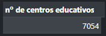

<p><b>2. ¿Cuántos centros tiene cada una de las provincias?</b></p>

```sql
select `col 10` as "provincia", count(*) as "cantidad de centros" from da_centros group by 1;
```

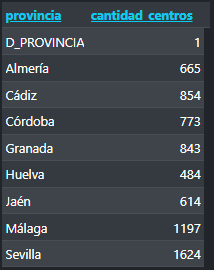

<p><b>3. ¿Cuántos centros hay de "Educación Infantil y Primaria"?</b></p>

```sql
select count(*) as "centros de educación infantil y primaria" from da_centros where `col 3`='colegio de educación infantil y primaria';
```

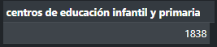

<p><b>4. ¿Cuántos centros rurales existen?</b></p>

```sql
select count(*) as "nº de centros rurales" from da_centros where `col 3` like "colegio público rural";
```

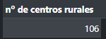

<p><b>5. ¿Cuántos centros instituto de secundaria existen?</b></p>

```sql
select count(*) as "nº de institutos de secundaria" from da_centros where `col 3` like "instituto de educación secundaria";
```

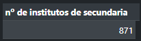

<p><b>6. ¿Cuántos colegios de infantil y primaria existen?</b></p>

```sql
select count(*) as "nº de colegios de infantil y primaria" from da_centros where `col 3` like "colegio de educación infantil y primaria";
```

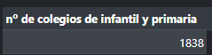

<p><b>7. ¿Cuántas escuelas elementales de música existen?</b></p>

```sql
select count(*) as "nº de escuelas elementales de música" from da_centros where `col 3` like "conservatorio elemental de música";
```


<p><b>8. ¿Cuántos centros autorizados de enseñanzas deportivas existen?</b></p>

```sql
select count(*) as "nº de centros autorizados de enseñanzas deportivas" from da_centros where `col 3` like "centro autorizado de enseñanzas deportivas";
```


<p><b>9. ¿Cuántas secciones de educación permanente existen?</b></p>

```sql
select count(*) as "nº de secciones de educación" from da_centros where `col 3` like "sección de educación permanente";
```

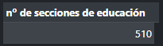

<p><b>10. ¿Cuántas EOI existen?</b></p>

```sql
select count(*) as "nº de eoi" from da_centros where `col 3` like "escuela oficial de idiomas";
```

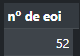

<p><b>11. ¿Cuántas escuelas de arte existen?</b></p>

```sql
select count(*) as "nº de escuelas de arte" from da_centros where `col 3` like "escuela de arte";
```


<p><b>12. ¿Cuántas escuelas de conservatorio superior de música existen?</b></p>

```sql
select count(*) as "nº de conservatorios superiores de música" from da_centros where `col 3` like "conservatorio superior de música";
```


<p><b>13. Saca un listado con los diferentes tipos de escuelas, y cuántas hay en Andalucía.</b></p>

```sql
select `col 3` from da_centros group by 1;
```

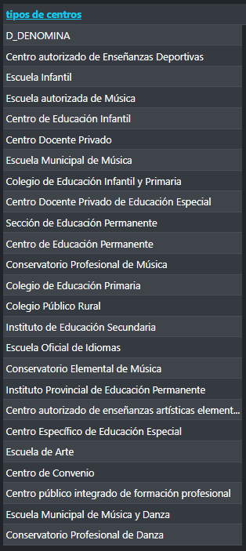

<p><b>14. Modifica los nombres de los campos para que coincidan con los del 1<sup>er</sup> registro.</b></p>

<p><b>*Solo los 15 primeros.</b></p>

```sql
alter table da_centros change column `col 1` `curso` varchar(5) not null;
```

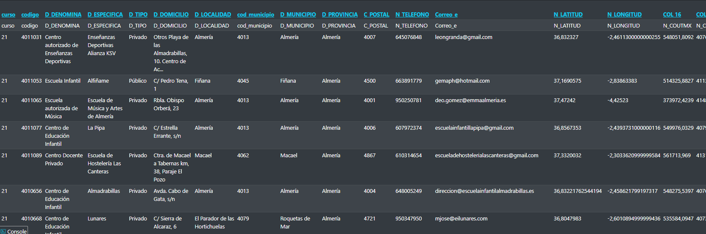

<p><b>15. ¿Cuántos centros educativos hay en la localidad de Málaga?</b></p>

```sql
select count(*) from da_centros where d_localidad like "málaga";
```

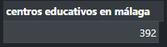

<p><b>16. Haz un listado del número de cada centro organizado por tipo en Málaga.</b></p>

```sql

```

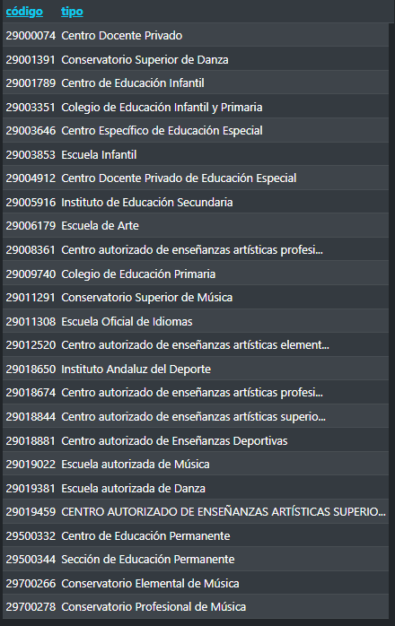