<style>
  h1{
    text-align: center;
    font-weight: bold;
    border: none;
    margin-bottom: 0px;
  }

  p{
    text-align: justify;
  }

  img{
    border: 2px solid black;
  }
</style>

<h1>PUEBLOS DE ESPAÑA V.5</h1>

<hr>

<p>Una vez importada la nueva tabla...</p>

<p><b>1. ¿Cuántos centros educativos tiene Andalucía?</b></p>

```sql
select count(*) as "nº de centros educativos" from da_centros;
```


<p><b>2. ¿Cuántos centros tiene cada una de las provincias?</b></p>

```sql
select `col 10` as "provincia", count(*) as "cantidad de centros" from da_centros group by 1;
```


<p><b>3. ¿Cuántos centros hay de "Educación Infantil y Primaria"?</b></p>

```sql
select count(*) as "centros de educación infantil y primaria" from da_centros where `col 3`='colegio de educación infantil y primaria';
```


<p><b>4. ¿Cuántos centros rurales existen?</b></p>

```sql
select count(*) as "nº de centros rurales" from da_centros where `col 3` like "colegio público rural";
```


<p><b>5. ¿Cuántos centros instituto de secundaria existen?</b></p>

```sql
select count(*) as "nº de institutos de secundaria" from da_centros where `col 3` like "instituto de educación secundaria";
```


<p><b>6. ¿Cuántos colegios de infantil y primaria existen?</b></p>

```sql
select count(*) as "nº de colegios de infantil y primaria" from da_centros where `col 3` like "colegio de educación infantil y primaria";
```


<p><b>7. ¿Cuántas escuelas elementales de música existen?</b></p>

```sql
select count(*) as "nº de escuelas elementales de música" from da_centros where `col 3` like "conservatorio elemental de música";
```

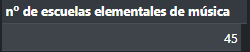

<p><b>8. ¿Cuántos centros autorizados de enseñanzas deportivas existen?</b></p>

```sql
select count(*) as "nº de centros autorizados de enseñanzas deportivas" from da_centros where `col 3` like "centro autorizado de enseñanzas deportivas";
```


<p><b>9. ¿Cuántas secciones de educación permanente existen?</b></p>

```sql
select count(*) as "nº de secciones de educación" from da_centros where `col 3` like "sección de educación permanente";
```


<p><b>10. ¿Cuántas EOI existen?</b></p>

```sql
select count(*) as "nº de eoi" from da_centros where `col 3` like "escuela oficial de idiomas";
```


<p><b>11. ¿Cuántas escuelas de arte existen?</b></p>

```sql
select count(*) as "nº de escuelas de arte" from da_centros where `col 3` like "escuela de arte";
```


<p><b>12. ¿Cuántas escuelas de conservatorio superior de música existen?</b></p>

```sql
select count(*) as "nº de conservatorios superiores de música" from da_centros where `col 3` like "conservatorio superior de música";
```


<p><b>13. Saca un listado con los diferentes tipos de escuelas, y cuántas hay en Andalucía.</b></p>

```sql
select `col 3` from da_centros group by 1;
```


<p><b>14. Modifica los nombres de los campos para que coincidan con los del 1<sup>er</sup> registro.</b></p>

<p><b>*Solo los 15 primeros.</b></p>

```sql
alter table da_centros change column `col 1` `curso` varchar(5) not null;
```


<p><b>15. ¿Cuántos centros educativos hay en la localidad de Málaga?</b></p>

```sql
select count(*) as "centros educativos en málaga" from da_centros where d_localidad like "málaga";
```


<p><b>16. Haz un listado del número de cada centro organizado por tipo en Málaga.</b></p>

```sql
select codigo as "código", d_denomina as "tipo" from da_centros where d_provincia like "málaga" group by d_denomina;
```

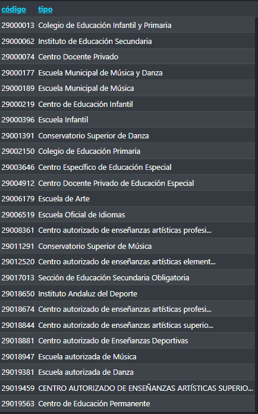

<p><b>17. Saca el listado de IES de Málaga.</b></p>

```sql
select d_especifica as "nombre", d_denomina as "tipo" from da_centros where d_provincia like "málaga" and d_denomina like "instituto de educación secundaria";
```

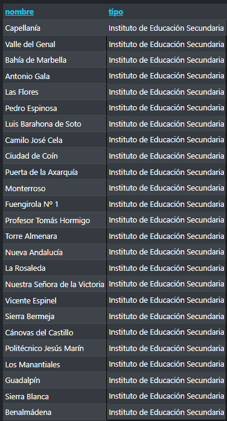

<p><b>18. Ordena por número de IES, de mayor número a menor, en cada una de las capitales de Andalucía.</b></p>

```sql
-- si el ejercicio se refiere al código de centro
  select codigo as "código", d_provincia as "capital" from da_centros order by 1 desc;

-- si el ejercicio se refiere al número de teléfono de centro
  select n_telefono as "nº de teléfono", d_provincia as "capital" from da_centros order by 1 desc;
```

<p>Primera:</p>

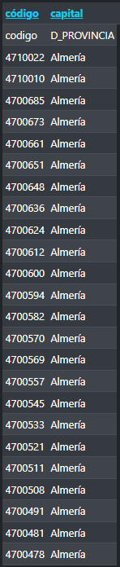

<p>Segunda:</p>

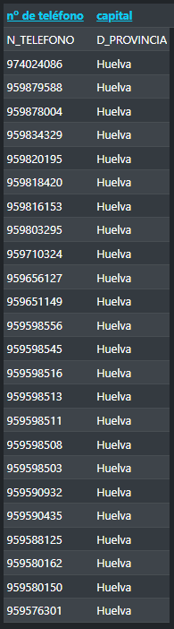

<p><b>19. Ordena por número de IES, de mayor a menor, agrupados por provincias.</b></p>

```sql
select d_especifica as "nombre", codigo as "código" from da_centros order by 2 desc;
```

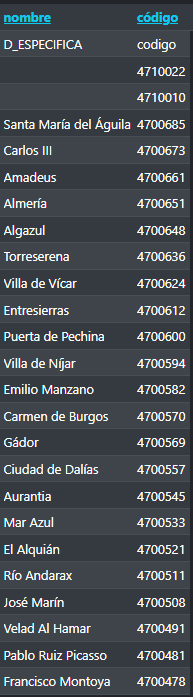

<p><b>20. ¿Qué diferencia de escuelas infantiles y primarias hay entre las provincias de Jaén y Sevilla?</b></p>

<p>Jaén:</p>

```sql
select count(*) as "nº en jaén" from da_centros where d_localidad like "jaén" and d_denomina like "colegio de educación infantil y primaria";
```

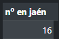

<p>Sevilla:</p>

```sql
select count(*) as "nº en sevilla" from da_centros where d_localidad like "sevilla" and d_denomina like "colegio de educación infantil y primaria";
```


<p><b>21. ¿Cuántos centros públicos de educación primaria tiene cada uno de los minucipios de la provincia de Málaga?</b></p>

```sql
select count(*) as "nº de centros de primaria en málaga", d_municipio as "municipio" from da_centros where d_provincia like "málaga" group by d_municipio;
```

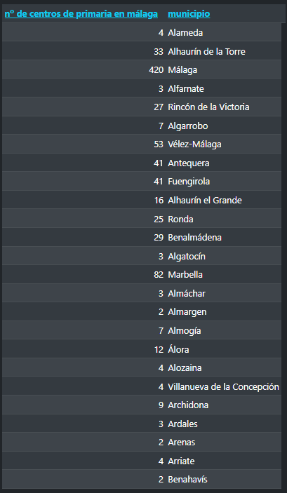

<p><b>22. Lista de menor a mayor el número de IES de los municipios de la provincia de Málaga.</b></p>

```sql
select codigo as "código", d_especifica as "centro" from da_centros where d_provincia like "málaga" order by 1 asc;
```

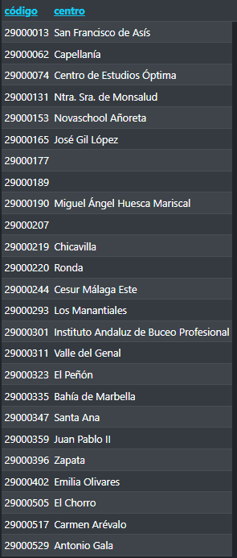

<p><b>23. Lista el nombre y ubicación de las escuelas de MEDAC.</b></p>

```sql
-- este está mal, no se que es medac
  select d_especifica as "nombre", d_provincia as "provincia" from da_centros where d_denomina like "centro público integrado de formación profesional";
```

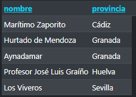

<p><b>24. Lista los 5 municipios con mayor número de escuelas de infantil de Andalucía.</b></p>

```sql
select d_municipio as "municipio", count(*) as "nº de escuelas de infantil" from da_centros where d_denomina like "centro de educación infantil" group by 1 limit 5;
```

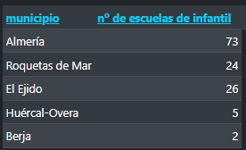

<p><b>25. Lista los centros cuyo domicilio contenga la palabra "estrella".</b></p>

```sql
select d_especifica as "centro", d_domicilio as "domicilio" from da_centros where d_domicilio like "%estrella%";
```

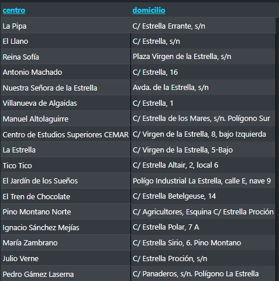

<p><b>26. Lista los centros de infantil y primaria que haya en tu localidad de nacimiento.</b></p>

```sql
select d_especifica as "centro" from da_centros where d_localidad like "málaga" and d_denomina like "colegio de educación infantil y primaria";
```

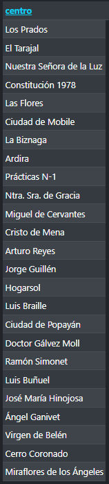

<p><b>27. Lista los centros que contengan en su nombre la palabra "chocolate".</b></p>

```sql
select d_especifica as "centro" from da_centros where d_especifica like "%chocolate%";
```

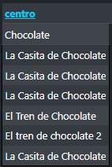

<p><b>28. Lista los centros que contengan en su nombre la palabra "carmen", ordenados ascendentemente por el nombre, ascendentemente por la provincia y descendentemente por la localidad,</b></p>

```sql
select d_especifica as "centro", d_provincia as "provincia", d_localidad as "localidad" from da_centros where d_especifica like "%carmen%" order by 1 asc, d_provincia asc, d_localidad desc;
```

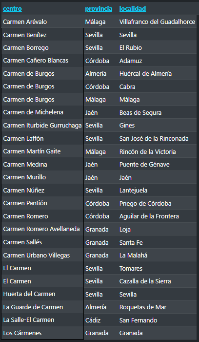

<p><b>29. Agrupa el número de centros de tipo privado por provincia, ordenados por orden descendente del número de centro.</b></p>

```sql

```

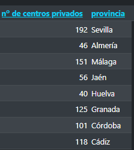

<p><b>30. Saca el número de centros privados existentes en Andalucía, organizados por su denominación y ordenados descendentemente por su número.</b></p>

```sql

```

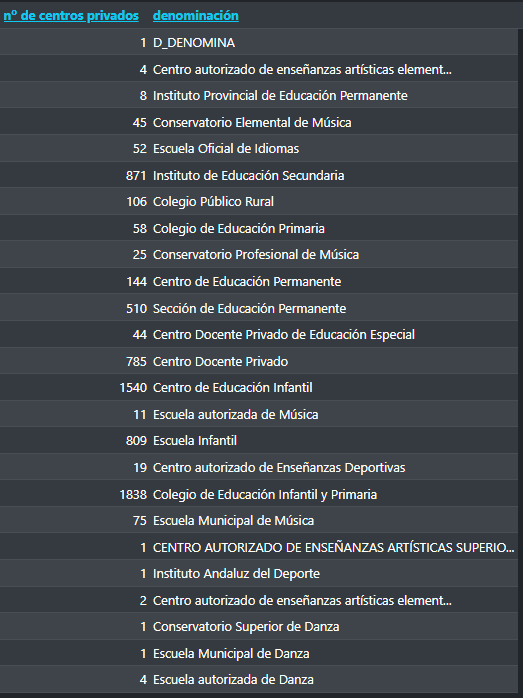