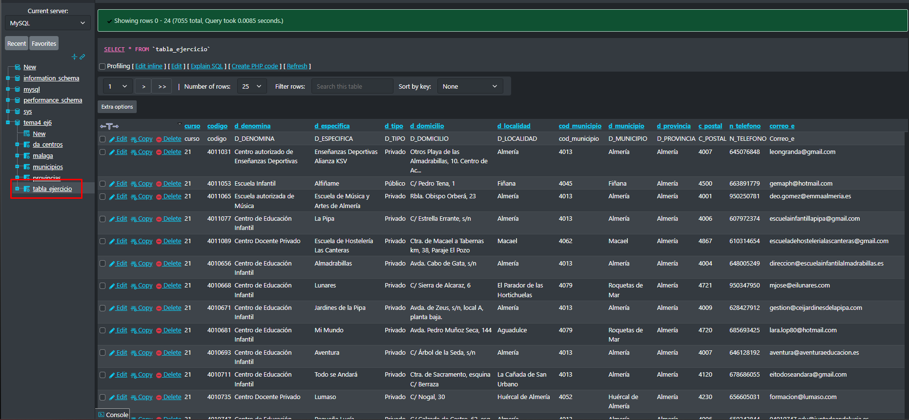

<style>
  h1{
    text-align: center;
    font-weight: bold;
    border: none;
    margin-bottom: 0px;
  }

  p{
    text-align: justify;
  }

  img{
    border: 2px solid black;
  }

  #ex{
    border: none;
  }
</style>

<h1>CENTROS ESCOLARES</h1>

<hr>

<p><b>1. ¿Cuántos centros educativos tiene la provincia de Málaga?</b></p>

```sql
select count(*) as "nº de centros educativos en málaga" from da_centros where d_provincia="málaga";
```


<p><b>2. ¿Cuántos centros educativos públicos tiene la provincia de Málaga?</b></p>

```sql
select count(*) as "nº de centros educativos públicos en málaga" from da_centros where d_tipo="público" and d_provincia="málaga";
```


<p><b>3. ¿Cuántos centros educativos tiene la provincia de Málaga en cada municipio?</b></p>

```sql
select count(*) as "nº de centros en cada municipio de málaga", d_municipio as "municipio" from da_centros where d_provincia="málaga" group by d_municipio;
```


<p><b>4. Crea una tabla con todos los centros de Málaga que contenga hasta la columna "correo_e".</b></p>

```sql
-- primero creo la tabla y las columnas
  create table tabla_ejercicio(`curso` varchar(5) not null, `codigo` varchar(8) not null, `d_denomina` varchar(70) not null, `d_especifica` varchar(89) not null, `d_tipo` varchar(7) not null, `d_domicilio` varchar(76) not null, `d_localidad` varchar(35) not null, `cod_municipio` varchar(13) not null, `d_municipio` varchar(32) not null, `d_provincia` varchar(11) not null, `c_postal` varchar(8) not null, `n_telefono` varchar(10) not null, `correo_e` varchar(70) not null, primary key(`codigo`));

-- ahora inserto los valores desde la tabla "da_centros"
  insert into tabla_ejercicio(curso, codigo, d_denomina, d_especifica, d_tipo, d_domicilio, d_localidad, cod_municipio, d_municipio, d_provincia, c_postal, n_telefono, correo_e) select curso, codigo, d_denomina, d_especifica, d_tipo, d_domicilio, d_localidad, cod_municipio, d_municipio, d_provincia, c_postal, n_telefono, correo_e from da_centros;
```



<p><b>5. Crea un índice en la tabla que contiene los datos de población de la provincia de Málaga.</b></p>

```sql
create index indice_poblacion on malaga(poblacion);
```


<p><b>6. Saca un listado de todos los municipios de la provincia de Málaga, la población, y el número de centros educativos.</b></p>

```sql
select d_municipio as "municipios" from da_centros where d_provincia="málaga";
```


```sql
select sum(poblacion) as "población" from malaga;
```


```sql
select count(codigo) as "nº de centros educativos" from da_centros where d_provincia="málaga";
```


<p><b>7. De los municipios que tienen centros educativos, saca la densidad (población/número de centros).</b></p>

```sql

```


<p><b>8. ¿Cuál es la densidad de IES's públicos en cada municipio de la provincia de Málaga?</b></p>

```sql

```


<p><b>9. Saca el listado de municipios que no tienen ningún centro educativo.</b></p>

```sql
select distinct d_municipio from da_centros as c1 where not exists (select * from da_centros as c2 where c1.d_municipio=c2.d_municipio);
```


<p><b>10. Saca el listado de municipios que no tienen un IES.</b></p>

```sql
select d_municipio as "municipio" from da_centros group by cod_municipio having count(case when d_denomina="instituto de educación secundaria" then 1 else null end)=0;
```


<p><b>11. ¿Cuántos municipios de la provincia de Málaga no tienen un IES?</b></p>

```sql

```

