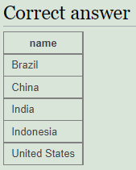
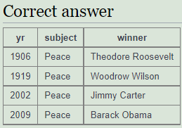

<style>
  h1{
    text-align: center;
    font-weight: bold;
    border: none;
    margin-bottom: 3px;
  }

  h3{
    font-weight: bold;
    font-size: 20px;
    margin-bottom: 1px;
  }

  h5{
    font-size: 17px;
    margin-bottom: 2px;
  }

  h6{
    font-size: 15px;
    margin-top: 2px;
  }

  img{
    border: 2px solid black;
  }

  .inline{
    background-color: lightgrey;
    padding: 2px;
    border-radius: 3px;
  }

  .exe{
    border: none;
  }

  .h1{
    border: none;
    height: 3px;
    color: black;
    background-color: black;
  }

  .line{
    border: none;
    height: 1px;
    color: black;
    background-color: black;
  }

  .line2{
    border: none;
    height: 2px;
    color: black;
    background-color: black;
  }
</style>

<h1>MANUAL LMD SQL</h1>

<hr class="h1">

<h3>SELECT basics</h3>

<hr class="line">

<h6>Introducing the world table of countries</h6>

<p><b>1. The example uses a WHERE clause to show the population of 'France'. Note that strings (pieces of text area that are data) should be in 'single quotes'.</b></p>
<p><b>Modify it to show the population of Germany.</b></p>

<p><b>Código:</b></p>

```sql
select population from world where name = 'France';
```

<p>Corrección:</p>

```sql
select population from world where name='Germany';
```


<hr class="line">

<h6>Scandinavia</h6>

<p><b>2. Checking a list with the word IN allows us to check if an item is in a list. The example shows the name and population for the countries 'Brazil', 'Russia', 'India' and 'China'.</b></p>

<p><b>Show the name and the population for 'Sweden', 'Norway' and 'Denmark'.</b></p>

<p><b>Código:</b></p>

```sql
select name, population from world where name in ('Brazil', 'Russia', 'India', 'China');
```

<p>Corrección:</p>

```sql
select name, population from world where name in('Sweden', 'Norway', 'Denmark');
```


<hr class="line">

<h6>Just the right size</h6>

<p><b>3. Which countries are not too small and not too big? <code class="inline">between</code> allows range checking (range specified is inclusive of boundary values). The example below shows countries with an area of 250,000-300,000 sq. km.</b></p>

<p><b>Modify it to show the country and the area for countries with an area between 200,000 and 250,000.</b></p>

<p><b>Código:</b></p>

```sql
select name, area from world where area between 250000 and 300000;
```

<p>Corrección:</p>

```sql
select name, area from world where area between 200000 and 250000;
```


<hr class="line">

<h5>SELECT basics - quiz</h5>

<hr class="line">

<p><b>1. Select the code which produces this table:</b></p>


<p>Respuesta:</p>


<p><b>2. Pick the result you would obtain from this code:</b></p>

```sql
select name, population from world where name like "Al%"
```

<p>Respuesta:</p>


<p><b>3. Select the code which shows the countries that end in A or L.</b></p>

<p><b>Respuesta:</b></p>


<p><b>4. Pick the result from the query:</b></p>

```sql
select name, length(name) from world where length(name)=5 and region='Europe';
```

<p><b>Respuesta:</b></p>


<p><b>5. Here are the first few rows of the world table:</b></p>


<p><b>Pick the result you would obtain from this code:</b></p>

```sql
select name, area*2 from world where population=64000;
```

<p>Respuesta:</p>


<p><b>6. Select the code that would show the countries with an area larger than 50000 and a population smaller than 10000000.</b></p>

<p>Respuesta:</p>


<p><b>7. Select the code that shows the population density of Chine, Australia, Nigeria and France.</b></p>

<p>Respuesta:</p>


<hr class="line2">

<h3>SELECT from world</h3>

<hr class="line">

<h6>Introduction</h6>

<p><b>1. Observe the result of running this SQL command to show the name, continent and population of all countries.</b></p>

<p><b>Código:</b></p>

```sql
select name, continent, population from world;
```

<p>Corrección (es lo mismo):</p>

```sql
select name, continent, population from world;
```


<hr class="line">

<h6>Large Countries</h6>

<p><b>2. Show the name for the countries that have a population of at least 200 million. 200 million is 200000000, there are eight zeros.</b></p>

<p><b>Código:</b></p>

```sql
select name from world where population=64105700;
```

<p>Corrección:</p>

```sql
select name from world where population>=200000000;
```



<hr class="line">

<h6>Per capita GDP</h6>

<p><b>3. Give the <code class="inline">name</code> and the per capita GDP for those countries with a <code class="inline">population</code> of at least 200 million.</b></p>

<p>Respuesta:</p>

```sql
select name, gdp/population from world where population>=200000000;
```


<hr class="line">

<h6>South America In millions</h6>

<p><b>4. Show the <code class="inline">name</code> and <code class="inline">population</code> in millions for the countries of the <code class="inline">continent</code> 'South America'. Divide the population by 1000000 to get population in millions.</b></p>

<p>Respuesta:</p>

```sql
select name, population/1000000 from world where continent='South America';
```


<hr class="line">

<h6>France, Germany, Italy</h6>

<p><b>5. Show the <code class="inline">name</code> and <code class="inline">population</code> for France, Germany, Italy.</b></p>

<p>Respuesta:</p>

```sql
select name, population from world where name in('France', 'Germany', 'Italy');
```


<hr class="line">

<h6>United</h6>

<p><b>6. Show the countries which have a <code class="inline">name</code> that includes the word 'United'.</b></p>

<p>Respuesta:</p>

```sql
select name from world where name like '%United%';
```


<hr class="line">

<h6>Two ways to be big</h6>

<p><b>7. Two ways to be big: A country is big if it has an area of more than 3 million sq km or it has a population of more than 250 million.</b></p>

<p><b>Show the countries that are big by area or big by population. Show name, population and area.</b></p>

<p>Respuesta:</p>

```sql
select name, population, area from world where area>3000000 or population>250000000;
```


<hr class="line">

<h6>One or the other (but not both)</h6>

<p><b>8. Exclusive OR (XOR). Show the countries that are big by area (more than 3 million) or big by population (more than 250 million) but not both. Show name, population and area.</b></p>

<p>Respuesta:</p>

```sql
select name, population, area from world where (area>3000000 and population<250000000) or (area<3000000 and population>250000000);
```


<hr class="line">

<h6>Rounding</h6>

<p><b>9. Show the <code class="inline">name</code> and <code class="inline">population</code> in millions and the GDP in billions for the countries of the <code class="inline">continent</code> 'South America'. Use the ROUND function to show the values to two decimal places.</b></p>

<p><b>For South America show population in millions and GDP in billions both to 2 decimal places.</b></p>

<p>Respuesta:</p>

```sql
select name, round(population/1000000, 2), round(gdp/1000000000, 2) from world where continent='South America';
```


<hr class="line">

<h6>Trillion dollar economies</h6>

<p><b>10. Show the <code class="inline">name</code> and per-capita GDP for those countries with a GDP of at least one trillion (1000000000000; that is 12 zeros). Round this value to the nearest 1000.</b></p>

<p><b>Show per-capita GDP for the trillion dollar countries to the nearest $1000.</b></p>

<p>Respuesta:</p>

```sql
select name, round(gdp/population, -3) from world where gdp>1000000000000;
```


<hr class="line">

<h6>Name and capital have the same length</h6>

<p><b>11. Greece has capital Athens. Each of the strings 'Greece', and 'Athens' has 6 characters.</b></p>

<p><b>Show the name and capital where the name and the capital have the same number of characters.</b></p>

<p>Respuesta:</p>

```sql
-- La función LENGTH hay que cambiarla por LEN

select name, len(name), capital, len(capital) from world where len(name)=len(capital);
```


<hr class="line">

<h6>Matching name and capital</h6>

<p><b>12. The capital of Sweden is Stockholm. Both words start with the letter 'S'.</b></p>

<p><b>Show the name and the capital where the first letters of each match. Don't include countries where the name and the capital are the same word.</b></p>

<p>Respuesta:</p>

```sql
select name, capital from world where left(name, 1)=left(capital, 1) and name<>capital;
```


<hr class="line">

<h6>All the vowels</h6>

<p><b>13. Equatorial Guinea and Dominican Republic have all of the vowels (a e i o u) in the name. They don't count because they have more than one word in the name.</b></p>

<p><b>Find the country that has all the vowels and no spaces in its name.</b></p>

<p>Respuesta:</p>

```sql
select name from world where name not like '% %' and name like '%a%' and name like '%e%' and name like '%i%' and name like '%o%' and name like '%u%';
```


<hr class="line">

<h5>SELECT from world - quiz</h5>

<hr class="line">

<p><b>1. Select the code which gives the name of countries beginning with U.</b></p>

<p>Respuesta:</p>


<p><b>2. Select the code which shows just the population of United Kingdom.</b></p>

<p>Respuesta:</p>


<p><b>3. Select the answer which shows the problem with this SQL code - the intended result should be the continent of France:</b></p>

```sql
select continent from world where 'name'='France';
```

<p>Respuesta:</p>


<p><b>4. Select the result that would be obtained from the following code:</b></p>

```sql
select name, population/10 from world where population<10000;
```


<p><b>5. Select the code which would reveal the name and population of countries in Europe and Asia.</b></p>

<p>Respuesta:</p>


<p><b>6. Select the code which would give two rows.</b></p>

<p>Respuesta:</p>


<p><b>7. Select the result that would be obtained from this code:</b></p>

```sql
select name from world where continent='South America' and population>40000000;
```

<p>Respuesta:</p>


<hr class="line2">

<h3>SELECT from nobel</h3>

<hr class="line">

<h6>Winners from 1950</h6>

<p><b>1. Change the query shown so that it displays Nobel prizes for 1950.</b></p>

<p><b>Código:</b></p>

```sql
select yr, subject, winner from nobel where yr=1960;
```

<p>Corrección:</p>

```sql
select yr, subject, winner from nobel where yr=1950;
```


<hr class="line">

<h6>1962 Literature</h6>

<p><b>2. Show who won the 1962 prize for literature.</b></p>

<p><b>Código:</b></p>

```sql
select winner from nobel where yr=1960 and subject='physics';
```

<p>Corrección:</p>

```sql
select winner from nobel where yr=1962 and subject='literature';
```


<hr class="line">

<h6>Albert Einstein</h6>

<p><b>3. Show the year and subject that won 'Albert Einstein' his prize.</b></p>

<p>Respuesta:</p>

```sql
select yr, subject from nobel where winner like 'Albert Einstein';
```


<hr class="line">

<h6>Recent Peace Prizes</h6>

<p><b>4. Give the name of the 'peace' winners since the year 2000, including 2000.</b></p>

<p>Respuesta:</p>

```sql
select winner from nobel where subject like 'peace' and yr>=2000;
```


<hr class="line">

<h6>Literature in the 1980's</h6>

<p><b>5. Show all details (yr, subject, winner) of the literature prize winners for 1980 to 1989 inclusive.</b></p>

<p>Respuesta:</p>

```sql
select * from nobel where subject like 'literature' and yr>=1980 and yr<=1989;
```


<hr class="line">

<h6>Only Presidents</h6>

<p><b>6. Show all details of the presidential winners: Theodore Roosevelt, Thomas Woodrow Wilson, Jimmy Carter and Barack Obama.</b></p>

<p><b>Código:</b></p>

```sql
select * from nobel where yr=1970 and subject in('cookery', 'chemistry', 'literature');
```

<p>Corrección:</p>

```sql
-- El nombre completo de WoWoodrow Wilson no funciona, hay que quitar Thomas

select * from nobel where winner in('Theodore Roosevelt', 'Woodrow Wilson', 'Jimmy Carter', 'Barack Obama');
```



<hr class="line">

<h6>John</h6>

<p><b>7. Show the winners with first name John.</b></p>

<p>Respuesta:</p>

```sql
select winner from nobel where winner like 'John%';
```


<hr class="line">

<h6>Chemistry and Physics from different years</h6>

<p><b>8. Show the year, subject, and name of physics winners for 1980 together with the chemistry winners for 1984.</b></p>

<p>Respuesta:</p>

```sql
select * from nobel where(subject like 'physics' and yr=1980) or (subject like 'chemistry' and yr=1984);
```


<hr class="line">

<h6>Exclude Chemists and Medics</h6>

<p><b>9. Show the year, subject, and name of winners for 1980 excluding chemistry and medicine.</b></p>

<p>Respuesta:</p>

```sql
select * from nobel where subject not in('chemistry', 'medicine') and yr=1980;
```


<hr class="line">

<h6>Early Medicine, Late Literature</h6>

<p><b>10. Show year, subject, and name of people who won a 'Medicine' prize in an early year (before 1910, not including 1910) together with winners of a 'Literature' prize in a later year (after 2004, including 2004).</b></p>

<p>Respuesta:</p>

```sql
select * from nobel where (subject like 'medicine' and yr<1910) or (subject like 'literature' and yr>=2004);
```


<hr class="line">

<h6>Umlaut</h6>

<p><b>11. Find all details of the prize won by Peter Grünberg.</b></p>

<p>Respuesta:</p>

```sql
select * from nobel where winner like 'Peter Grünberg';
```


<hr class="line">

<h6>Apostrophe</h6>

<p><b>12. Find all details of the prize won by Eugene O'Neill.</b></p>

<p>Respuesta:</p>

```sql
select * from nobel where winner like 'Eugene O''Neill';
```


<hr class="line">

<h6>Knights of the realm</h6>

<p><b>13. List the winners, year and subject where the winner starts with Sir. Show the the most recent first, then by name order.</b></p>

<p>Respuesta:</p>

```sql
select winner, yr, subject from nobel where winner like 'sir%' order by yr desc, winner;
```


<hr class="line">

<h6>Chemistry and Physics last</h6>

<p><b>14. The expression subject IN ('chemistry','physics') can be used as a value - it will be 0 or 1.</b></p>

<p><b>Show the 1984 winners and subject ordered by subject and winner name; but list chemistry and physics last.</b></p>

<p><b>Código:</b></p>

```sql
select winner, subject, subject in ('physics','chemistry') from nobel where yr=1984 order by subject,winner;
```

<p>Corrección:</p>

```sql
select winner, subject from nobel where yr=1984 order by subject in('physics', 'chemistry'), subject, winner;
```


<hr class="line">

<h5>SELECT from nobel - quiz</h5>

<hr class="line">

<p><b>1. Pick the code which shows the name of winner's names beginning with C and ending in n.</b></p>

<p>Respuesta:</p>


<p><b>2. Select the code that shows how many Chemistry awards were given between 1950 and 1960.</b></p>

<p>Respuesta:</p>


<p><b>3. Pick the code that shows the amount of years where no Medicine awards were given.</b></p>

<p>Respuesta:</p>


<p><b>4. Select the result that would be obtained from the following code:</b></p>

```sql
select subject, winner from nobel where winner like 'sir%' and yr like '196%';
```

<p>Respuesta:</p>


<p><b>5. Select the code which would show the year when neither a Physics or Chemistry award was given.</b></p>

<p>Respuesta:</p>


<p><b>6. Select the code which shows the years when a Medicine award was given but no Peace or Literature award was.</b></p>

<p>Respuesta:</p>


<p><b>7. Pick the result that would be obtained from the following code:</b></p>

```sql
select subject, count(subject) from nobel where yr ='1960' group by subject;
```

<p>Respuesta:</p>


<hr class="line2">

<h3>SELECT in SELECT</h3>

<hr class="line">

<h6>Bigger than Russia</h6>

<p><b>1. List each country name where the population is larger than that of 'Russia'.</b></p>

<p><b>Código:</b></p>

```sql
select name from world where population>(select population from world where name='romania');
```

<p>Corrección:</p>

```sql
select name from world where population>(select population from world where name='russia');
```


<hr class="line">

<h6>Richer than UK</h6>

<p><b>2. Show the countries in Europe with a per capita GDP greater than 'United Kingdom'.</b></p>

<p>Respuesta:</p>

```sql
select name from world where gdp/population>(select gdp/population from world where name='united kingdom') and continent='europe';
```


<hr class="line">

<h6>Neighbours of Argentina and Australia</h6>

<p><b>3. List the name and continent of countries in the continents containing either Argentina or Australia. Order by name of the country.</b></p>

<p>Respuesta:</p>

```sql
select name, continent from world where continent in(select continent from world where name in('argentina', 'australia')) order by name;
```


<hr class="line">

<h6>Between Canada and Poland</h6>

<p><b>4. Which country has a population that is more than United Kingdom but less than Germany? Show the name and the population.</b></p>

<p>Respuesta:</p>

```sql
select name, population from world where population>(select population from world where name='united kingdom') and population<(select population from world where name='germany');
```


<hr class="line">

<h6>Percentages of Germany</h6>

<p><b>5. Germany (population 80 million) has the largest population of the countries in Europe. Austria (population 8.5 million) has 11% of the population of Germany.</b></p>

<p><b>Show the name and the population of each country in Europe. Show the population as a percentage of the population of Germany.</b></p>

<p>Respuesta:</p>

```sql

```


<hr class="line">

<h6>Bigger than every country in Europe</h6>

<p><b>6. Which countries have a GDP greater than every country in Europe? [Give the name only.] (Some countries may have NULL gdp values).</b></p>

<p>Respuesta:</p>

```sql
select name from world where gdp>=all(select gdp from world where gdp>=0 and continent='europe') and continent!='europe';
```


<hr class="line">

<h6>Largest in each continent</h6>

<p><b>7. Find the largest country (by area) in each continent, show the continent, the name and the area:</b></p>

<p><b>Código:</b></p>

```sql
select continent, name, population from world x where population>=all(select population from world y where y.continent=x.continent and population>0);
```

<p>Corrección:</p>

```sql
select continent, name, area from world x where area >= all(select area from world y where y.continent=x.continent and area>0);
```


<hr class="line">

<h6>First country of each continent (alphabetically)</h6>

<p><b>8. List each continent and the name of the country that comes first alphabetically.</b></p>

<p>Respuesta:</p>

```sql
select continent, name from world x where name <= all(select name from world y where y.continent = x.continent);
```


<hr class="line">

<h6>Difficult Questions That Utilize Techniques Not Covered In Prior Sections</h6>

<p><b>9. Find the continents where all countries have a population <= 25000000. Then find the names of the countries associated with these continents. Show name, continent and population.</b></p>

<p>Respuesta:</p>

```sql
select name, continent, population from world x where 25000000  > all(select population from world y where x.continent = y.continent and y.population > 0);
```


<hr class="line">

<h6>Three time bigger</h6>

<p><b>10. Some countries have populations more than three times that of all of their neighbours (in the same continent). Give the countries and continents.</b></p>

<p>Respuesta:</p>

```sql
select name, continent from world x where population > all(select population*3 from world y where x.continent = y.continent and population > 0 and y.name != x.name);
```


<hr class="line">

<h5>SELECT in SELECT - quiz</h5>

<hr class="line">

<p><b>1. Select the code that shows the name, region and population of the smallest country in each region.</b></p>

<p>Respuesta:</p>


<p><b>2. Select the code that shows the countries belonging to regions with all populations over 50000.</b></p>

<p>Respuesta:</p>


<p><b>3. Select the code that shows the countries with a less than a third of the population of the countries around it.</b></p>

<p>Respuesta:</p>


<p><b>4. Select the result that would be obtained from the following code:</b></p>

```sql
select name from bbc where population>(select population from bbc where name='united kingdom') and region in(select region from bbc where name='united kingdom');
```

<p>Respuesta:</p>


<p><b>5. Select the code that would show the countries with a greater GDP than any country in Africa (some countries may have NULL gdp values).</b></p>

<p>Respuesta:</p>


<p><b>6. Select the code that shows the countries with population smaller than Russia but bigger than Denmark.</b></p>

<p>Respuesta:</p>


<p><b>7. Select the result that would be obtained from the following code:</b></p>

```sql
select name from bbc where population>all(select max(population) from bbc where region = 'europe') and region = 'south asia';
```

<p>Respuesta:</p>

