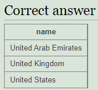

<style>
  h1{
    text-align: center;
    font-weight: bold;
    border: none;
    margin-bottom: 3px;
  }

  h3{
    font-weight: bold;
    font-size: 20px;
    margin-bottom: 1px;
  }

  h5{
    font-size: 17px;
    margin-bottom: 2px;
  }

  h6{
    font-size: 15px;
    margin-top: 2px;
  }

  img{
    border: 2px solid black;
  }

  .inline{
    background-color: lightgrey;
    padding: 2px;
    border-radius: 3px;
  }

  .exe{
    border: none;
  }

  .h1{
    border: none;
    height: 3px;
    color: black;
    background-color: black;
  }

  .line{
    border: none;
    height: 1px;
    color: black;
    background-color: black;
  }

  .line2{
    border: none;
    height: 2px;
    color: black;
    background-color: black;
  }
</style>

<h1>MANUAL LMD SQL</h1>

<hr class="h1">

<h3>SELECT basics</h3>

<hr class="line">

<h6>Introducing the world table of countries</h6>

<p><b>1. The example uses a WHERE clause to show the population of 'France'. Note that strings (pieces of text area that are data) should be in 'single quotes'.</b></p>
<p><b>Modify it to show the population of Germany.</b></p>

<p><b>Código:</b></p>

```sql
select population from world where name = 'France';
```

<p>Corrección:</p>

```sql
select population from world where name='Germany';
```


<hr class="line">

<h6>Scandinavia</h6>

<p><b>2. Checking a list with the word IN allows us to check if an item is in a list. The example shows the name and population for the countries 'Brazil', 'Russia', 'India' and 'China'.</b></p>

<p><b>Show the name and the population for 'Sweden', 'Norway' and 'Denmark'.</b></p>

<p><b>Código:</b></p>

```sql
select name, population from world where name in ('Brazil', 'Russia', 'India', 'China');
```

<p>Corrección:</p>

```sql
select name, population from world where name in('Sweden', 'Norway', 'Denmark');
```


<hr class="line">

<h6>Just the right size</h6>

<p><b>3. Which countries are not too small and not too big? <code class="inline">between</code> allows range checking (range specified is inclusive of boundary values). The example below shows countries with an area of 250,000-300,000 sq. km.</b></p>

<p><b>Modify it to show the country and the area for countries with an area between 200,000 and 250,000.</b></p>

<p><b>Código:</b></p>

```sql
select name, area from world where area between 250000 and 300000;
```

<p>Corrección:</p>

```sql
select name, area from world where area between 200000 and 250000;
```


<hr class="line">

<h5>SELECT basics - quiz</h5>

<hr class="line">

<p><b>1. Select the code which produces this table:</b></p>


<p>Respuesta:</p>


<p><b>2. Pick the result you would obtain from this code:</b></p>

```sql
select name, population from world where name like "Al%"
```

<p>Respuesta:</p>


<p><b>3. Select the code which shows the countries that end in A or L.</b></p>

<p><b>Respuesta:</b></p>


<p><b>4. Pick the result from the query:</b></p>

```sql
select name, length(name) from world where length(name)=5 and region='Europe';
```

<p><b>Respuesta:</b></p>


<p><b>5. Here are the first few rows of the world table:</b></p>


<p><b>Pick the result you would obtain from this code:</b></p>

```sql
select name, area*2 from world where population=64000;
```

<p>Respuesta:</p>


<p><b>6. Select the code that would show the countries with an area larger than 50000 and a population smaller than 10000000.</b></p>

<p>Respuesta:</p>


<p><b>7. Select the code that shows the population density of Chine, Australia, Nigeria and France.</b></p>

<p>Respuesta:</p>


<hr class="line2">

<h3>SELECT from world</h3>

<hr class="line">

<h6>Introduction</h6>

<p><b>1. Observe the result of running this SQL command to show the name, continent and population of all countries.</b></p>

<p><b>Código:</b></p>

```sql
select name, continent, population from world;
```

<p>Corrección (es lo mismo):</p>

```sql
select name, continent, population from world;
```


<hr class="line">

<h6>Large Countries</h6>

<p><b>2. Show the name for the countries that have a population of at least 200 million. 200 million is 200000000, there are eight zeros.</b></p>

<p><b>Código:</b></p>

```sql
select name from world where population=64105700;
```

<p>Corrección:</p>

```sql
select name from world where population>=200000000;
```


<hr class="line">

<h6>Per capita GDP</h6>

<p><b>3. Give the <code class="inline">name</code> and the per capita GDP for those countries with a <code class="inline">population</code> of at least 200 million.</b></p>

<p>Respuesta:</p>

```sql
select name, gdp/population from world where population>=200000000;
```


<hr class="line">

<h6>South America In millions</h6>

<p><b>4. Show the <code class="inline">name</code> and <code class="inline">population</code> in millions for the countries of the <code class="inline">continent</code> 'South America'. Divide the population by 1000000 to get population in millions.</b></p>

<p>Respuesta:</p>

```sql
select name, population/1000000 from world where continent='South America';
```


<hr class="line">

<h6>France, Germany, Italy</h6>

<p><b>5. Show the <code class="inline">name</code> and <code class="inline">population</code> for France, Germany, Italy.</b></p>

<p>Respuesta:</p>

```sql
select name, population from world where name in('France', 'Germany', 'Italy');
```


<hr class="line">

<h6>United</h6>

<p><b>6. Show the countries which have a <code class="inline">name</code> that includes the word 'United'.</b></p>

<p>Respuesta:</p>

```sql
select name from world where name like '%United%';
```



<hr class="line">

<h6>Two ways to be big</h6>

<p><b>7. Two ways to be big: A country is big if it has an area of more than 3 million sq km or it has a population of more than 250 million.</b></p>

<p><b>Show the countries that are big by area or big by population. Show name, population and area.</b></p>

<p>Respuesta:</p>

```sql
select name, population, area from world where area>3000000 or population>250000000;
```


<hr class="line">

<h6>One or the other (but not both)</h6>

<p><b>8. Exclusive OR (XOR). Show the countries that are big by area (more than 3 million) or big by population (more than 250 million) but not both. Show name, population and area.</b></p>

<p>Respuesta:</p>

```sql
select name, population, area from world where (area>3000000 and population<250000000) or (area<3000000 and population>250000000);
```


<hr class="line">

<h6>Rounding</h6>

<p><b>9. Show the <code class="inline">name</code> and <code class="inline">population</code> in millions and the GDP in billions for the countries of the <code class="inline">continent</code> 'South America'. Use the ROUND function to show the values to two decimal places.</b></p>

<p><b>For South America show population in millions and GDP in billions both to 2 decimal places.</b></p>

<p>Respuesta:</p>

```sql
select name, round(population/1000000, 2), round(gdp/1000000000, 2) from world where continent='South America';
```


<hr class="line">

<h6>Trillion dollar economies</h6>

<p><b>10. Show the <code class="inline">name</code> and per-capita GDP for those countries with a GDP of at least one trillion (1000000000000; that is 12 zeros). Round this value to the nearest 1000.</b></p>

<p><b>Show per-capita GDP for the trillion dollar countries to the nearest $1000.</b></p>

<p>Respuesta:</p>

```sql

```

