<style>
  h1{
    border: none;
    margin-bottom: 2px;
    text-align: center;
    font-weight: bold;
  }

  img{
    border: 2px solid black;
  }
</style>

<h1>EMPRESA - RELACIÓN 1</h1>

<hr>

<p><b>1. Hallar por orden alfabético los nombres de los departamentos cuyo director lo es en funciones y no en propiedad.</b></p>

```sql
select nomde from tdepto where tidir='f' order by 1;
```

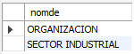

<p><b>2. Obtener una lista telefónica de los empleados del departamento 121, incluyendo nombre del empleado, número del empleado y extensión telefónica. Por orden alfabético descendente.</b></p>

```sql
select nomem, numem, extel from temple where numde=121 order by 1 desc;
```

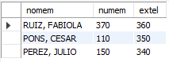

<p><b>3. Obtener por orden creciente una relación de todos los números de extensiones telefónicas de los empleados. Elimina las repeticiones.</b></p>

```sql
select distinct extel from temple order by 1;
```

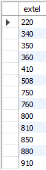

<p><b>4. Hallar la comisión, nombre y salario de los empleados con más de un hijo, clasificados por comisión, y dentro de la comisión por orden alfabético. El listado debe incluir también los empleados con más de un hijo aunque no tengan comisión.</b></p>

```sql
select ifnull(comis, 0), nomem, salar from temple where numhi>1 order by 1, 2;
```

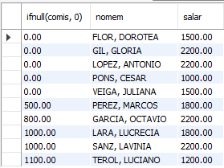

<p><b>5. Obtener salario y nombre de los empleados con dos hijos por orden decreciente de salario y por orden alfabético dentro del salario.</b></p>

```sql
select salar, nomem from temple where numhi=2 order by 1 desc, 2;
```

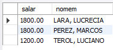

<p><b>6. Obtener el nombre de los empleados cuya comisión es superior o igual al 50% de su salario, por orden alfabético.</b></p>

```sql
select nomem from temple where comis>=salar*0.5 order by 1;
```

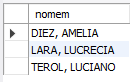

<p><b>7. En una campaña de ayuda familiar se ha decidido dar a los empleados una paga extra de 30 euros por hijo a partir del tercero inclusive. Obtener por orden alfabético para estos empleados: nombre y salario total que van a cobrar incluyendo esta paga extra.</b></p>

```sql
select nomem, salar+30*(numhi-2) from temple where numhi>2 order by 1;
```

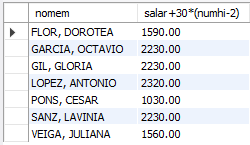

```sql
select nomem, salar+30*(numhi-2) as 'Paga' from temple where numhi>=3 union select nomem, salar from temple where numhi<3 order by 1;
```

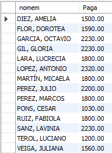

<p><b>8. Hallar por orden alfabético los nombres de los empleados tales que, si se les da una gratificación de 60 euros por hijo, el total de esta gratificación no supera a la décima parte de su salario.</b></p>

```sql
select nomem from temple where 60*numhi<=salar/10 order by 1;
```

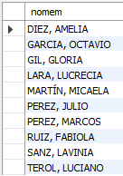

<p><b>9. Obtener para los departamentos con un presupuesto superior a 5000 euros, su nombre junto con el nombre del centro donde está ubicado.</b></p>

```sql
select nomde, nomce from tcentr c join tdepto d on(c.numce=d.numce) where presu>5000;
```

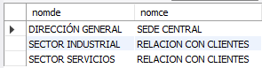

<p><b>10. Para los empleados del departamento de Nóminas, obtener el nombre, salario y número de hijos.</b></p>

```sql
select nomem, salar, numhi from temple e join tdepto d on(e.numde=d.numde) where nomde='nominas';
```

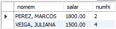