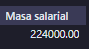
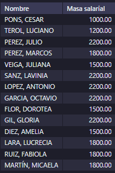
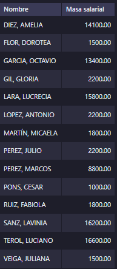
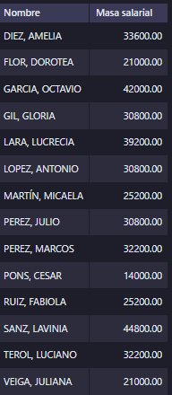
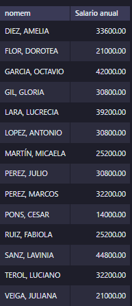

<style>
  h1{
    border: none;
    margin-bottom: 0px;
    text-align: center;
    font-weight: bold;
  }

  img{
    border: 2px solid black;
  }

  p{
    text-align: justify;
  }

  h2{
    font-weight: bold;
    margin-bottom: 0px;
  }
</style>

<h1>EMPRESA - RELACIÓN 2</h1>

<hr>

<p><b>1. Hallar el nombre de los empleados que no tienen comisión, clasificados de manera que aparezcan primero aquellos nombres que son más cortos.</b></p>

```sql
-- selecciona el nombre de todos los empleados cuyo campo "comis" sea nulo y los ordena utilizando la longitud de los nombres

select nomem as 'Empleados sin comisión' from temple where comis is null order by length(nomem), 1;
```


<p><b>2. Hallar, por orden alfabético, los nombres de los empleados suprimiendo las dos últimas letras. Mirar en la ayuda el funcionamiento de las funciones escalares de manejo de cadena: substring y length.</b></p>

```sql
-- selecciona una columna donde aparecen los nombres de los empledaos sin las últimas 2 letras

/*
la función "substring" tiene la siguiente sintaxis:
  - campo que se va a recortar
  - posición inicial
  - longitud del campo (en este caso, la longitud total menos 2)
*/

select substring(nomem, 1, length(nomem)-2) as 'Nombre recortado' from temple order by 1;
```


<p><b>3. Hallar cuántos departamentos hay y el presupuesto anual medio de ellos.</b></p>

```sql
-- selecciona el número de departamentos existentes y la media de todos sus presupuestos: se suman todos los presupuestos, se dividen entre el número de departamentos existentes y, para terminar, se redondea a dos decimales

select count(distinct nomde)as 'Nº de departamentos', round(sum(presu)/count(distinct nomde), 2) as 'Presupuesto anual medio' from tdepto;
```


<p><b>4. Hallar la masa salarial anual (salario más comisión) de la empresa (se suponen 14 pagas anuales).</b></p>

```sql
-- selecciona la masa salarial total sumándolas todas y la multiplica por 14 (nº de pagos anuales)

select sum((salar+comis)*14) as 'Masa salarial' from temple;
```



<p><b>5. Hallar la masa salarial anual de cada empleado. Hacer el ejercicio de diferentes maneras: con el operador "union", con la función "ifnull", con la función "if" y con la expresión "case".</b></p>

<p>UNION:</p>

```sql
--! este apartado no lo entiendo bien. no veo como se combinan los datos de "salar" y "comis" en una misma columna

-- selecciona el nombre y la masa salarial de cada empleado. los datos los obtiene de una subconsulta que une los campos "nomem", y "salar" y "comis" (estos dos últimos en una misma columna, aplicándoles el mismo alias a los dos). estos datos se generan en una tabla temporal "temp_salarios", que se elimina al terminar la consulta. por último, se agrupan los datos por el nombre del empleado, ya que si no se hace esto aparecen los nombres duplicados y los datos de "salar" y "comis" separados

select nomem as 'Nombre', masa as 'Masa salarial' from(select nomem, salar as 'masa' from temple union select nomem, comis as 'masa' from temple) as temp_salarios group by nomem;
```



<p>IFNULL:</p>

```sql
select nomem as 'Nombre', (salar+ifnull(comis, 0)*14) as 'Masa salarial' from temple order by 1;
```



<p>IF:</p>

```sql
-- selecciona el nombre y la masa salarial de cada registro. en caso de que la comisión del registro sea null, la función "if" la transforma en 0

select nomem as 'Nombre', (salar+if(comis is null, 0, comis))*14 as 'Masa salarial' from temple order by 1;
```



<p>CASE:</p>

```sql
/*
selecciona la columna del nombre y la de la masa salarial, la cual se calcula de la siguiente forma:
  - la cláusula "case" comprueba si la condición "comis is null" se cumple
    - si se cumple el resultado de la columna es "salar*14"
    - si no se cumple el resultado de la columna es "(salar+comis)*14"

por último se ordena por los nombres
*/

select nomem as 'Nombre', case when comis is null then salar*14 else(salar+comis)*14 end as 'Masa salarial' from temple order by 1;
```



<p><b>6. Hallar cuántos empleados han ingresado en el año actual. Utiliza la función "year".</b></p>

```sql
-- suponiendo que el año actual es el 2022, esta consulta selecciona el conteo de empleados (sin repetirse) cuyo año de inicio (obtenido con la función "year", la cual extrae el año de un campo de tipo fecha, del campo "fecin") sea igual a 2022

select count(distinct nomem) as 'Nº de empleados este año' from temple where year(fecin)=2022;
```


<p><b>7. Hallar la diferencia entre el salario más alto y el salario más bajo.</b></p>

```sql
-- selecciona la diferencia del valor máximo dentro del campo "salar" (obtenido con "max") y le resta el valor mínimo del mismo campo (obtenido con "min")

select max(salar)-min(salar) as 'Diferencia' from temple;
```


<hr>

<h2>Anexo</h2>

```sql
CREATE DATABASE tema4_empresa_relaciones;
USE tema4_empresa_relaciones;

CREATE TABLE tcentr(
  NUMCE INT NOT NULL,
  NOMCE VARCHAR(45) NOT NULL,
  SEÑAS VARCHAR(45) NOT NULL,
  PRIMARY KEY (NUMCE)
);

CREATE TABLE tdepto(
  NUMDE INT NOT NULL,
  NOMDE VARCHAR(45) NOT NULL,
  PRESU DECIMAL(7,2) NOT NULL,
  TIDIR CHAR(1) NULL,
  DIREC INT NULL,
  DEPDE INT NULL,
  NUMCE INT NULL,
  PRIMARY KEY (NUMDE),
  FOREIGN KEY (NUMCE) REFERENCES tcentr (NUMCE)
  ON DELETE NO ACTION
  ON UPDATE NO ACTION,
  FOREIGN KEY (DEPDE)
  REFERENCES tdepto (NUMDE)
  ON DELETE NO ACTION
  ON UPDATE NO ACTION
);

CREATE TABLE temple(
  NUMEM INT NOT NULL,
  NOMEM VARCHAR(45) NOT NULL,
  FECNA DATE NOT NULL,
  FECIN DATE NOT NULL,
  NUMHI SMALLINT NOT NULL,
  SALAR DECIMAL(6,2) NOT NULL,
  COMIS DECIMAL(6,2) NULL,
  EXTEL VARCHAR(4) NOT NULL,
  NUMDE INT NULL,
  PRIMARY KEY (NUMEM),
  FOREIGN KEY (NUMDE) REFERENCES tdepto (NUMDE)
  ON DELETE NO ACTION
  ON UPDATE NO ACTION
);

ALTER TABLE tdepto ADD CONSTRAINT restriccion1 FOREIGN KEY (DIREC) REFERENCES temple (NUMEM) ON DELETE NO ACTION ON UPDATE NO ACTION;

INSERT INTO tcentr (NUMCE, NOMCE,SEÑAS) VALUES (10, 'SEDE CENTRAL','C. ALCALA, 820, MADRID'), (20, 'RELACION CON CLIENTES','C. ATOCHA, 405, MADRID');

INSERT INTO tdepto (NUMDE, NUMCE, DIREC, TIDIR, PRESU, DEPDE, NOMDE) VALUES (100, 10, NULL, 'P', 12000.00, NULL, 'DIRECCIÓN GENERAL'), (110, 20, NULL, 'P', 5000.00, NULL, 'NOMINAS'), (111, 20, NULL, 'F', 11000.00, 110, 'SECTOR INDUSTRIAL'), (112, 20, NULL, 'P', 9000.00, 110, 'SECTOR SERVICIOS'), (120, 10, NULL, 'F', 3000.00, 100, 'ORGANIZACION'), (121, 10, NULL, 'P', 2000.00, 120, 'PERSONAL');

UPDATE tdepto SET DEPDE=120 WHERE NUMDE=110;

INSERT INTO temple (NUMEM, NUMDE, EXTEL, FECNA, FECIN, SALAR, COMIS, NUMHI, NOMEM) VALUES(110, 121, 350, '1989-11-10', '2011-02-15', 1000.00, NULL, 3, 'PONS, CESAR'), (130, 112, 810, '1966-09-09', '2011-02-01' ,1200.00, 1100.00 , 2, 'TEROL, LUCIANO'),	(150, 121, 340, '1971-01-10', '2010-01-15', 2200.00, NULL, 1, 'PEREZ, JULIO'), (180, 110, 508, '1980-01-18','2011-03-18', 1800.00, 500.00, 2, 'PEREZ, MARCOS'), (190, 110, 350, '1982-05-12','2010-02-11', 1500.00, NULL, 4, 'VEIGA, JULIANA'), (240, 111, 760, '1984-02-26','2010-02-24', 2200.00, 1000.00, 3, 'SANZ, LAVINIA'), (260, 100, 220, '1979-12-03','2010-07-12', 2200.00, NULL	, 6, 'LOPEZ, ANTONIO'), (270, 112, 800, '1978-05-21', '2010-09-10', 2200.00, 800.00, 3, 'GARCIA, OCTAVIO'), (280, 120, 410, '1973-01-11','2010-10-08', 1500.00, NULL, 5, 'FLOR, DOROTEA'), (290, 120, 910, '1974-11-30', '2010-02-14', 2200.00, NULL, 3, 'GIL, GLORIA'), (330, 112, 850, '1984-08-19', '2011-03-01', 1500.00, 900.00, 0, 'DIEZ, AMELIA'), (360, 111, 750, '1980-10-29', '2011-10-10', 1800.00, 1000.00, 2, 'LARA, LUCRECIA'), (370, 121, 360, '1985-06-22', '2022-01-20', 1800.00, NULL, 1, 'RUIZ, FABIOLA'), (380, 112, 880, '1980-03-30', '2022-01-01' ,1800.00, NULL, 0, 'MARTÍN, MICAELA');

UPDATE tdepto SET DIREC=260 WHERE NUMDE=100;
UPDATE tdepto SET DIREC=290 WHERE NUMDE=110;
UPDATE tdepto SET DIREC=240 WHERE NUMDE=111;
UPDATE tdepto SET DIREC=270 WHERE NUMDE=112;
UPDATE tdepto SET DIREC=150 WHERE NUMDE=121;
```