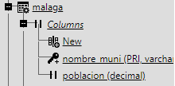
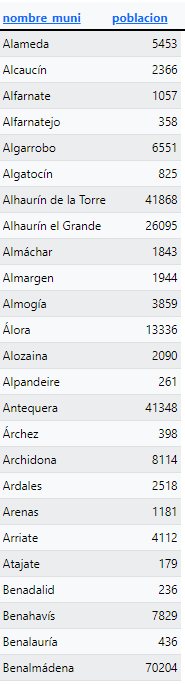
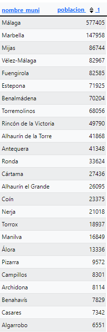
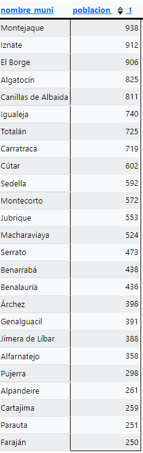
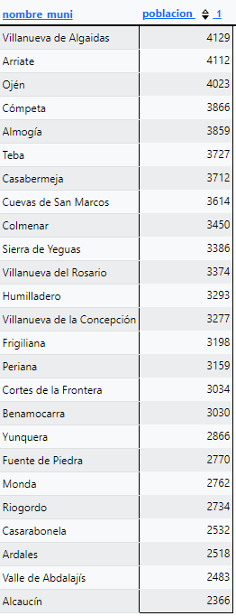
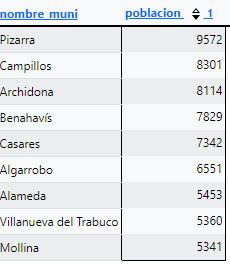
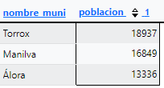
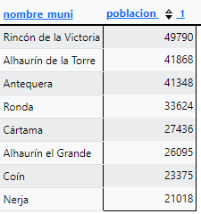
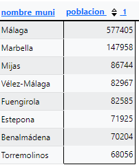
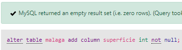

<style>
  h1{
    text-align: center;
    font-weight: bold;
    border: none;
    margin-bottom: 0px;
  }

  p{
    text-align: justify;
  }

  img{
    border: 2px solid black;
  }
</style>

<h1>PUEBLOS DE ESPAÑA V.2</h1>

<hr>

<p>* Continuación del ejercicio anterior.</p>

<p><b>1. Crea una tabla llamada "malaga", cuyos campos sean "nombre_muni" y "poblacion".</b></p>

```sql
create table malaga(`nombre_muni` varchar(80) not null, `poblacion` decimal(9, 0) not null, primary key(`nombre_muni`));
```



<p><b>2. Introduce los datos de la provincia de Málaga en la nueva tabla "malaga".</b></p>

```sql
insert into `malaga`(`nombre_muni`, `poblacion`) select `municipios`.`nombre_actual`, `municipios`.`poblacion_muni` from municipios where provincia="málaga";
```



<p><b>3. Borra todos los datos de la tabla "malaga".</b></p>

```sql
delete from malaga;
```


<p><b>4. Como tenemos el "use" sobre la base de datos, volvemos a cargar los datos de la provincia.</b></p>

```sql
insert into `malaga`(`nombre_muni`, `poblacion`) select nombre_actual, poblacion_muni from municipios where provincia="málaga";
```


<p><b>5. Saca un listado por orden descendente de población.</b></p>

```sql
select * from malaga order by poblacion desc;
```



<p><b>6. Saca un listado por orden descendente de población de los municipios:</b></p>

<p><b>a. menores de 1000</b></p>

```sql
select * from malaga where poblacion<1000 order by poblacion desc;
```



<p><b>b. entre 1000 y 5000</b></p>

```sql
select * from malaga where poblacion between 1000 and 5000 order by poblacion desc;
```



<p><b>c. entre 5000 y 10000</b></p>

```sql
select * from malaga where poblacion between 5000 and 10000 order by poblacion desc;
```



<p><b>d. entre 10000 y 20000</b></p>

```sql
select * from malaga where poblacion between 10000 and 20000 order by poblacion desc;
```



<p><b>e. entre 20000 y 50000</b></p>

```sql
select * from malaga where poblacion between 20000 and 50000 order by poblacion desc;
```



<p><b>e. mayores de 50000</b></p>

```sql
select * from malaga where poblacion>50000 order by poblacion desc;
```



<p><b>7. Vamos a incluir el campo de superficie.</b></p>

```sql
alter table malaga add column superficie int;
```



<p><b>9. Introduce los valores de superficie en km<sup>2</sup>.</b></p>

```sql
update malaga set superficie=floor(rand()*(100-1)+1);
```