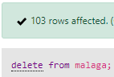

<style>
  h1{
    text-align: center;
    font-weight: bold;
    border: none;
    margin-bottom: 0px;
  }

  p{
    text-align: center;
  }

  img{
    border: 2px solid black;
  }
</style>

<h1>PUEBLOS DE ESPAÑA V.2</h1>

<hr>

<p>* Continuación del ejercicio anterior.</p>

<p><b>1. Crea una tabla llamada "malaga", cuyos campos sean "nombre_muni" y "poblacion".</b></p>

```sql
create table malaga(`nombre_muni` varchar(80) not null, `poblacion` decimal(9, 0) not null, primary key(`nombre_muni`));
```


<p><b>2. Introduce los datos de la provincia de Málaga en la nueva tabla "malaga".</b></p>

```sql
insert into `malaga`(`nombre_muni`, `poblacion`) select `municipios`.`nombre_actual`, `municipios`.`poblacion_muni` from municipios where provincia="málaga";
```


<p><b>3. Borra todos los datos de la tabla "malaga".</b></p>

```sql
delete from malaga;
```



<p><b>4. Como tenemos el "use" sobre la base de datos, volvemos a cargar los datos de la provincia.</b></p>

```sql
insert into `malaga`(`nombre_muni`, `poblacion`) select nombre_actual, poblacion_muni from municipios where provincia="málaga";
```

