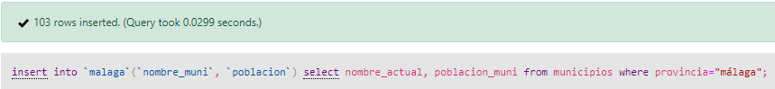
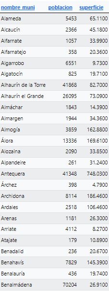
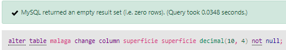
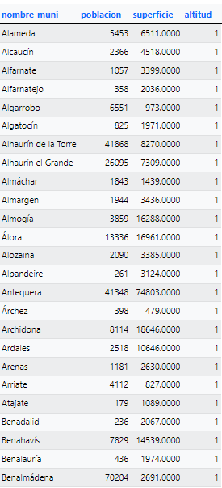
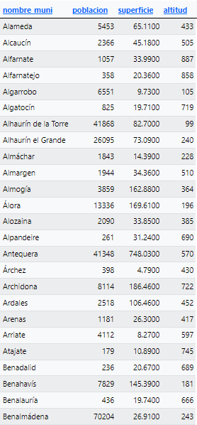
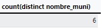

<style>
  h1{
    text-align: center;
    font-weight: bold;
    border: none;
    margin-bottom: 0px;
  }

  p{
    text-align: justify;
  }

  img{
    border: 2px solid black;
  }
</style>

<h1>PUEBLOS DE ESPAÑA V.2</h1>

<hr>

<p>* Continuación del ejercicio anterior.</p>

<p><b>1. Crea una tabla llamada "malaga", cuyos campos sean "nombre_muni" y "poblacion".</b></p>

```sql
create table malaga(`nombre_muni` varchar(80) not null, `poblacion` decimal(9, 0) not null, primary key(`nombre_muni`));
```


<p><b>2. Introduce los datos de la provincia de Málaga en la nueva tabla "malaga".</b></p>

```sql
insert into `malaga`(`nombre_muni`, `poblacion`) select `municipios`.`nombre_actual`, `municipios`.`poblacion_muni` from municipios where provincia="málaga";
```


<p><b>3. Borra todos los datos de la tabla "malaga".</b></p>

```sql
delete from malaga;
```


<p><b>4. Como tenemos el "use" sobre la base de datos, volvemos a cargar los datos de la provincia.</b></p>

```sql
insert into `malaga`(`nombre_muni`, `poblacion`) select nombre_actual, poblacion_muni from municipios where provincia="málaga";
```



<p><b>5. Saca un listado por orden descendente de población.</b></p>

```sql
select * from malaga order by poblacion desc;
```


<p><b>6. Saca un listado por orden descendente de población de los municipios:</b></p>

<p><b>a. menores de 1000</b></p>

```sql
select * from malaga where poblacion<1000 order by poblacion desc;
```


<p><b>b. entre 1000 y 5000</b></p>

```sql
select * from malaga where poblacion between 1000 and 5000 order by poblacion desc;
```


<p><b>c. entre 5000 y 10000</b></p>

```sql
select * from malaga where poblacion between 5000 and 10000 order by poblacion desc;
```


<p><b>d. entre 10000 y 20000</b></p>

```sql
select * from malaga where poblacion between 10000 and 20000 order by poblacion desc;
```


<p><b>e. entre 20000 y 50000</b></p>

```sql
select * from malaga where poblacion between 20000 and 50000 order by poblacion desc;
```


<p><b>e. mayores de 50000</b></p>

```sql
select * from malaga where poblacion>50000 order by poblacion desc;
```


<p><b>8. Vamos a incluir el campo de superficie.</b></p>

```sql
alter table malaga add column superficie double(10, 4);
```


<p><b>9. Introduce los valores de superficie en km<sup>2</sup>.</b></p>

```sql
update malaga set superficie=(select superficie/100 from municipios where malaga.nombre_muni=municipios.nombre_actual) where nombre_muni<>"";
```



<p><b>10. Cambia a no nulo el campo "superficie".</b></p>

```sql
alter table malaga change column superficie superficie decimal(10, 4) not null;
```



<p><b>11. Añade en la tabla el campo "altitud" con valor 1 por defecto.</b></p>

```sql
alter table malaga add column altitud int default 1;
```



<p><b>12. Inserta los datos de altitud de cada uno de los municipios.</b></p>

```sql
update malaga set altitud=(select altitud from municipios where malaga.nombre_muni=municipios.nombre_actual) where nombre_muni<>"";
```



<p><b>13. Lista los 10 municipios de Málaga con menor altitud.</b></p>

```sql
select nombre_muni, altitud from malaga order by 2 asc limit 10;
```


<p><b>14. Lista la población de los 10 municipios de Málaga con menor altitud.</b></p>

```sql
select nombre_muni, poblacion from malaga order by altitud asc limit 10;
```


<p><b>15. Calcula la altitud media de los 5 municipios de menor altitud.</b></p>

```sql
select avg(altitud) from(select altitud from malaga order by 1 asc limit 5) malaga;
```


<p><b>16. Indica la población total de los 3 municipios de menor altitud.</b></p>

```sql
select sum(poblacion) from(select poblacion from malaga order by altitud asc limit 3) malaga;
```


<p><b>17. Lista los 10 municipios de Málaga con mayor altitud.</b></p>

```sql
select nombre_muni from malaga order by altitud desc limit 10;
```


<p><b>18. Lista la población de los 12 municipios de Málaga con mayor altitud.</b></p>

```sql
select nombre_muni, poblacion from malaga order by altitud desc limit 12;
```


<p><b>19. Calcula altitud media de los 10 municipios de mayor altitud.</b></p>

```sql
select avg(altitud) from(select altitud from malaga order by 1 desc limit 10) malaga;
```


<p><b>20. Indica la población total de los 10 municipios de mayor altitud.</b></p>

```sql
select sum(poblacion) from(select poblacion from malaga order by altitud desc limit 10) malaga;
```


<p><b>21. ¿Cuál es la altitud media de la provincia?</b></p>

```sql
select avg(altitud) from malaga;
```


<p><b>22. ¿Cuál es la media poblacional de la provincia?</b></p>

```sql
select avg(poblacion) from malaga;
```


<p><b>23. Lista los pueblos de la provincia que estén por debajo de los 100 metros de altitud.</b></p>

```sql
select nombre_muni from malaga where altitud<100;
```


<p><b>24. Lista los pueblos de la provincia que estén por encima de los 100 metros de altitud.</b></p>

```sql
select nombre_muni from malaga where altitud>100;
```


<p><b>25. Lista los pueblos entre 10 metros y 50 metros de altitud.</b></p>

```sql
select nombre_muni from malaga where altitud between 10 and 50;
```


<p><b>26. ¿Cuál es la media de población de los pueblos de la provincia?</b></p>

```sql
select avg(poblacion) from malaga where poblacion<10000;
```


<p><b>27. Lista los 5 pueblos de mayor extensión de la provincia de Málaga.</b></p>

```sql
select nombre_muni from malaga order by superficie desc limit 5;
```


<p><b>28. Mostrar la lista de bases de datos.</b></p>

```sql
show databases;
```


<p><b>29. Mostrar las tablas de la base de datos.</b></p>

```sql
use tema4_ej6;

show tables;
```


<p><b>30. Haz una descripción de la tabla "municipios".</b></p>

<p>Este comando no me funciona en phpMyAdmin ni en MySQL Workbench.</p>

```sql
describe "tema4_ej6.municipios";
```

<p><b>31. Haz una descripción de la tabla "malaga".</b></p>

```sql
describe "tema4_ej6.malaga";
```

<p><b>32. Modifica el campo "poblacion" para que verifique que todos los municipios tienen más de 1 habitante.</b></p>

```sql
alter table malaga add constraint poblacion_minima check(poblacion>=1);
```


<p><b>33. Modifica el campo "altitud" para que verifique que todos los municipios están entre 1 y 4000 metros.</b></p>

```sql
alter table malaga add constraint altitud_entre check(altitud between 1 and 4000);
```


<p><b>34. Lista todos los pueblos que no comiencen ni por la "B", ni la "A", ni la "M".</b></p>

```sql
select nombre_muni from malaga where poblacion<10000 and nombre_muni not like 'b%' and nombre_muni not like 'a%' and nombre_muni not like 'm%';
```


<p><b>35. ¿Cuántos pueblos hay que no comiencen por la "M" ni por la "A".</b></p>

```sql
select count(distinct nombre_muni) from malaga where poblacion<10000 and nombre_muni not like 'm%' and nombre_muni not like 'A%';
```


<p><b>36. Haz un listado con los 10 pueblos con mayor densidad poblacional de la provincia.</b></p>

```sql
select nombre_muni from malaga where poblacion<10000 order by poblacion/superficie desc limit 10;
```


<p><b>37. ¿Cuáles son los 5 pueblos con menor densidad poblacional de la provincia?</b></p>

```sql
select nombre_muni from malaga where poblacion<10000 order by poblacion/superficie asc limit 5;
```


<p><b>38. ¿Cuántos pueblos comienzan por "M"?</b></p>

```sql
select count(distinct nombre_muni) from malaga where poblacion<10000 and nombre_muni like 'm%';
```


```

<p><b>39. ¿Cuántos pueblos comienzan por "A"?</b></p>

```sql
select count(distinct nombre_muni) from malaga where poblacion<10000 and nombre_muni like 'a%';
```


<p><b>40. Pon en la misma tabla, el número de pueblos que comienzan por "A", "B", "C", "M", "T" y el número de cada uno.</b></p>

```sql

```

