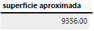

<style>
  h1{
    text-align: center;
    font-weight: bold;
    border: none;
    margin-bottom: 0px;
  }

  p{
    text-align: justify;
  }

  img{
    border: 2px solid black;
  }
</style>

<h1>PUEBLOS DE ESPAÑA V.3</h1>

<hr>

<p><b>1. ¿Cuántos habitantes tiene el pueblo de Ronda, en la provincia de Málaga?</b></p>

```sql
select poblacion_muni as "habitantes ronda" from municipios where nombre_actual="ronda";
```


<p><b>2. ¿Qué altitud alcanza el pueblo de Requena en la provincia de Valencia?</b></p>

```sql
select altitud as "altitud requena" from municipios where nombre_actual="requena";
```


<p><b>3. ¿Cuál es el nombre del pueblo más pequeño en términos de población en la provincia de Cáceres?</b></p>

```sql
select nombre_actual as "nombre pueblo" from municipios where provincia="caceres" order by altitud asc limit 1;
```


<p><b>4. ¿Cuál es la superficie del pueblo de Cazorla, en la provincia de Jaén?</b></p>

```sql
select superficie as "superficie cazorla" from municipios where nombre_actual="cazorla"
```


<p><b>5. ¿Qué provincia alberga al pueblo de Cuenca con mayor superficie?</b></p>

```sql
select provincia from municipios where provincia="cuenca" order by superficie desc limit 1;
```


<p><b>6. ¿Cuál es la altura en metros sobre el nivel del mar del pueblo de Albarracín, en Teruel?</b></p>

```sql
select altitud as "altura en metros" from municipios where nombre_actual="albarracin";
```


<p><b>7. ¿En qué provincia se encuentra el pueblo de Güéjar Sierra?</b></p>

```sql
select provincia from municipios where nombre_actual="guejar sierra";
```


<p><b>8. ¿Cuál es la superficie aproximada del pueblo de Estepona?</b></p>

```sql
select superficie from municipios where nombre_actual="estepona";
```


<p><b>9. ¿Qué altura alcanza el pueblo de La Granja de San Ildefonso, en Segovia?</b></p>

```sql
select altitud from municipios where nombre_actual="real sitio de san ildefonso";
```


<p><b>10. ¿Cuál es el nombre del pueblo con mayor población en la provincia de Almería?</b></p>

```sql
select nombre_actual as "nombre del pueblo" from municipios where provincia="almeria" order by poblacion_muni desc limit 1;
```


<p><b>11. ¿Cuál es la superficie aproximada del pueblo de Calahorra, en la provincia de Lar Rioja?</b></p>

```sql
select superficie as "superficie aproximada" from municipios where nombre_actual="calahorra" and provincia="la rioja";
```



<p><b>12. ¿Qué provincia alberga al pueblo de Haro con mayor altura sobre el nivel del mar?</b></p>

```sql
select provincia from municipios where nombre_actual="haro" order by altitud desc limit 1;
```


<p><b>13. ¿Cuántos habitantes tiene Cádiz?</b></p>

```sql
select sum(poblacion_muni) as "población cádiz" from municipios where provincia="cadiz";
```


<p><b>14. ¿Qué altura alcanza el pueblo de Peñafiel, en la provincia de Valladolid?</b></p>

```sql
select altitud as "altitud peñafiel" from municipios where nombre_actual="peñafiel" and provincia="valladolid";
```


<p><b>15. ¿Cuál es el nombre del pueblo con mayor superficie en la provincia de Zaragoza?</b></p>

```sql
select nombre_actual as "pueblo con mayor superficie de zaragoza" from municipios where provincia="zaragoza" order by superficie desc limit 1;
```


<p><b>16. ¿Cuál es la población aproximada del pueblo de Santander? Indica la provincia.</b></p>

```sql
select poblacion_muni as "población aproximada de santander", provincia from municipios where nombre_actual="santander";
```


<p><b>17. ¿Qué provincia alberga al pueblo de Galicia con mayor altura sobre el nivel del mar?</b></p>

```sql
select provincia from municipios where provincia in("la coruña", "lugo", "orense", "pontevedra") order by altitud desc limit 1;
```


<p><b>18. ¿Cuántos habitantes tiene el pueblo de Girona?</b></p>

```sql
select poblacion_muni as "población girona" from municipios where nombre_actual="girona";
```


<p><b>19. ¿Qué altura alcanza el pueblo de Ávila?</b></p>

```sql
select altitud as "altitud ávila" from municipios where nombre_actual="avila";
```


<p><b>20. ¿Cuál es el nombre del pueblo con mayor población en la provincia de Alicante?</b></p>

```sql
select nombre_actual as "pueblo con mayor población de alicante" from municipios where provincia="alacant/alicante" order by poblacion_muni desc limit 1;
```


<p><b>21. ¿Cuáles son los 5 pueblos más grandes en términos de población en la provincia de Valencia?</b></p>

```sql
select nombre_actual as "5 pueblos con mayor población de valencia" from municipios where provincia="valencia/valencia" order by poblacion_muni desc limit 5;
```


<p><b>22. ¿Cuáles son los 3 pueblos más altos sobre el nivel del mar en la provincia de Madrid?</b></p>

```sql
select nombre_actual as "3 pueblos más altos de madrid" from municipios where provincia="madrid" order by altitud desc limit 3;
```


<p><b>23. ¿Qué pueblo tiene la menor superficie en la provincia de Barcelona?</b></p>

```sql
select nombre_actual as "pueblo con menor superficie de barcelona" from municipios where provincia="barcelona" order by superficie asc limit 1;
```


<p><b>24. ¿Cuál es la suma de la población de los pueblos de La Rioja con mayor número de habitantes?</b></p>

```sql
-- he tomado como "los pueblos de La Rioja con mayo número de habitantes" los 5 pueblos con mayor población

select sum(poblacion_muni) as "suma de la población de los 5 pueblos más habitados de la rioja" from municipios where provincia="la rioja" order by poblacion_muni desc limit 5;
```


<p><b>25. ¿Qué pueblo en Andalucía tiene la mayor altura sobre el nivel del mar?</b></p>

```sql
select nombre_actual as "pueblo más alto de andalucía" from municipios where provincia in("almeria", "granada", "malaga", "jaen", "cordoba", "sevilla", "cadiz", "huelva") order by altitud desc limit 1;
```


<p><b>26. ¿Cuántos pueblos en Castilla y León tienen una superficie mayor a 100 km<sup>2</sup>?</b></p>

```sql
select count(nombre_actual) as "nº de pueblos de castilla y león con más de 100 km cuadrados" from municipios where provincia in("araba/alava", "burgos", "leon", "palencia", "salamanca", "segovia", "soria", "valladolid", "zamora") and superficie>100;
```


<p><b>27. ¿Cuáles son los 2 pueblos más grandes en términos de población en la provincia de Alicante?</b></p>

```sql

```

