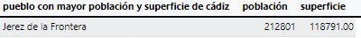
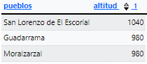
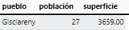
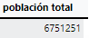
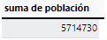
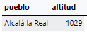
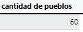
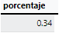
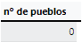
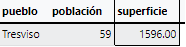

<style>
  h1{
    text-align: center;
    font-weight: bold;
    border: none;
    margin-bottom: 0px;
  }

  p{
    text-align: justify;
  }

  img{
    border: 2px solid black;
  }
</style>

<h1>PUEBLOS DE ESPAÑA V.4</h1>

<hr>

<p><b>1. ¿Cuál es el pueblo con la mayor población y la mayor superficie en la provincia de Cádiz?</b></p>

```sql
select nombre_actual as 'pueblo con mayor población y superficie de cádiz', poblacion_muni as 'población', superficie from municipios where provincia='cadiz' order by poblacion_muni desc, superficie desc limit 1;
```



<p><b>2. ¿Cuáles son los 3 pueblos más altos sobre el nivel del mar y con una población mayor a 10000 habitantes en la provincia de Madrid?</b></p>

```sql
select nombre_actual as 'pueblos', altitud from municipios where provincia='madrid' and poblacion_muni>10000 order by altitud desc limit 3;
```



<p><b>3. ¿Qué pueblo tiene la menor superficie y población en la provincia de Barcelona?</b></p>

```sql
select nombre_actual as 'pueblo', poblacion_muni as 'población', superficie from municipios where provincia='barcelona' order by poblacion_muni asc, superficie asc limit 1;
```



<p><b>4. ¿Cuál es la suma de la población de los 10 municipios con mayor número de habitantes de la comunidad de Madrid?</b></p>

```sql
select sum(poblacion_muni) as 'población total' from municipios where provincia='madrid' order by poblacion_muni desc limit 10;
```



<p><b>5. ¿Cuál es la suma de la población de los 10 municipios con mayor número de habitantes de la comunidad de Barcelona?</b></p>

```sql
select sum(poblacion_muni) as 'suma de población'from municipios where provincia='barcelona' order by poblacion_muni desc limit 10;
```



<p><b>6. ¿Qué pueblo en Andalucía tiene la mayor altura sobre el nivel del mar y una población mayor a 20000 habitantes?</b></p>

```sql
select nombre_actual as 'pueblo', altitud from municipios where provincia in('málaga', 'cádiz', 'sevilla', 'huelva', 'córdoba', 'jaén', 'granada', 'almería') and poblacion_muni>20000 order by altitud desc limit 1;
```



<p><b>7. ¿Cuántos pueblos en Castilla y León tienen una superficie mayor a 100 km<sup>2</sup> y una población mayor a 5000 habitantes?</b></p>

```sql
select count(*) as 'cantidad de pueblos' from municipios where provincia in('ávila', 'burgos', 'leon', 'palencia', 'salamanca', 'segovia', 'soria', 'valladolid', 'zamora') and poblacion_muni>5000 and superficie>100;
```



<p><b>8. ¿Cuáles son los 2 pueblos más grandes en términos de población y con una superficie mayor a 50 km<sup>2</sup> en la provincia de Alicante?</b></p>

```sql
select nombre_actual as 'pueblo', poblacion_muni as 'población', superficie from municipios where provincia='alacant/alicante' and superficie>50 order by poblacion_muni desc limit 2;
```


<p><b>9. ¿Qué porcentaje del número de municipios de la provincia de Zaragoza vive en pueblos con una superficie menor a 50 km<sup>2</sup> y una población menor a 15000 habitantes?</b></p>

```sql
select round(count(*)*100.0/(select count(*) from municipios where cod_prov='50'), 2) as 'porcentaje' from municipios where cod_prov='50' and poblacion_muni<15000 AND superficie<50;
```



<p><b>10. ¿Cuántos pueblos en Galicia tienen una altura sobre el nivel del mar mayor a 800 metros y una población mayor a 5000 habitantes?</b></p>

```sql
select count(*) as 'nº de pueblos' from municipios where provincia in('la coruña', 'lugo', 'orense', 'pontevedra') and altitud>800 and poblacion_muni>5000;
```



<p><b>11. ¿Qué pueblo en Cantabria tiene la menor población y una superficie mayor a 25 km<sup>2</sup>?</b></p>

```sql
select nombre_actual as 'pueblo', poblacion_muni as 'población', superficie from municipios where provincia='cantabria' and superficie>25 order by poblacion_muni asc limit 1;
```

