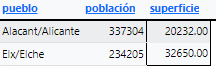
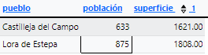
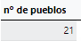

<style>
  h1{
    text-align: center;
    font-weight: bold;
    border: none;
    margin-bottom: 0px;
  }

  p{
    text-align: justify;
  }

  img{
    border: 2px solid black;
  }
</style>

<h1>PUEBLOS DE ESPAÑA V.4</h1>

<hr>

<p><b>1. ¿Cuál es el pueblo con la mayor población y la mayor superficie en la provincia de Cádiz?</b></p>

```sql
select nombre_actual as 'pueblo con mayor población y superficie de cádiz', poblacion_muni as 'población', superficie from municipios where provincia='cadiz' order by poblacion_muni desc, superficie desc limit 1;
```


<p><b>2. ¿Cuáles son los 3 pueblos más altos sobre el nivel del mar y con una población mayor a 10000 habitantes en la provincia de Madrid?</b></p>

```sql
select nombre_actual as 'pueblos', altitud from municipios where provincia='madrid' and poblacion_muni>10000 order by altitud desc limit 3;
```


<p><b>3. ¿Qué pueblo tiene la menor superficie y población en la provincia de Barcelona?</b></p>

```sql
select nombre_actual as 'pueblo', poblacion_muni as 'población', superficie from municipios where provincia='barcelona' order by poblacion_muni asc, superficie asc limit 1;
```


<p><b>4. ¿Cuál es la suma de la población de los 10 municipios con mayor número de habitantes de la comunidad de Madrid?</b></p>

```sql
select sum(poblacion_muni) as 'población total' from municipios where provincia='madrid' order by poblacion_muni desc limit 10;
```


<p><b>5. ¿Cuál es la suma de la población de los 10 municipios con mayor número de habitantes de la comunidad de Barcelona?</b></p>

```sql
select sum(poblacion_muni) as 'suma de población'from municipios where provincia='barcelona' order by poblacion_muni desc limit 10;
```


<p><b>6. ¿Qué pueblo en Andalucía tiene la mayor altura sobre el nivel del mar y una población mayor a 20000 habitantes?</b></p>

```sql
select nombre_actual as 'pueblo', altitud from municipios where provincia in('málaga', 'cádiz', 'sevilla', 'huelva', 'córdoba', 'jaén', 'granada', 'almería') and poblacion_muni>20000 order by altitud desc limit 1;
```


<p><b>7. ¿Cuántos pueblos en Castilla y León tienen una superficie mayor a 100 km<sup>2</sup> y una población mayor a 5000 habitantes?</b></p>

```sql
select count(*) as 'cantidad de pueblos' from municipios where provincia in('ávila', 'burgos', 'leon', 'palencia', 'salamanca', 'segovia', 'soria', 'valladolid', 'zamora') and poblacion_muni>5000 and superficie>100;
```


<p><b>8. ¿Cuáles son los 2 pueblos más grandes en términos de población y con una superficie mayor a 50 km<sup>2</sup> en la provincia de Alicante?</b></p>

```sql
select nombre_actual as 'pueblo', poblacion_muni as 'población', superficie from municipios where provincia='alacant/alicante' and superficie>50 order by poblacion_muni desc limit 2;
```



<p><b>9. ¿Qué porcentaje del número de municipios de la provincia de Zaragoza vive en pueblos con una superficie menor a 50 km<sup>2</sup> y una población menor a 15000 habitantes?</b></p>

```sql
SELECT 
round(count(case when poblacion_muni<15000 and superficie<50 then 1 else null end)*100.0/count(*), 2) as 'porcentaje' from municipios where provincia='zaragoza';
```


<p><b>10. ¿Cuántos pueblos en Galicia tienen una altura sobre el nivel del mar mayor a 800 metros y una población mayor a 5000 habitantes?</b></p>

```sql
select count(*) as 'nº de pueblos' from municipios where provincia in('la coruña', 'lugo', 'orense', 'pontevedra') and altitud>800 and poblacion_muni>5000;
```


<p><b>11. ¿Qué pueblo en Cantabria tiene la menor población y una superficie mayor a 25 km<sup>2</sup>?</b></p>

```sql
select nombre_actual as 'pueblo', poblacion_muni as 'población', superficie from municipios where provincia='cantabria' and superficie>25 order by poblacion_muni asc limit 1;
```


<p><b>12. ¿Cuáles son los 3 pueblos con mayor superficie y una población mayor a 10000 habitantes en la provincia de Girona?</b></p>

```sql
select nombre_actual as 'pueblo', poblacion_muni as 'población', superficie  from municipios  where provincia='girona' and poblacion_muni>10000 and superficie>25  order by superficie desc limit 3;
```


<p><b>13. ¿Qué pueblo en la provincia de León tiene la mayor altura sobre el nivel del mar y una población mayor a 2000 habitantes?</b></p>

```sql
select nombre_actual as 'pueblo', altitud from municipios where provincia='león' and poblacion_muni>2000 and superficie>0 and altitud>0 order by altitud desc limit 1;
```


<p><b>14. ¿Cuántos pueblos en la provincia de Málaga tienen una población mayor a 10000 habitantes y una superficie mayor a 50 km<sup>2</sup>?</b></p>

```sql
select count(*) as 'nº de pueblos' from municipios where provincia='málaga' and poblacion_muni>10000 and superficie>50;
```


<p><b>15. ¿Cuáles son los 2 pueblos más pequeños en términos de superficie y con una población menor a 2000 habitantes en la provincia de Sevilla?</b></p>

```sql
select nombre_actual as 'pueblo', poblacion_muni as 'población', superficie from municipios where provincia='sevilla' and poblacion_muni<2000 order by superficie asc limit 2;
```



<p><b>16. ¿Qué porcentaje de la superficie total de la provincia de Valladolid es ocupado por pueblos con una población menor a 5000 habitantes y una superficie menor a 25 km<sup>2</sup>?</b></p>

```sql
select round(sum(case when poblacion_muni<5000 and superficie<25 then superficie else 0 end)*100.0/sum(superficie), 2) as 'porcentaje' from municipios where provincia='valladolid';
```


<p><b>17. ¿Cuántos pueblos en Asturias tienen una altura sobre el nivel del mar mayor a 600 metros y una población mayor a 5000 habitantes?</b></p>

```sql
select count(*) as 'nº de pueblos' from municipios where provincia='asturias' and altitud>600 and poblacion_muni>5000;
```


<p><b>18. ¿Cuáles son los 3 pueblos con mayor población y una superficie mayor a 30 km<sup>2</sup> en la provincia de Huesca?</b></p>

```sql
select nombre_actual as 'pueblo', poblacion_muni as 'poblacion', superficie from municipios where provincia='huesca' and superficie>30 and poblacion_muni>0 order by poblacion_muni desc limit 3;
```


<p><b>19. ¿Qué pueblo en la provincia de Cuenca tiene la menor superficie y una población mayor a 2000 habitantes?</b></p>

```sql
select nombre_actual as 'pueblo', poblacion_muni as 'población', superficie from municipios where provincia='cuenca' and poblacion_muni>2000 order by superficie asc limit 1;
```


<p><b>20. ¿Cuántos pueblos en Navarra tienen una población mayor a 5000 habitantes y una superficie mayor a 50 km<sup>2</sup>?</b></p>

```sql
select count(*) as 'nº de pueblos' from municipios where provincia='navarra' and poblacion_muni>5000 and superficie>50;
```



<p><b>21. ¿Cuál es el pueblo con la mayor superficie y la mayor altura sobre el nivel del mar en la provincia de Soria?</b></p>

```sql
select nombre_actual as 'pueblo', superficie, altitud from municipios where provincia='soria' and superficie=(select max(superficie) from municipios where provincia='soria') and altitud=(select max(altitud) from municipios where provincia='soria') limit 1;
```


<p><b>22. ¿Cuáles son los 5 pueblos más grandes en términos d epoblación en la provincia de Valencia y tienen una altura sobre el nivel del mar mayor a 500 metros?</b></p>

```sql
select nombre_actual as 'pueblo', poblacion_muni as 'población', altitud from municipios where provincia='valencia/valencia' and altitud>500 order by poblacion_muni desc limit 5;
```

