<style>
  h1{
    text-align: center;
    font-weight: bold;
    border: none;
    margin-bottom: 0px;
  }

  p{
    text-align: justify;
  }

  img{
    border: 2px solid black;
  }

  #ex{
    border: none;
  }
</style>

<h1>EXAMEN 2ª EVALUACIÓN</h1>

<hr>

<p><b>1. Creación del entorno de trabajo.</b></p>

<li>Para evitar problemas y posibles confusiones, lo primero es cambiar el nombre de tu base de datos, la que tengas municipios, modifica con phpMyAdmin el nombre de tu base de datos y nombra "muni_old".</li>

<p>La base de datos con la que he estado trabajando siempre se llama "tema4_ej6":</p>

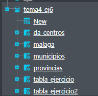

<p>Para cambiar el nombre a la base de datos utilizo el siguiente comando:</p>

```sql
alter database tema4_ej6 modify name=muni_old;
```

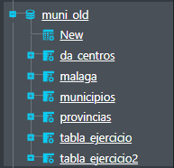

<li>Crea una nueva base de datos que se llame "muni_< iniciales >", con tus iniciales.</li>

```sql
create database muni_cms;
```

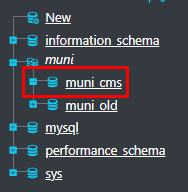

<li>En esta nueva base de datos, vas a cargar 3 tablas, que encontrarás en la plataforma:</li>

  - provincias
  - pueblos
  - da_centros

<p>Las importo desde MySQL Workbench.</p>

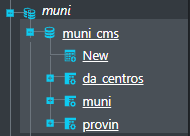

<li>Cambia el nombre de las tablas "pueblos" ("muni") y "da_centros". Pasan a llamarse "pu_< iniciales >" y "< iniciales >_centros".</li>

```sql
alter table `muni` rename column name to `pu_cms`;
alter table `da_centros` rename column name to `cms_centros`;
```

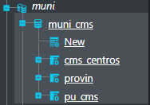

<li>Cambia el nombre de los campos "pu_cms.nombre_actual" (pasa a ser "nombre_< iniciales >") y "cms_centros.d_denomina" (pasa a ser "< iniciales >_denomina").</li>

```sql
alter table pu_cms change column `nombre_actual` `nombre_cms` text;
alter table cms_centros change column `d_denomina` `cms_denomina` text;
```


<p><b>2. Nuestro centro no se encuentra en el listado, ya que es del curso pasado. Añádelo.</b></p>

```sql
insert into cms_centros(curso, codigo, cms_denomina, d_especifica, d_tipo, d_domicilio, d_localidad, cod_municipio, d_municipio, d_provincia, c_postal, n_telefono, correo_e) values(22, 29020231, "Centro Público Integrado de Formación Profesional", "NUEVO (desglose IES Campanillas)", "Publico", "C. Frederick Terman, 3, 29590 Málaga", "Málaga", 29067, "Campanillas", "Málaga", 29590, 612345678, "example@gmail.com");
```

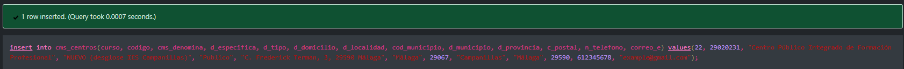

<p><b>3. Crea una tabla independiente, "centro_mal", que contenga todos los centros educativos de la provincia de Málaga.</b></p>

<p>Primero creo la tabla.</p>

```sql
create table centro_mal(`curso` int, `codigo` int, `cms_denomina` text, `d_especifica` text, `d_tipo` text, `d_domicilio` text, `d_localidad` text, `cod_municipio` int, `d_municipio` text, `d_provincia` text, `c_postal` int, `n_telefono` int, `correo_e` text, primary key(`codigo`));
```

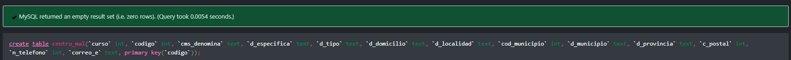

<p>Una vez creada la tabla con los campos, inserto los datos desde la tabla "cms_centros".</p>

```sql
insert into `centro_mal`(curso, codigo, cms_denomina, d_especifica, d_tipo, d_domicilio, d_localidad, cod_municipio, d_municipio, d_provincia, c_postal, n_telefono, correo_e) select `cms_centros`.* from cms_centros where d_provincia="málaga";
```

<p>Imagen de los datos introducidos en esta nueva tabla:</p>

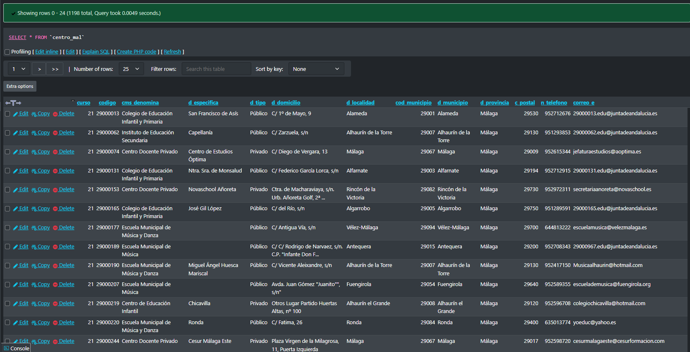

<p><b>4. Crea una tabla independiente con los datos de los municipios de Sevilla, pasa la superficie a km<sup>2</sup> sin perder información, modifica el campo "altitud" para que cumpla que todos estén entre 1 y 4000 m de altitud.</b></p>

<p>Primero creo la tabla, a la que he llamado "muni_sevi_cms".</p>

```sql
create table muni_sevi_cms(`id_pub` int, `cod_prov` int, `nombre_cms` text, `poblacion` int, `superficie` float, `perimetro` int, `cod_ine_capital` text, `capital` text, `poblacion_capital` int, `longitud_etrs89` text, `latitud_erts89` text, `altitud` int, primary key(`id_pub`));
```

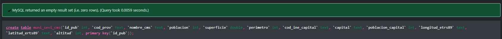

<p>Ahora inserto los datos de los municipios de Sevilla.</p>

```sql
insert into `muni_sevi_cms`(id_pub, cod_prov, nombre_cms, poblacion, superficie, perimetro, cod_ine_capital, capital, poblacion_capital, longitud_etrs89, latitud_erts89, altitud) select * from pu_cms inner join provin on pu_cms.cod_prov=provin.cod_prov where pu_cms.cod_prov=41;
```


<p><b>5. Crear un usuario con acceso limitado a la tabla "muni_sevi_cms".</b></p>

```sql
create user 'usuario_sevilla'@'localhost' identified by 'pass1234';

grant select on muni_cms.muni_sevi_cms to 'usuario_sevilla'@'localhost';
```

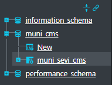

<p><b>6. Ordena por número de IES, de mayor a menor, agrupados por provincias.</b></p>

```sql
select * from cms_centros group by d_provincia order by codigo desc;
```

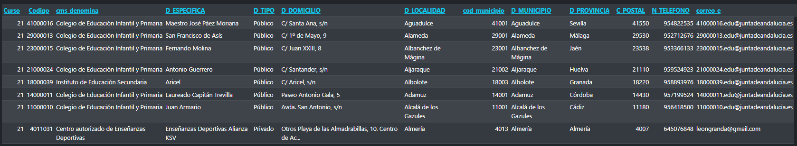

<p><b>7. Lista los centros educativos que haya en tu localidad de nacimiento, ordenados ascendentemente por nombre del centro.</b></p>

```sql
select * from cms_centros where d_localidad="málaga" order by d_especifica asc;
```

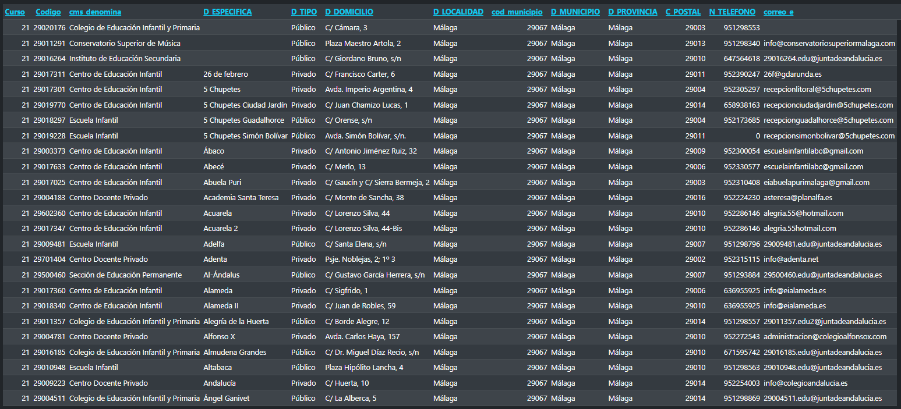

<p><b>8. Saca un listado de todos los municipios de la provincia de Sevilla, la población, y el número de centros educativos.</b></p>

```sql
select pu_cms.nombre_cms as "nombre", pu_cms.poblacion as "poblacion" from pu_cms inner join provin on provin.cod_prov=pu_cms.cod_prov where pu_cms.cod_prov=44;
```

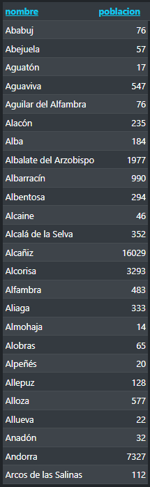

<p><b>9. Pon una tabla con el número de pueblos que comienzan por "A", "B" y "S" en la provincia de Sevilla.</b></p>

```sql
select sum(*) from pu_cms inner join provin on provin.cod_prov=pu_cms.cod_prov where(pu_cms.nombre_cms like 'A%' or `pu_cms`.nombre_cms like 'B%' or `pu_cms`.nombre_cms like 'S%') and pu_cms.cod_prov=41;
```


<p><b>10. ¿Cuáles son los pueblos con menor densidad poblacional de Teruel?</b></p>

```sql
select nombre_cms as "pueblos", poblacion/superficie as "densidad" from pu_cms where cod_prov=44;
```

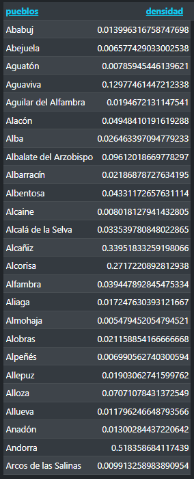

<p><b>11. Indicar los 10 municipios de España con mayor densidad poblacional, además del nombre del municipio, mostrar la provincia a la que pertenecen y la población, ordenados de mayor a menor por número de habitantes.</b></p>

```sql
select pu_cms.nombre_cms as "nombre", provin.provincia as "provincia", pu_cms.poblacion from pu_cms inner join provin on provin.cod_prov=pu_cms.cod_prov order by poblacion/superficie desc limit 10;
```

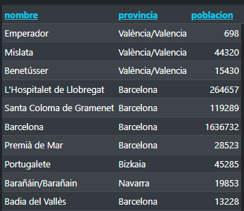

<p><b>12. ¿Cuál es la suma de la población de los 10 municipios con mayor número de habitantes de la Comunidad de Madrid?</b></p>

```sql
select sum(poblacion) as "suma" from pu_cms inner join provin on provin.cod_prov=pu_cms.cod_prov where pu_cms.cod_prov=28 limit 10;
```

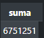

<p><b>13. ¿Qué pueblo en Andalucía tiene la mayor altura sobre el nivel del mar y una población mayor a 20 000 habitantes?</b></p>

```sql
select nombre_cms as "pueblo" from pu_cms where cod_prov in(4, 18, 29, 14, 23, 11, 21) and poblacion>20000 order by altitud desc limit 1;
```


<p><b>14. Lista los pueblos en la Comunidad Valenciana que tienen una altura sobre el nivel del mar menor a 200 metros y una población mayor a 5 000 habitantes, en orden descendente de número de habitantes (mostrar número de habitantes y altitud).</b></p>

```sql
select pu_cms.nombre_cms as "pueblos", pu_cms.poblacion "nº habitantes", pu_cms.altitud from pu_cms right join provin on provin.comunidad_autonoma="comunitat valenciana" where pu_cms.altitud<200 and pu_cms.poblacion>5000 order by poblacion desc;
```

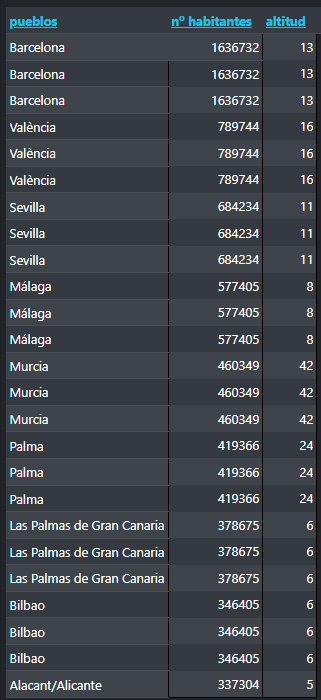

<p><b>15. ¿Qué porcentaje de la población total de la provincia de Navarra vive en pueblos con una superficie menor a 50 km<sup>2</sup> y una altura sobre el nivel del mar mayor a 400 metros?</b></p>

```sql

```


<p><b>16. ¿Cuál es la densidad poblacional de la Comunidad Valenciana?</b></p>

```sql
select sum(pu_cms.poblacion/pu_cms.superficie) as "densidad" from pu_cms right join provin on provin.comunidad_autonoma="comunitat valenciana";
```

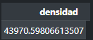

<p><b>17. Saca un listado de cada tipo de centro educativo y en 2 columnas diferentes. Diferenciar si es pública o privada y cuantos existen de cada. En caso de tener valor nulo, poner un 0.</b></p>

```sql

```

