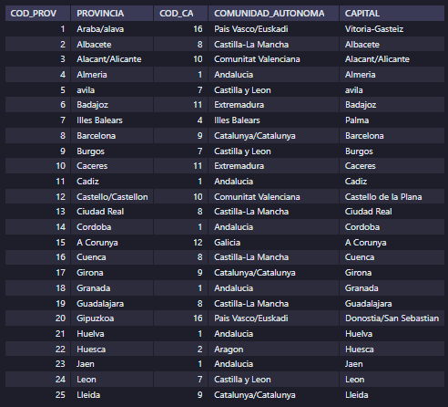
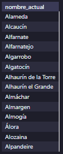
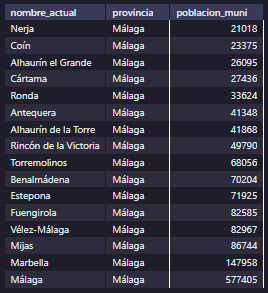

<style>
  h1{
    border: none;
    margin-bottom: 0px;
    text-align: center;
    font-weight: bold;
  }

  img{
    border: 2px solid black;
  }

  p{
    text-align: justify;
  }

  .slim-line{
    border: none;
    height: 1px;
    color: black;
    background-color: black;
  }

  h3{
    font-weight: bold;
  }
</style>

<h1>PUEBLOS DE ESPAÑA</h1>

<hr>

<p>Lo primero es crear la base de datos:</p>

```sql
create database tema4_ej6;

use tema4_ej6;
```

<p>Una vez seleccionada la base de datos, se crea la tabla "provincias".</p>

```sql
create table provincias(
	cod_prov int not null unique,
  provincia varchar(45) not null,
  cod_ca int not null,
  comunidad_autonoma varchar(35) not null,
  capital varchar(30) not null,
  primary key(cod_prov)
);
```


<p>Se importan los datos en esta tabla desde el archivo csv que nos hemos descargado. Debido a errores con este paso, decidimos eliminar la tabla y crearla a la hora de importar, pero utilizando MySQL Workbench.</p>


<p>Hay que tener en cuenta el tipo de codificación de los campos para admitir tildes, "ñ", etc. En mi caso, no he podido hacerlo de otra manera que no sea quitar absolutamente todos los caracteres que pudieran interferir del archivo csv.</p>



<p>Por último, se importa la tabla "municipios":</p>


<hr class="slim-line">

<h3>EJERCICIOS</h3>

<p><b>1. ¿Cuántos municipios tiene la provincia de Málaga?</b></p>

```sql
select count(*) from municipios where provincia="málaga";
```


<p><b>2. ¿Cuántos municipios tiene la provincia de Cádiz?</b></p>

```sql
select count(*) from municipios where provincia="cádiz";
```


<p><b>3. ¿Cuántos municipios tiene la provincia de Murcia?</b></p>

```sql
select count(*) from municipios where provincia="murcia";
```


<p><b>4. ¿Cuántos municipios tiene la provincia de Pontevedra?</b></p>

```sql
select count(*) from municipios where provincia="pontevedra";
```


<p><b>5. ¿Cuántos municipios tiene la provincia de La Rioja?</b></p>

```sql
select count(*) from municipios where provincia="la rioja";
```


<p><b>6. ¿Cuántos municipios tiene la provincia de Burgos?</b></p>

```sql
select count(*) from municipios where provincia="burgos";
```


<p><b>7. ¿Cuántos municipios tiene la provincia de Teruel?</b></p>

```sql
select count(*) from municipios where provincia="teruel";
```


<p><b>8. ¿Cuántos municipios tiene la provincia de Madrid?</b></p>

```sql
select count(*) from municipios where provincia="madrid";
```


<p><b>9. ¿Cuántos municipios tiene la provincia de Valencia?</b></p>

```sql
select count(*) from municipios where provincia="valència/valencia";
```


<p><b>10. ¿Cuántos municipios tiene la provincia de Albacete?</b></p>

```sql
select count(*) from municipios where provincia="albacete";
```


<p><b>11. Lista los municipios que tienen la provincia de Málaga que comienzan por la letra "A".</b></p>

```sql
select nombre_actual from municipios where provincia="málaga" and nombre_actual like "a%";
```


<p><b>12. Lista los municipios que tienen la provincia de Málaga que comienzan por la letra "B".</b></p>

```sql
select nombre_actual from municipios where provincia="málaga" and nombre_actual like "b%";
```


<p><b>13. Lista los municipios que tienen la provincia de Málaga que comienzan por la letra "C".</b></p>

```sql
select nombre_actual from municipios where provincia="málaga" and nombre_actual like "c%";
```


<p><b>14. Lista los municipios que tienen la provincia de Málaga que comienzan por la letra "M".</b></p>

```sql
select nombre_actual from municipios where provincia="málaga" and nombre_actual like "m%";
```


<p><b>15. Lista los municipios que tienen la provincia de Málaga que comienzan por "Al".</b></p>

```sql
select nombre_actual from municipios where provincia="málaga" and nombre_actual like "al%";
```



<p><b>16. Lista los municipios que tienen la provincia de Málaga que comienzan por "Bena".</b></p>

```sql
select nombre_actual from municipios where provincia="málaga" and nombre_actual like "bena%";
```


<p><b>17. Lista los municipios que comienzan por "Al".</b></p>

```sql
select nombre_actual from municipios where nombre_actual like "al%";
```


<p><b>18. ¿Cuántos municipios en España comienzan por "Al"?</b></p>

```sql
select count(*) from municipios where nombre_actual like "al%";
```


<p><b>19. Lista los municipios que comienzan por "Bena".</b></p>

```sql
select nombre_actual from municipios where nombre_actual like "bena%";
```


<p><b>20. ¿Cuántos municipios en España comienzan por "Bena"?</b></p>

```sql
select count(*) from municipios where nombre_actual like "h%";
```


<p><b>21. Lista los municipios que contienen la palabra "puerto" por orden descendente, incluyendo su provincia.</b></p>

```sql
select nombre_actual, provincia from municipios where nombre_actual like "%puerto%" order by 1 desc;
```


<p>* Terminé de importar las 3 tablas restantes.</p>

<p><b>22. Haz una consulta para cada una de las palabras que pone a continuación de manera que incluyan dentro del nombre del municipio la palabra "xx" incluyendo su provincia.</b></p>

<p><b>a. Jerez</b></p>

```sql
select nombre_actual, provincia from municipios where nombre_actual like "%jerez%"
```


<p><b>b. Frontera</b></p>

```sql
select nombre_actual, provincia from municipios where nombre_actual like "%frontera%"
```


<p><b>c. Marquesado</b></p>

```sql
select nombre_actual, provincia from municipios where nombre_actual like "%marquesado%"
```


<p><b>d. Santa</b></p>

```sql
select nombre_actual, provincia from municipios where nombre_actual like "%santa%"
```


<p><b>e. Casa</b></p>

```sql
select nombre_actual, provincia from municipios where nombre_actual like "%casa%"
```


<p><b>f. Villa</b></p>

```sql
select nombre_actual, provincia from municipios where nombre_actual like "%villa%"
```


<p><b>g. Cabeza</b></p>

```sql
select nombre_actual, provincia from municipios where nombre_actual like "%cabeza%"
```


<p><b>h. Cuevas</b></p>

```sql
select nombre_actual, provincia from municipios where nombre_actual like "%cuevas%"
```


<p><b>i. Dios</b></p>

```sql
select nombre_actual, provincia from municipios where nombre_actual like "%dios%"
```


<p><b>j. Barco</b></p>

```sql
select nombre_actual, provincia from municipios where nombre_actual like "%barco%"
```


<p><b>k. Pepe</b></p>

```sql
select nombre_actual, provincia from municipios where nombre_actual like "%pepe%"
```


<p><b>l. Naval</b></p>

```sql
select nombre_actual, provincia from municipios where nombre_actual like "%naval%"
```


<p><b>m. Pajares</b></p>

```sql
select nombre_actual, provincia from municipios where nombre_actual like "%pajares%"
```


<p><b>n. Empiece por "San"</b></p>

```sql
select nombre_actual, provincia from municipios where nombre_actual like "san%"
```


<p><b>o. Santi</b></p>

```sql
select nombre_actual, provincia from municipios where nombre_actual like "%santi%"
```


<p><b>p. María</b></p>

```sql
select nombre_actual, provincia from municipios where nombre_actual like "%maría%"
```


<p><b>q. Zapa</b></p>

```sql
select nombre_actual, provincia from municipios where nombre_actual like "%zapa%"
```


<p><b>r. Haba</b></p>

```sql
select nombre_actual, provincia from municipios where nombre_actual like "%haba%"
```


<p><b>s. León</b></p>

```sql
select nombre_actual, provincia from municipios where nombre_actual like "%león%"
```


<p><b>t. Torre</b></p>

```sql
select nombre_actual, provincia from municipios where nombre_actual like "%torre%"
```


<p><b>u. Mata</b></p>

```sql
select nombre_actual, provincia from municipios where nombre_actual like "%mata%"
```


<p><b>v. Verde</b></p>

```sql
select nombre_actual, provincia from municipios where nombre_actual like "%verde%"
```


<p><b>w. Oliva</b></p>

```sql
select nombre_actual, provincia from municipios where nombre_actual like "%oliva%"
```


<p><b>x. Puebla</b></p>

```sql
select nombre_actual, provincia from municipios where nombre_actual like "%puebla%"
```


<p><b>y. Higuera</b></p>

```sql
select nombre_actual, provincia from municipios where nombre_actual like "%higuera%"
```


<p><b>z. Feria</b></p>

```sql
select nombre_actual, provincia from municipios where nombre_actual like "%feria%"
```


<p><b>23. ¿Cuántos municipios hay que contengan las palabras que se indican? Haz una consulta para cada uno. Haz una consulta para cada una de las palabras que pone a continuación.</b></p>

<p><b>a. Jerez</b></p>

```sql
select count(*) from municipios where nombre_actual like "%jerez%";
```


<p><b>b. Frontera</b></p>

```sql
select count(*) from municipios where nombre_actual like "%frontera%";
```


<p><b>c. Marquesado</b></p>

```sql
select count(*) from municipios where nombre_actual like "%marquesado%";
```


<p><b>d. Santa</b></p>

```sql
select count(*) from municipios where nombre_actual like "%santa%";
```


<p><b>e. Casa</b></p>

```sql
select count(*) from municipios where nombre_actual like "%casa%";
```


<p><b>f. Villa</b></p>

```sql
select count(*) from municipios where nombre_actual like "%villa%";
```


<p><b>g. Cabeza</b></p>

```sql
select count(*) from municipios where nombre_actual like "%cabeza%";
```


<p><b>h. Cuevas</b></p>

```sql
select count(*) from municipios where nombre_actual like "%cuevas%";
```


<p><b>i. Dios</b></p>

```sql
select count(*) from municipios where nombre_actual like "%dios%";
```


<p><b>j. Barco</b></p>

```sql
select count(*) from municipios where nombre_actual like "%barco%";
```


<p><b>k. Pepe</b></p>

```sql
select count(*) from municipios where nombre_actual like "%pepe%";
```


<p><b>l. Naval</b></p>

```sql
select count(*) from municipios where nombre_actual like "%naval%";
```


<p><b>m. Pajares</b></p>

```sql
select count(*) from municipios where nombre_actual like "%pajares%";
```


<p><b>n. Empiece por "San"</b></p>

```sql
select count(*) from municipios where nombre_actual like "san%";
```


<p><b>o. Santi</b></p>

```sql
select count(*) from municipios where nombre_actual like "%santi%";
```


<p><b>p. María</b></p>

```sql
select count(*) from municipios where nombre_actual like "%maría%";
```


<p><b>q. Zapa</b></p>

```sql
select count(*) from municipios where nombre_actual like "%zapa%";
```


<p><b>r. Haba</b></p>

```sql
select count(*) from municipios where nombre_actual like "%haba%";
```


<p><b>s. León</b></p>

```sql
select count(*) from municipios where nombre_actual like "%león%";
```


<p><b>t. Torre</b></p>

```sql
select count(*) from municipios where nombre_actual like "%torre%";
```


<p><b>u. Mata</b></p>

```sql
select count(*) from municipios where nombre_actual like "%mata%";
```


<p><b>v. Verde</b></p>

```sql
select count(*) from municipios where nombre_actual like "%verde%";
```


<p><b>w. Vallès</b></p>

```sql
select count(*) from municipios where nombre_actual like "%vallès%";
```


<p><b>x. Higuera</b></p>

```sql
select count(*) from municipios where nombre_actual like "%higuera%";
```


<p><b>y. Puebla</b></p>

```sql
select count(*) from municipios where nombre_actual like "%puebla%";
```


<p><b>z. Peña</b></p>

```sql
select count(*) from municipios where nombre_actual like "%peña%";
```


<p><b>24. ¿Cuál es el municipio con mayor extensión de España?</b></p>

<p>Lo primero es cambiar el tipo de dato del campo "superficie", ya que es texto, y debe ser decimal.</p>

```sql
alter table `tema4_ej6`.`municipios` change column `superficie` `superficie` decimal(12, 2) null default null;
```

<p>Ahora se puede obtener el resultado correctamente:</p>

```sql
select nombre_actual, provincia, superficie from municipios order by 3 desc limit 1;
```


<p><b>25. Haz una consulta para cada una de las provincias. Debes indicar el nombre del municipio, provincia y superficie. ¿Cuál es el municipio de mayor extensión de cada una de estas provincias?</b></p>

<p><b>a. Almería</b></p>

```sql
select nombre_actual, provincia, superficie from municipios where provincia="almeria" order by 3 desc limit 1;
```


<p><b>b. Granada</b></p>

```sql
select nombre_actual, provincia, superficie from municipios where provincia="granada" order by 3 desc limit 1;
```


<p><b>c. Jaén</b></p>

```sql
select nombre_actual, provincia, superficie from municipios where provincia="jaén" order by 3 desc limit 1;
```


<p><b>d. Córdoba</b></p>

```sql
select nombre_actual, provincia, superficie from municipios where provincia="córdoba" order by 3 desc limit 1;
```


<p><b>e. Sevilla</b></p>

```sql
select nombre_actual, provincia, superficie from municipios where provincia="sevilla" order by 3 desc limit 1;
```


<p><b>f. Huelva</b></p>

```sql
select nombre_actual, provincia, superficie from municipios where provincia="huelva" order by 3 desc limit 1;
```


<p><b>g. Cádiz</b></p>

```sql
select nombre_actual, provincia, superficie from municipios where provincia="cádiz" order by 3 desc limit 1;
```


<p><b>h. Málaga</b></p>

```sql
select nombre_actual, provincia, superficie from municipios where provincia="málaga" order by 3 desc limit 1;
```


<p><b>i. Madrid</b></p>

```sql
select nombre_actual, provincia, superficie from municipios where provincia="madrid" order by 3 desc limit 1;
```


<p><b>j. Barcelona</b></p>

```sql
select nombre_actual, provincia, superficie from municipios where provincia="barcelona" order by 3 desc limit 1;
```


<p><b>k. Huesca</b></p>

```sql
select nombre_actual, provincia, superficie from municipios where provincia="huesca" order by 3 desc limit 1;
```


<p><b>l. León</b></p>

```sql
select nombre_actual, provincia, superficie from municipios where provincia="león" order by 3 desc limit 1;
```


<p><b>m. Albacete</b></p>

```sql
select nombre_actual, provincia, superficie from municipios where provincia="albacete" order by 3 desc limit 1;
```


<p><b>n. Girona</b></p>

```sql
select nombre_actual, provincia, superficie from municipios where provincia="girona" order by 3 desc limit 1;
```


<p><b>o. Islas Baleares</b></p>

```sql
select nombre_actual, provincia, superficie from municipios where provincia="illes balears" order by 3 desc limit 1;
```


<p><b>26. Respite para las provincias anteriores pero buscando el de menor extensión.</b></p>

<p><b>a. Almería</b></p>

```sql
select nombre_actual, provincia, superficie from municipios where provincia="almeria" order by 3 asc limit 1;
```


<p><b>b. Granada</b></p>

```sql
select nombre_actual, provincia, superficie from municipios where provincia="granada" order by 3 asc limit 1;
```


<p><b>c. Jaén</b></p>

```sql
select nombre_actual, provincia, superficie from municipios where provincia="jaén" order by 3 asc limit 1;
```


<p><b>d. Córdoba</b></p>

```sql
select nombre_actual, provincia, superficie from municipios where provincia="córdoba" order by 3 asc limit 1;
```


<p><b>e. Sevilla</b></p>

```sql
select nombre_actual, provincia, superficie from municipios where provincia="sevilla" order by 3 asc limit 1;
```


<p><b>f. Huelva</b></p>

```sql
select nombre_actual, provincia, superficie from municipios where provincia="huelva" order by 3 asc limit 1;
```


<p><b>g. Cádiz</b></p>

```sql
select nombre_actual, provincia, superficie from municipios where provincia="cádiz" order by 3 asc limit 1;
```


<p><b>h. Málaga</b></p>

```sql
select nombre_actual, provincia, superficie from municipios where provincia="málaga" order by 3 asc limit 1;
```


<p><b>i. Madrid</b></p>

```sql
select nombre_actual, provincia, superficie from municipios where provincia="madrid" order by 3 asc limit 1;
```


<p><b>j. Barcelona</b></p>

```sql
select nombre_actual, provincia, superficie from municipios where provincia="barcelona" order by 3 asc limit 1;
```


<p><b>k. Huesca</b></p>

```sql
select nombre_actual, provincia, superficie from municipios where provincia="huesca" order by 3 asc limit 1;
```


<p><b>l. León</b></p>

```sql
select nombre_actual, provincia, superficie from municipios where provincia="león" order by 3 asc limit 1;
```


<p><b>m. Albacete</b></p>

```sql
select nombre_actual, provincia, superficie from municipios where provincia="albacete" order by 3 asc limit 1;
```


<p><b>n. Girona</b></p>

```sql
select nombre_actual, provincia, superficie from municipios where provincia="girona" order by 3 asc limit 1;
```


<p><b>o. Islas Baleares</b></p>

```sql
select nombre_actual, provincia, superficie from municipios where provincia="illes balears" order by 3 asc limit 1;
```


<p><b>27. Busca la de mayor población en cada una de las provincias de la cuestión 25.</b></p>

<p><b>a. Almería</b></p>

```sql
select nombre_actual, provincia, poblacion_muni from municipios where provincia="almeria" order by 3 desc limit 1;
```


<p><b>b. Granada</b></p>

```sql
select nombre_actual, provincia, poblacion_muni from municipios where provincia="granada" order by 3 desc limit 1;
```


<p><b>c. Jaén</b></p>

```sql
select nombre_actual, provincia, poblacion_muni from municipios where provincia="jaén" order by 3 desc limit 1;
```


<p><b>d. Córdoba</b></p>

```sql
select nombre_actual, provincia, poblacion_muni from municipios where provincia="córdoba" order by 3 desc limit 1;
```


<p><b>e. Sevilla</b></p>

```sql
select nombre_actual, provincia, poblacion_muni from municipios where provincia="sevilla" order by 3 desc limit 1;
```


<p><b>f. Huelva</b></p>

```sql
select nombre_actual, provincia, poblacion_muni from municipios where provincia="huelva" order by 3 desc limit 1;
```


<p><b>g. Cádiz</b></p>

```sql
select nombre_actual, provincia, poblacion_muni from municipios where provincia="cádiz" order by 3 desc limit 1;
```


<p><b>h. Málaga</b></p>

```sql
select nombre_actual, provincia, poblacion_muni from municipios where provincia="málaga" order by 3 desc limit 1;
```


<p><b>i. Madrid</b></p>

```sql
select nombre_actual, provincia, poblacion_muni from municipios where provincia="madrid" order by 3 desc limit 1;
```


<p><b>j. Barcelona</b></p>

```sql
select nombre_actual, provincia, poblacion_muni from municipios where provincia="barcelona" order by 3 desc limit 1;
```


<p><b>k. Huesca</b></p>

```sql
select nombre_actual, provincia, poblacion_muni from municipios where provincia="huesca" order by 3 desc limit 1;
```


<p><b>l. León</b></p>

```sql
select nombre_actual, provincia, poblacion_muni from municipios where provincia="león" order by 3 desc limit 1;
```


<p><b>m. Albacete</b></p>

```sql
select nombre_actual, provincia, poblacion_muni from municipios where provincia="albacete" order by 3 desc limit 1;
```


<p><b>n. Girona</b></p>

```sql
select nombre_actual, provincia, poblacion_muni from municipios where provincia="girona" order by 3 desc limit 1;
```


<p><b>o. Islas Baleares</b></p>

```sql
select nombre_actual, provincia, poblacion_muni from municipios where provincia="illes balears" order by 3 desc limit 1;
```


<p><b>28. ¿Cuál sería la de menor población en cada una de esas provincias?</b></p>

<p><b>a. Almería</b></p>

```sql
select nombre_actual, provincia, poblacion_muni from municipios where provincia="almeria" order by 3 asc limit 1;
```


<p><b>b. Granada</b></p>

```sql
select nombre_actual, provincia, poblacion_muni from municipios where provincia="granada" order by 3 asc limit 1;
```


<p><b>c. Jaén</b></p>

```sql
select nombre_actual, provincia, poblacion_muni from municipios where provincia="jaén" order by 3 asc limit 1;
```


<p><b>d. Córdoba</b></p>

```sql
select nombre_actual, provincia, poblacion_muni from municipios where provincia="córdoba" order by 3 asc limit 1;
```


<p><b>e. Sevilla</b></p>

```sql
select nombre_actual, provincia, poblacion_muni from municipios where provincia="sevilla" order by 3 asc limit 1;
```


<p><b>f. Huelva</b></p>

```sql
select nombre_actual, provincia, poblacion_muni from municipios where provincia="huelva" order by 3 asc limit 1;
```


<p><b>g. Cádiz</b></p>

```sql
select nombre_actual, provincia, poblacion_muni from municipios where provincia="cádiz" order by 3 asc limit 1;
```


<p><b>h. Málaga</b></p>

```sql
select nombre_actual, provincia, poblacion_muni from municipios where provincia="málaga" order by 3 asc limit 1;
```


<p><b>i. Madrid</b></p>

```sql
select nombre_actual, provincia, poblacion_muni from municipios where provincia="madrid" order by 3 asc limit 1;
```


<p><b>j. Barcelona</b></p>

```sql
select nombre_actual, provincia, poblacion_muni from municipios where provincia="barcelona" order by 3 asc limit 1;
```


<p><b>k. Huesca</b></p>

```sql
select nombre_actual, provincia, poblacion_muni from municipios where provincia="huesca" order by 3 asc limit 1;
```


<p><b>l. León</b></p>

```sql
select nombre_actual, provincia, poblacion_muni from municipios where provincia="león" order by 3 asc limit 1;
```


<p><b>m. Albacete</b></p>

```sql
select nombre_actual, provincia, poblacion_muni from municipios where provincia="albacete" order by 3 asc limit 1;
```


<p><b>n. Girona</b></p>

```sql
select nombre_actual, provincia, poblacion_muni from municipios where provincia="girona" order by 3 asc limit 1;
```


<p><b>o. Islas Baleares</b></p>

```sql
select nombre_actual, provincia, poblacion_muni from municipios where provincia="illes balears" order by 3 asc limit 1;
```


<p><b>29. La legislación española considera municipios con capacidad de autogestión de todos los servicios a partir de 20 000 habitantes. Para los de menor población depende algunos de os servicios de las diputaciones provinciales. Lista, para una de las provincias anteriores, las poblaciones que tengan una población mayor a partir de 20 000 habitantes, ordenadas ascendentemente por la población del municipio.</b></p>

```sql
select nombre_actual, provincia, poblacion_muni from municipios where provincia="málaga" and poblacion_muni>=20000 order by 3 asc;
```



<p><b>30. ¿Cuántos municipios están bajo el paraguas de las diputaciones para cada provincia?</b></p>

<p><b>a. Almería</b></p>

```sql
select count(nombre_actual), provincia from municipios where provincia="almería" and poblacion_muni<20000;
```


<p><b>b. Granada</b></p>

```sql
select count(nombre_actual), provincia from municipios where provincia="granada" and poblacion_muni<20000;
```


<p><b>c. Jaén</b></p>

```sql
select count(nombre_actual), provincia from municipios where provincia="jaén" and poblacion_muni<20000;
```


<p><b>d. Córdoba</b></p>

```sql
select count(nombre_actual), provincia from municipios where provincia="córdoba" and poblacion_muni<20000;
```


<p><b>e. Sevilla</b></p>

```sql
select count(nombre_actual), provincia from municipios where provincia="sevilla" and poblacion_muni<20000;
```


<p><b>f. Huelva</b></p>

```sql
select count(nombre_actual), provincia from municipios where provincia="huelva" and poblacion_muni<20000;
```


<p><b>g. Cádiz</b></p>

```sql
select count(nombre_actual), provincia from municipios where provincia="cádiz" and poblacion_muni<20000;
```


<p><b>h. Málaga</b></p>

```sql
select count(nombre_actual), provincia from municipios where provincia="málaga" and poblacion_muni<20000;
```


<p><b>i. Madrid</b></p>

```sql
select count(nombre_actual), provincia from municipios where provincia="madrid" and poblacion_muni<20000;
```


<p><b>j. Barcelona</b></p>

```sql
select count(nombre_actual), provincia from municipios where provincia="barcelona" and poblacion_muni<20000;
```


<p><b>k. Huesca</b></p>

```sql
select count(nombre_actual), provincia from municipios where provincia="huesca" and poblacion_muni<20000;
```


<p><b>l. León</b></p>

```sql
select count(nombre_actual), provincia from municipios where provincia="león" and poblacion_muni<20000;
```


<p><b>m. Albacete</b></p>

```sql
select count(nombre_actual), provincia from municipios where provincia="albacete" and poblacion_muni<20000;
```


<p><b>n. Girona</b></p>

```sql
select count(nombre_actual), provincia from municipios where provincia="girona" and poblacion_muni<20000;
```


<p><b>o. Islas Baleares</b></p>

```sql
select count(nombre_actual), provincia from municipios where provincia="illes balears" and poblacion_muni<20000;
```


<p><b>31. Calcula la superficie de la provincia de Murcia.</b></p>

```sql
select sum(superficie) from municipios where provincia="murcia";
```


<p><b>32. Calcula la superficie de cada una de las siguientes provincias:</b></p>

<p><b>a. Araba/Álava</b></p>

```sql
select sum(superficie) from municipios where provincia="araba/álava";
```


<p><b>b. Alacant/Alicante</b></p>

```sql
select sum(superficie) from municipios where provincia="alacant/alicante";
```

