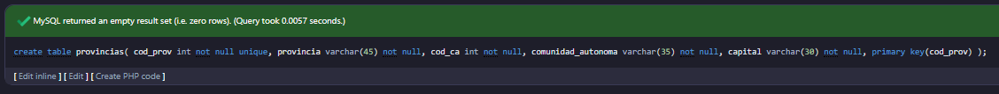
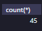
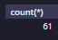
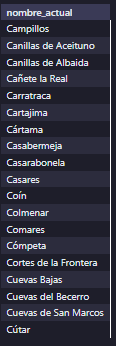
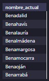
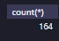
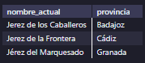
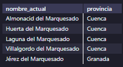

<style>
  h1{
    border: none;
    margin-bottom: 0px;
    text-align: center;
    font-weight: bold;
  }

  img{
    border: 2px solid black;
  }

  p{
    text-align: justify;
  }

  .slim-line{
    border: none;
    height: 1px;
    color: black;
    background-color: black;
  }

  h3{
    font-weight: bold;
  }
</style>

<h1>PUEBLOS DE ESPAÑA</h1>

<hr>

<p>Lo primero es crear la base de datos:</p>

```sql
create database tema4_ej6;

use tema4_ej6;
```

<p>Una vez seleccionada la base de datos, se crea la tabla "provincias".</p>

```sql
create table provincias(
	cod_prov int not null unique,
  provincia varchar(45) not null,
  cod_ca int not null,
  comunidad_autonoma varchar(35) not null,
  capital varchar(30) not null,
  primary key(cod_prov)
);
```



<p>Se importan los datos en esta tabla desde el archivo csv que nos hemos descargado. Debido a errores con este paso, decidimos eliminar la tabla y crearla a la hora de importar, pero utilizando MySQL Workbench.</p>


<p>Hay que tener en cuenta el tipo de codificación de los campos para admitir tildes, "ñ", etc. En mi caso, no he podido hacerlo de otra manera que no sea quitar absolutamente todos los caracteres que pudieran interferir del archivo csv.</p>


<p>Por último, se importa la tabla "municipios":</p>


<hr class="slim-line">

<h3>EJERCICIOS</h3>

<p><b>1. ¿Cuántos municipios tiene la provincia de Málaga?</b></p>

```sql
select count(*) from municipios where provincia="málaga";
```


<p><b>2. ¿Cuántos municipios tiene la provincia de Cádiz?</b></p>

```sql
select count(*) from municipios where provincia="cádiz";
```



<p><b>3. ¿Cuántos municipios tiene la provincia de Murcia?</b></p>

```sql
select count(*) from municipios where provincia="murcia";
```


<p><b>4. ¿Cuántos municipios tiene la provincia de Pontevedra?</b></p>

```sql
select count(*) from municipios where provincia="pontevedra";
```



<p><b>5. ¿Cuántos municipios tiene la provincia de La Rioja?</b></p>

```sql
select count(*) from municipios where provincia="la rioja";
```


<p><b>6. ¿Cuántos municipios tiene la provincia de Burgos?</b></p>

```sql
select count(*) from municipios where provincia="burgos";
```


<p><b>7. ¿Cuántos municipios tiene la provincia de Teruel?</b></p>

```sql
select count(*) from municipios where provincia="teruel";
```


<p><b>8. ¿Cuántos municipios tiene la provincia de Madrid?</b></p>

```sql
select count(*) from municipios where provincia="madrid";
```


<p><b>9. ¿Cuántos municipios tiene la provincia de Valencia?</b></p>

```sql
select count(*) from municipios where provincia="valència/valencia";
```


<p><b>10. ¿Cuántos municipios tiene la provincia de Albacete?</b></p>

```sql
select count(*) from municipios where provincia="albacete";
```


<p><b>11. Lista los municipios que tienen la provincia de Málaga que comienzan por la letra "A".</b></p>

```sql
select nombre_actual from municipios where provincia="málaga" and nombre_actual like "a%";
```


<p><b>12. Lista los municipios que tienen la provincia de Málaga que comienzan por la letra "B".</b></p>

```sql
select nombre_actual from municipios where provincia="málaga" and nombre_actual like "b%";
```


<p><b>13. Lista los municipios que tienen la provincia de Málaga que comienzan por la letra "C".</b></p>

```sql
select nombre_actual from municipios where provincia="málaga" and nombre_actual like "c%";
```



<p><b>14. Lista los municipios que tienen la provincia de Málaga que comienzan por la letra "M".</b></p>

```sql
select nombre_actual from municipios where provincia="málaga" and nombre_actual like "m%";
```


<p><b>15. Lista los municipios que tienen la provincia de Málaga que comienzan por "Al".</b></p>

```sql
select nombre_actual from municipios where provincia="málaga" and nombre_actual like "al%";
```


<p><b>16. Lista los municipios que tienen la provincia de Málaga que comienzan por "Bena".</b></p>

```sql
select nombre_actual from municipios where provincia="málaga" and nombre_actual like "bena%";
```



<p><b>17. Lista los municipios que comienzan por "Al".</b></p>

```sql
select nombre_actual from municipios where nombre_actual like "al%";
```


<p><b>18. ¿Cuántos municipios en España comienzan por "Al"?</b></p>

```sql
select count(*) from municipios where nombre_actual like "al%";
```


<p><b>19. Lista los municipios que comienzan por "Bena".</b></p>

```sql
select nombre_actual from municipios where nombre_actual like "bena%";
```


<p><b>20. ¿Cuántos municipios en España comienzan por "Bena"?</b></p>

```sql
select count(*) from municipios where nombre_actual like "h%";
```



<p><b>21. Lista los municipios que contienen la palabra "puerto" por orden descendente, incluyendo su provincia.</b></p>

```sql
select nombre_actual, provincia from municipios where nombre_actual like "%puerto%" order by 1 desc;
```


<p>* Terminé de importar las 3 tablas restantes.</p>

<p><b>22. Haz una consulta para cada una de las palabras que pone a continuación de manera que incluyan dentro del nombre del municipio la palabra "xx" incluyendo su provincia.</b></p>

<p><b>a. Jerez</b></p>

```sql
select nombre_actual, provincia from municipios where nombre_actual like "%jerez%"
```



<p><b>b. Frontera</b></p>

```sql
select nombre_actual, provincia from municipios where nombre_actual like "%frontera%"
```


<p><b>c. Marquesado</b></p>

```sql
select nombre_actual, provincia from municipios where nombre_actual like "%marquesado%"
```



<p><b>d. Santa</b></p>

```sql
select nombre_actual, provincia from municipios where nombre_actual like "%santa%"
```


<p><b>e. Casa</b></p>

```sql
select nombre_actual, provincia from municipios where nombre_actual like "%casa%"
```


<p><b>f. Villa</b></p>

```sql
select nombre_actual, provincia from municipios where nombre_actual like "%villa%"
```


<p><b>g. Cabeza</b></p>

```sql
select nombre_actual, provincia from municipios where nombre_actual like "%cabeza%"
```


<p><b>h. Cuevas</b></p>

```sql
select nombre_actual, provincia from municipios where nombre_actual like "%cuevas%"
```


<p><b>i. Dios</b></p>

```sql
select nombre_actual, provincia from municipios where nombre_actual like "%dios%"
```


<p><b>j. Barco</b></p>

```sql
select nombre_actual, provincia from municipios where nombre_actual like "%barco%"
```


<p><b>k. Pepe</b></p>

```sql
select nombre_actual, provincia from municipios where nombre_actual like "%pepe%"
```


<p><b>l. Naval</b></p>

```sql
select nombre_actual, provincia from municipios where nombre_actual like "%naval%"
```


<p><b>m. Pajares</b></p>

```sql
select nombre_actual, provincia from municipios where nombre_actual like "%pajares%"
```


<p><b>n. Empiece por "San"</b></p>

```sql
select nombre_actual, provincia from municipios where nombre_actual like "san%"
```

