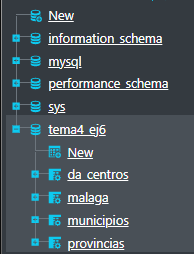
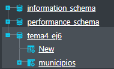
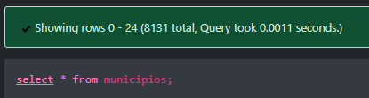

<style>
  h1{
    text-align: center;
    font-weight: bold;
    border: none;
    margin-bottom: 0px;
  }

  p{
    text-align: justify;
  }

  img{
    border: 2px solid black;
  }

  #ex{
    border: none;
  }
</style>

<h1>CREACIÓN DE USUARIOS</h1>

<hr>

<p><b>1. Crear un usuario con acceso a todo.</b></p>

```sql
create user 'test_user1'@'localhost' identified by 'password1234';
```

```sql
grant all privileges on *.* to 'test_user1'@'localhost' with grant option;
```

<p>Este usuario es un superusuario.</p>



<p><b>2. Crear un usuario con acceso a una base de datos específica.</b></p>

```sql
create user 'test_user2'@'localhost' identified by 'password1234';
```

```sql
grant all privileges on tema4_ej6.* to 'test_user2'@'localhost' with grant option;
```

<p>Este usuario solo puede acceder a la base de datos "tema4_ej6".</p>


<p><b>3. Crear un usuario con acceso limitado a una tabla específica.</b></p>

```sql
create user 'test_user3'@'localhost' identified by 'password1234';
```

```sql
grant select, insert, update on tema4_ej6.municipios to 'test_user3'@'localhost';
```

<p>Este usuario solo tiene acceso a la tabla "municipios", además de poder ejecutar los comandos especificados.</p>



<p>Aquí se ve como puede hacer selects, por ejemplo:</p>



<p><b>4. </b></p>

<p><b>5. Quitar los privilegios de un usuario.</b></p>

```sql
revoke all privileges on *.* from 'test_user3'@'localhost';
```