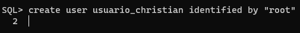
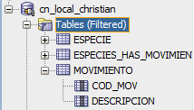
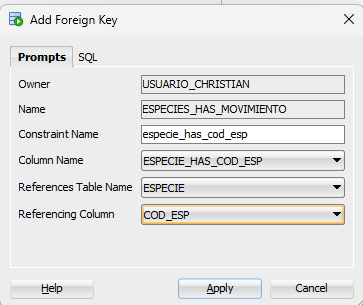
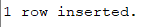
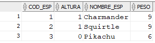

<style>
  h1, h4{
    text-align: center;
    font-weight: bold;
    border: none;
    margin-bottom: 0px;
  }

  p{
    text-align: justify;
  }

  img{
    border: 2px solid black;
  }

  #ex{
    border: none;
  }
</style>

<h1>POKÉMON</h1>

<h4>CHRISTIAN MILLÁN SORIA</h4>

<hr>

<p>Para empezar, es necesario crear un usuario personal con el que se va a trabajar. Abro el SQL Plus.</p>


<p>Una vez dentro del terminal, ejecuto la siguiente línea para entrar como el usuario "sysdba":</p>

```bash
/as sysdba
```


<p>Modifico la sesión para que me permita trabajar de la forma correcta.</p>

```bash
alter session set "_oracle_script"=true;
```


<p>Comienzo creando el usuario nuevo con contraseña "root".</p>

```bash
create user usuario_christian identified by "root"
```



<p>Ejecuto las siguientes instrucciones por separado para terminar la configuración del usuario:</p>

```bash
default tablespace "USERS"
```

```bash
temporary tablespace "TEMP";
```


<p>Lo siguiente es darle privilegios/permisos al usuario nuevo.</p>

```bash
alter user usuario_christian quota unlimited on USERS;
```


<p>Modifico la accesibilidad del usuario.</p>

```bash
grant create session to usuario_christian;
```


<p>Establecemos algunas configuraciones adicionales:</p>

```bash
grant "RESOURCE" to usuario_christian;
```


```bash
alter user usuario_christian default role "RESOURCE";
```


```bash
grant create tablespace to usuario_christian;
```


<p>Una vez creado y configurado el usuario, genero la conexión en el entorno gráfico.</p>


<p>Ahora paso a la creación de tablas de Pokémon.</p>

```sql
create table especie(cod_esp int not null, altura int not null, nombre_esp varchar(45) not null, peso int not null, primary key (cod_esp));
```


```sql
create table movimiento(cod_mov int not null, descripcion varchar(100) not null, primary key(cod_mov));
```



```sql
create table especies_has_movimiento(especie_has_cod_esp int not null, movimiento_cod_mov int not null, primary key (especie_has_cod_esp, movimiento_cod_mov));
```


<p>Añado las claves foráneas.</p>




<p>Paso a insertar 3 Pokémons.</p>

<li>Pokémon 1</li>

```sql
insert into especie(cod_esp, altura, nombre_esp, peso) values(1, 0.6, 'Charmander', 8.5);

insert into movimiento(cod_mov, descripcion) values(1, 'Ascuas');
insert into movimiento(cod_mov, descripcion) values(2, 'Garra Dragón');

insert into especies_has_movimiento(especies_has_cod_esp, movimiento_cod_mov) values(1, 1);
insert into especies_has_movimiento(especies_has_cod_esp, movimiento_cod_mov) values(1, 2);
```



<li>Pokémon 2</li>

```sql
insert into especie(cod_esp, altura, nombre_esp, peso) values(2, 1.1, 'Squirtle', 9.0);

insert into movimiento(cod_mov, descripcion) values(3, 'Pistola Agua');
insert into movimiento(cod_mov, descripcion) values(4, 'Mordisco');

insert into especies_has_movimiento(especies_has_cod_esp, movimiento_cod_mov) values(2, 3);
insert into especies_has_movimiento(especies_has_cod_esp, movimiento_cod_mov) values(2, 4);
```


<li>Pokémon 3</li>

```sql
insert into especie(cod_esp, altura, nombre_esp, peso) values(3, 0.4, 'Pikachu', 6.0);

insert into movimiento(cod_mov, descripcion) values(5, 'Impactrueno');
insert into movimiento(cod_mov, descripcion) values(6, 'Bola Voltio');

insert into especies_has_movimiento(especies_has_cod_esp, movimiento_cod_mov) values(3, 5);
insert into especies_has_movimiento(especies_has_cod_esp, movimiento_cod_mov) values(3, 6);
```


<p>*Las especies y los movimientos se me insertan correctamente, pero al intentar insertar un registro en la tabla con las claves foráneas se me produce el siguiente error siempre. No he conseguido arreglarlo después de probar muchas opciones diferentes, por lo que no puedo realizar la última consulta de esta tarea:</p>


<p>Lista de los tipos de Pokémons.</p>

```sql
select * from especie;
```



<p>Lista de los tipos de movimientos.</p>

```sql
select * from movimiento;
```


<p>Lista un movimiento y cuáles de los Pokémons lo usan.</p>

```sql

```

