<style>
  h1, h4{
    text-align: center;
    font-weight: bold;
    border: none;
    margin-bottom: 0px;
  }

  p{
    text-align: justify;
  }

  img{
    border: 2px solid black;
  }

  #ex{
    border: none;
  }
</style>

<h1>REPASO EXAMEN</h1>

<h4>CHRISTIAN MILLÁN SORIA</h4>

<hr>

<p><b>1. Creación del entorno de trabajo.</b></p>

<p><b>a. Crea un nuevo usuario.</b></p>

```bash
/as sysdba
```

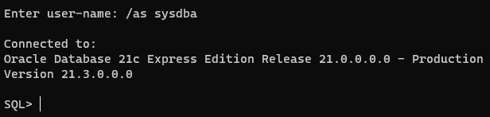

```bash
create user repaso_cms identified by "root"
```

```bash
default tablespace "USERS"
temporary tablespace "TEMP";
```

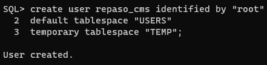

```bash
alter user repaso_cms quota unlimited on users;
grant create session to repaso_cms;
grant "RESOURCE" to repaso_cms;
alter user usuario_christian default role "RESOURCE";
```

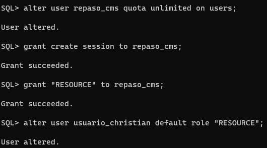

```bash
grant create view to repaso_cms;
```

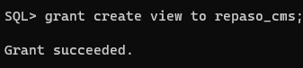

<p><b>b. Crea una conexión a la base de datos con nombre "cn_< usuario >".</b></p>

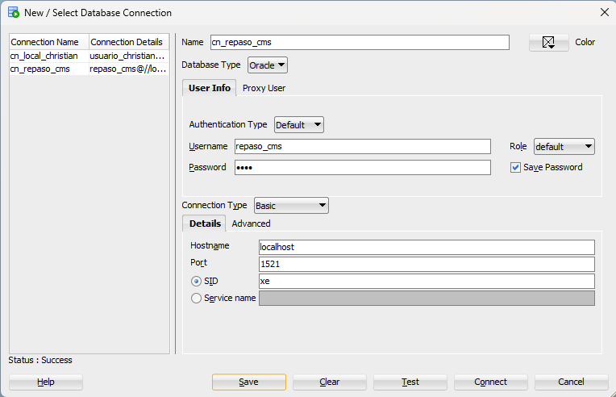

<p><b>c. Revisa que no tienes tablas desde ese perfil.</b></p>

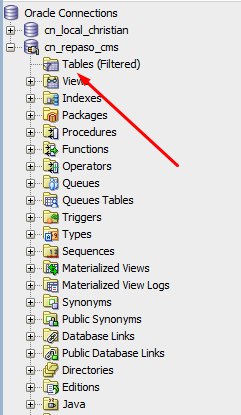

<p><b>d. Cierra la conexión que tienes abierta con el SYS.</b></p>

<p>No tengo ninguna conexión abierta con el SYS.</p>

<p><b>e. Importa los archivos CSV, necesarios para la práctica ("municipios", "centros", "provincias").</b></p>

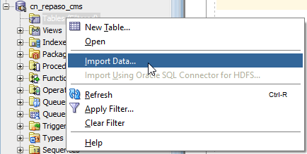

<p>*Establezco que el delimitador en los 3 archivos es ";".</p>

```sql
alter table muni rename to pueblo_cms;
```

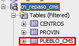

<p><b>2. Nuestro centro no se encuentra en el listado, ya que es el curso pasado, añádelo.</b></p>

<p><b>Datos:</b></p>

<li><b>Curso 22</b></li>

<li><b>Código: 29020231</b></li>

<li><b>Denominación: Centro Público Integrado de Formación Profesional</b></li>

<li><b>Especifica: Nuevo (desglose IES Campanillas)</b></li>

<li><b>Tipo: Público</b></li>

<li><b>Cod. municipio: 29067</b></li>

<li><b>Tlf. y email: 911 22 33 44 y nuevocampanillas@gmail.com</b></li>

<li><b>Dirección: C. Frederik Terman, 3, 29590, Málaga</b></li>

```sql
insert into centros(curso, codigo, d_denomina, d_especifica, d_tipo, d_domicilio, d_localidad, cod_municipio, d_municipio, d_provincia, c_postal, n_telefono, correo_e) values(22, 29020231, 'Centro Público Integrado de Formación Profesional', 'Nuevo (desglose IES Campanillas)', 'Público', 'C. Frederik Terman, 3, 29590, Málaga', 'Málaga', 29067, 'Campanillas', 'Málaga', 29590, 911223344, 'nuevocampanillas@gmail.com');
```

<p><b>3. Crea una tabla independiente, "centro_mal", que contenga todos los centros educativos de la provincia de Málaga.</b></p>

```sql
create table centro_mal(curso number, codigo number, cms_denomina varchar(60), d_especifica varchar(60), d_tipo varchar(60), d_domicilio varchar(60), d_localidad varchar(60), cod_municipio number, d_municipio varchar(60), d_provincia varchar(60), c_postal number, n_telefono number, correo_e varchar(60), primary key(codigo));
```

```sql
insert into centro_mal(curso, codigo, cms_denomina, d_especifica, d_tipo, d_domicilio, d_localidad, cod_municipio, d_municipio, d_provincia, c_postal, n_telefono, correo_e) select centros.* from centros where d_provincia="málaga";
```

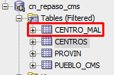

<p><b>4. Crea una tabla independiente con los datos de los municipios de Sevilla, pasa la superficie a km<sup>2</sup> sin perder información y modifica el campo "altitud" para que cumpla que todos estén entre 1 y 4000 m de altitud.</b></p>

```sql
create table muni_sevi_cms as select cod_prov, nombre_actual, poblacion, superficie/100 as km2, perimetro, cod_ine_capital, capital, poblacion_capital, longitud_etrs89, latitud_etrs89, altitud from pueblo_cms where pueblo_cms.cod_prov=41;
```

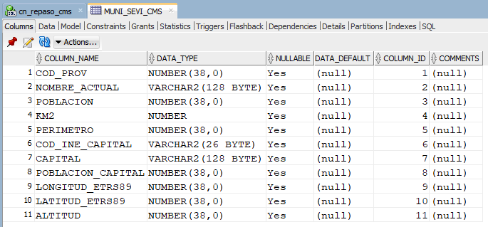

<p><b>5. Crear una vista.</b></p>

```sql
create view nombre_valle as(select * from pueblo_cms where nombre_actual like '%valle%');
```

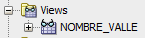

<p><b>6. Ordena por número de IES, de mayor número a menor, agrupados por provincias.</b></p>

```sql
select * from centros group by d_provincia order by codigo desc;
```


<p><b>7. Lista los centros educativos que haya en tu localidad de nacimiento, ordenados ascendentemente por nombre del centro.</b></p>

```sql

```

