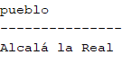

<style>
  h1, h4{
    text-align: center;
    font-weight: bold;
    border: none;
    margin-bottom: 0px;
  }

  p{
    text-align: justify;
  }

  img{
    border: 2px solid black;
  }

  #ex{
    border: none;
  }
</style>

<h1>REPASO EXAMEN</h1>

<h4>CHRISTIAN MILLÁN SORIA</h4>

<hr>

<p><b>1. Creación del entorno de trabajo.</b></p>

<p><b>a. Crea un nuevo usuario.</b></p>

```bash
/as sysdba
```


```bash
create user repaso_cms identified by "root"
```

```bash
default tablespace "USERS"
temporary tablespace "TEMP";
```


```bash
alter user repaso_cms quota unlimited on users;
grant create session to repaso_cms;
grant "RESOURCE" to repaso_cms;
alter user usuario_christian default role "RESOURCE";
```


```bash
grant create view to repaso_cms;
```


<p><b>b. Crea una conexión a la base de datos con nombre "cn_< usuario >".</b></p>


<p><b>c. Revisa que no tienes tablas desde ese perfil.</b></p>


<p><b>d. Cierra la conexión que tienes abierta con el SYS.</b></p>

<p>No tengo ninguna conexión abierta con el SYS.</p>

<p><b>e. Importa los archivos CSV, necesarios para la práctica ("municipios", "centros", "provincias").</b></p>


<p>*Establezco que el delimitador en los 3 archivos es ";".</p>

```sql
alter table muni rename to pueblo_cms;
```


<p><b>2. Nuestro centro no se encuentra en el listado, ya que es el curso pasado, añádelo.</b></p>

<p><b>Datos:</b></p>

<li><b>Curso 22</b></li>

<li><b>Código: 29020231</b></li>

<li><b>Denominación: Centro Público Integrado de Formación Profesional</b></li>

<li><b>Especifica: Nuevo (desglose IES Campanillas)</b></li>

<li><b>Tipo: Público</b></li>

<li><b>Cod. municipio: 29067</b></li>

<li><b>Tlf. y email: 911 22 33 44 y nuevocampanillas@gmail.com</b></li>

<li><b>Dirección: C. Frederik Terman, 3, 29590, Málaga</b></li>

```sql
insert into centros(curso, codigo, d_denomina, d_especifica, d_tipo, d_domicilio, d_localidad, cod_municipio, d_municipio, d_provincia, c_postal, n_telefono, correo_e) values(22, 29020231, 'Centro Público Integrado de Formación Profesional', 'Nuevo (desglose IES Campanillas)', 'Público', 'C. Frederik Terman, 3, 29590, Málaga', 'Málaga', 29067, 'Campanillas', 'Málaga', 29590, 911223344, 'nuevocampanillas@gmail.com');
```

<p><b>3. Crea una tabla independiente, "centro_mal", que contenga todos los centros educativos de la provincia de Málaga.</b></p>

```sql
create table centro_mal(curso number, codigo number, cms_denomina varchar(60), d_especifica varchar(60), d_tipo varchar(60), d_domicilio varchar(60), d_localidad varchar(60), cod_municipio number, d_municipio varchar(60), d_provincia varchar(60), c_postal number, n_telefono number, correo_e varchar(60), primary key(codigo));
```

```sql
insert into centro_mal(curso, codigo, cms_denomina, d_especifica, d_tipo, d_domicilio, d_localidad, cod_municipio, d_municipio, d_provincia, c_postal, n_telefono, correo_e) select centros.* from centros where d_provincia="málaga";
```


<p><b>4. Crea una tabla independiente con los datos de los municipios de Sevilla, pasa la superficie a km<sup>2</sup> sin perder información y modifica el campo "altitud" para que cumpla que todos estén entre 1 y 4000 m de altitud.</b></p>

```sql
create table muni_sevi_cms as select cod_prov, nombre_actual, poblacion, superficie/100 as km2, perimetro, cod_ine_capital, capital, poblacion_capital, longitud_etrs89, latitud_etrs89, altitud from pueblo_cms where pueblo_cms.cod_prov=41;
```


<p><b>5. Crear una vista.</b></p>

```sql
create view nombre_valle as(select * from pueblo_cms where nombre_actual like '%valle%');
```


<p><b>6. Ordena por número de IES, de mayor número a menor, agrupados por provincias.</b></p>

```sql
select * from centros group by d_provincia order by codigo desc;
```


<p><b>7. Lista los centros educativos que haya en tu localidad de nacimiento, ordenados ascendentemente por nombre del centro.</b></p>

```sql
select * from centros where d_localidad="málaga" order by d_especifica asc;
```


<p><b>8. Saca un listado de todos los municipios de la provincia de Sevilla, la población y el número de centros educativos.</b></p>

```sql
select pueblo_cms.nombre_actual as "nombre", pueblo_cms.poblacion as "poblacion" from pueblo_cms inner join provin on provin.cod_prov=pueblo_cms.cod_prov where pueblo_cms.cod_prov=44;
```


<p><b>9. Pon en una tabla el número de pueblos que ne la provincia de Sevilla comienzan por "A", "B" y "S".</b></p>

```sql
select sum(*) from pueblo_cms inner join provin on provin.cod_prov=pueblo_cms.cod_prov where(pueblo_cms.nombre_actual like 'A%' or pueblo_cms.nombre_actual like 'B%' or pueblo_cms.nombre_actual like 'S%') and pueblo_cms.cod_prov=41;
```


<p><b>10. ¿Cuáles son los pueblos con menor densidad poblacional de la provincia de Teruel?</b></p>

```sql
select nombre_actual as "pueblos", poblacion/superficie as "densidad" from pueblo_cms where cod_prov=44;
```


<p><b>11. Indicar los 10 municipios de España con mayor densidad poblacional. Además del nombre del municipio, mostrar la provincia a la que pertenece y la población, ordenados de mayor a menor por número de habitantes.</b></p>

```sql
select pueblo_cms.nombre_actual as "nombre", provin.provincia as "provincia", pueblo_cms.poblacion from pueblo_cms inner join provin on provin.cod_prov=pueblo_cms.cod_prov order by poblacion/superficie desc fetch first 10 rows only;
```


<p><b>12. ¿Cuál es la suma dela población de los 10 municipios con mayor número de habitantes de la comunidad de Madrid?</b></p>

```sql
select sum(poblacion) as "suma" from pueblo_cms inner join provin on provin.cod_prov=pueblo_cms.cod_prov where pueblo_cms.cod_prov=28 fetch first 10 rows only;
```


<p><b>13. ¿Qué pueblo de Andalucía tiene la mayor altura sobre el nivel del mar y una población mayor a 20000 habitantes?</b></p>

```sql
select nombre_actual as "pueblo" from pueblo_cms where cod_prov in(4, 18, 29, 14, 23, 11, 21) and poblacion>20000 order by altitud desc fetch first 1 rows only;
```



<p><b>14. Lista los pueblos en la Comunidad Valenciana que tienen una altura sobre el nivel del amr menor a 200 metros y una población mayor a 5000 habitantes, en orden descendente de número de habitantes (mostrar número de habitantes y altitud).</b></p>

```sql
select pueblo_cms.nombre_actual as "pueblos", pueblo_cms.poblacion "nº habitantes", pueblo_cms.altitud from pueblo_cms right join provin on provin.comunidad_autonoma="comunitat valenciana" where pueblo_cms.altitud<200 and pueblo_cms.poblacion>5000 order by poblacion desc;
```


<p><b>15. ¿Qué porcentaje de la población total de Navarra vive en pueblos con una superficie menor a 50 km<sup>2</sup> y una altura sobre el nivel del mar mayor a 400 metros?</b></p>

```sql

```


<p><b>16. ¿Cuál es la densidad poblacional de la Comunidad Valenciana?</b></p>

```sql
select sum(pueblo_cms.poblacion/pueblo_cms.superficie) as "densidad" from pueblo_cms right join provin on provin.comunidad_autonoma="comunitat valenciana";
```


<p><b>17. Saca un listado de cada tipo de centro educativo y en 2 columnas diferentes, diferenciar si es pública y privada y cuantos existen de cada. En caso de tener valor NULO, poner un 0.</b></p>

```sql


```

