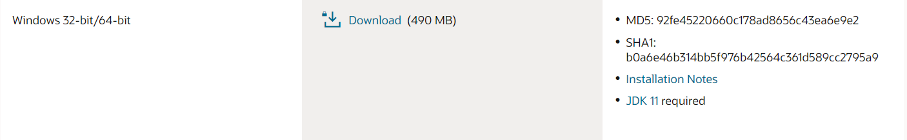

<h1>INSTALACIÓN DE ORACLE</h1>

<h4>CHRISTIAN MILLÁN SORIA</h4>

Lo primero que debemos hacer es visitar la <a href="https://www.oracle.com/es/database/technologies/xe-downloads.html">página web de descarga</a>. Nos encontramos distintos archivos disponibles, en mi caso elijo el de Windows.

Una vez descargado, descomprimimos el archivo.

Entre otros archivos, vemos un ".exe". Lo ejecutamos.

Esto abre el instalador de Oracle.

Avanzamos unos pasos aceptando la licencia del software y estableciendo la ubicación de instalación del mismo (dejamos la ubicación predeterminada) y añadimos una contraseña ("root") para la base de datos.

Hacemos clic en "Instalar".

El proceso puede tardar un poco. Al terminar aparece el último aviso:

Una vez instalado, podemos visitar la url "<a href="https://localhost:5500/em">https://localhost:5500/em</a>" para acceder a Oracle.

Para iniciar sesión la primera vez se puede hacer con el usuario "system" y la contraseña que establecimos anteriormente.

Lo siguiente es instalar el SQL Developer desde <a href="https://www.oracle.com/database/sqldeveloper/technologies/download/">este enlace</a>.

Se descarga el segundo archivo, al menos en mi caso, ya que ya tengo instalado JDK.

