

<h1>SQL SERVER EN AWS</h1>

<h4>CHRISTIAN MILLÁN SORIA</h4>

Accedemos primero a nuestra cuenta de AWS. Entramos en el "laboratorio" de AWS.

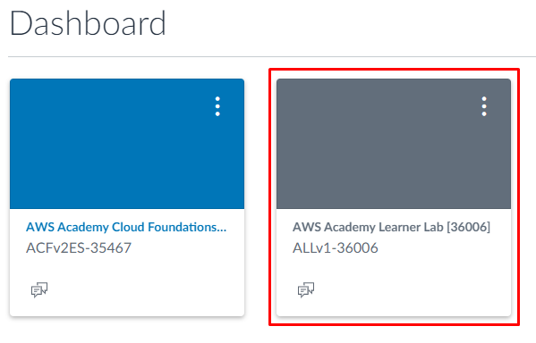

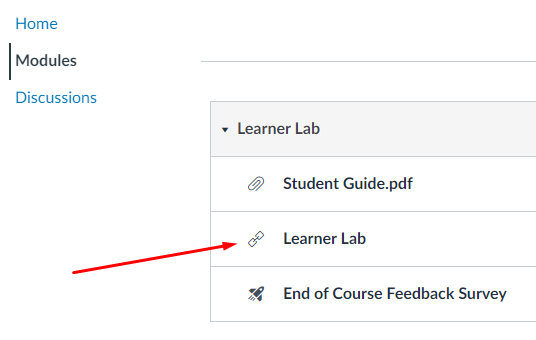

Encendemos el entorno de trabajo.

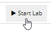

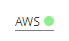

Accedemos al panel de control.

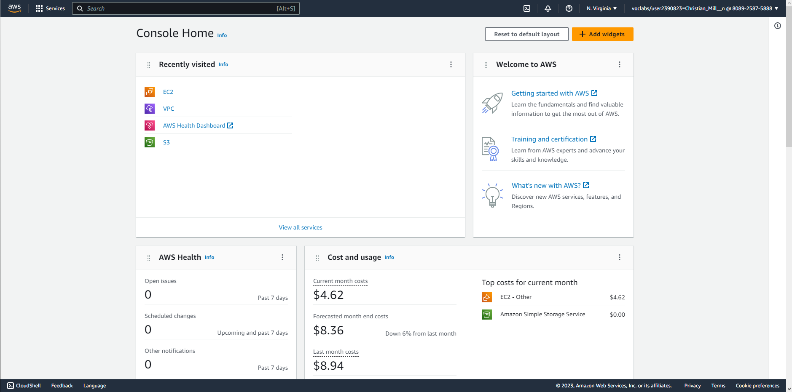

En el apartado de "Servicios", hacemos clic en la opción "Base de datos".

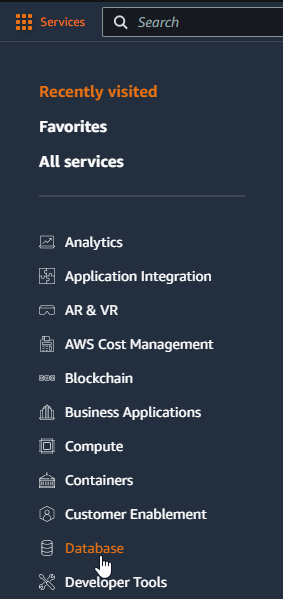

Dentro de esta opción, entramos en la de "RDS".

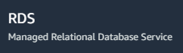

Nos encontramos con otro panel de control:

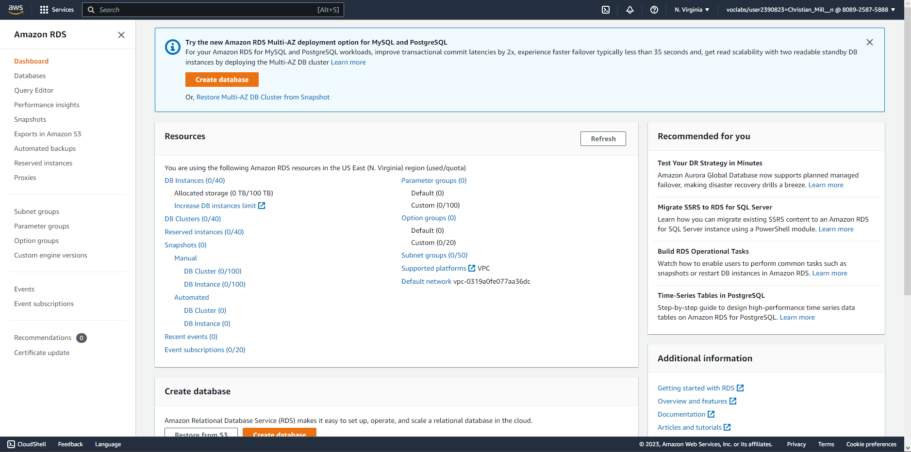

Hacemos clic en la opción "Crear base de datos".

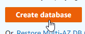

De esta forma, entramos a la configuración de la nueva base de datos a crear.

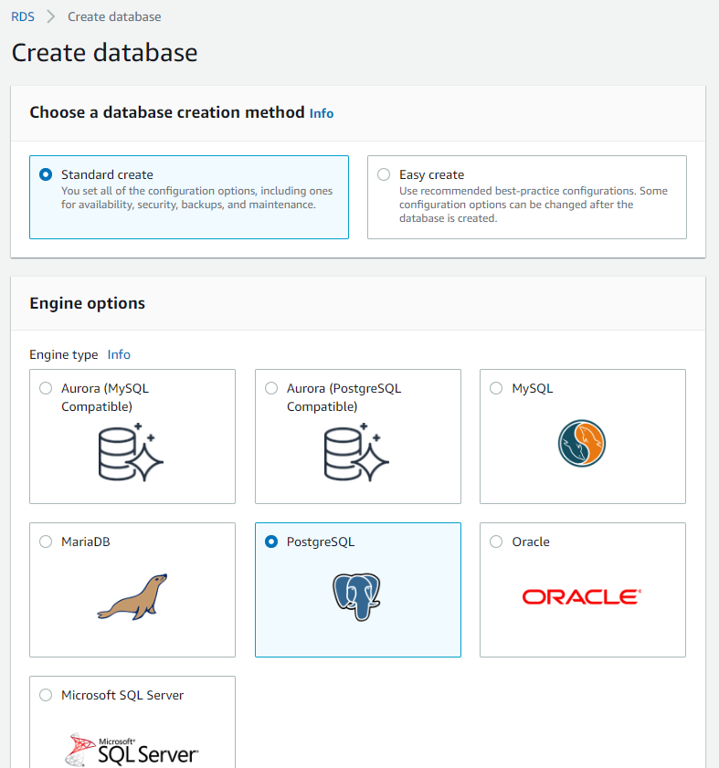

Para empezar, dejamos el método de creación de la base de datos en tipo "Estándar".

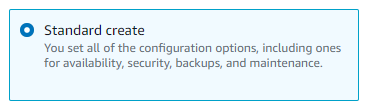

Seleccionamos el tipo de servidor que vamos a crear:

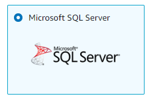

Dejamos el Amazon RDS por defecto.

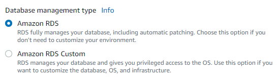

Hacemos lo mismo con la edición a instalar.

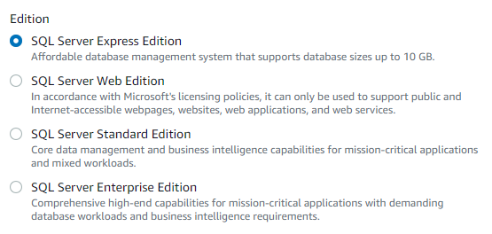

De igual manera, la versión del motor será la que viene por defecto (la más actualizada).

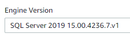

Establecemos un nombre para la base de datos.

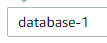

Elegimos un nombre para el usuario administrador de la base de datos.

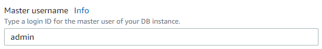

