

<h1>SQL SERVER EN AWS</h1>

<h4>CHRISTIAN MILLÁN SORIA</h4>

Accedemos primero a nuestra cuenta de AWS. Entramos en el "laboratorio" de AWS.

Encendemos el entorno de trabajo.

Accedemos al panel de control.

En el apartado de "Servicios", hacemos clic en la opción "Base de datos".

Dentro de esta opción, entramos en la de "RDS".

Nos encontramos con otro panel de control:

Hacemos clic en la opción "Crear base de datos".

De esta forma, entramos a la configuración de la nueva base de datos a crear.

Para empezar, dejamos el método de creación de la base de datos en tipo "Estándar".

Seleccionamos el tipo de servidor que vamos a crear:

Dejamos el Amazon RDS por defecto.

Hacemos lo mismo con la edición a instalar.

De igual manera, la versión del motor será la que viene por defecto (la más actualizada).

Establecemos un nombre para la base de datos.

Elegimos un nombre para el usuario administrador de la base de datos.

Y le establecemos una contraseña.

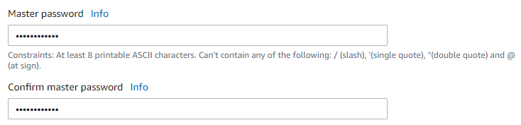

Dejamos el hardware dedicado a la base de datos por defecto.

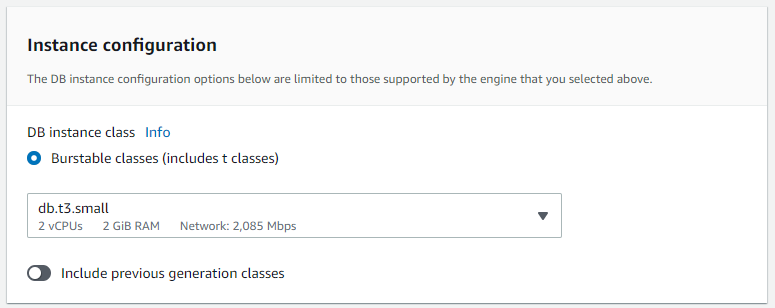

Dejamos también el tamaño de la base de datos en 20GB.

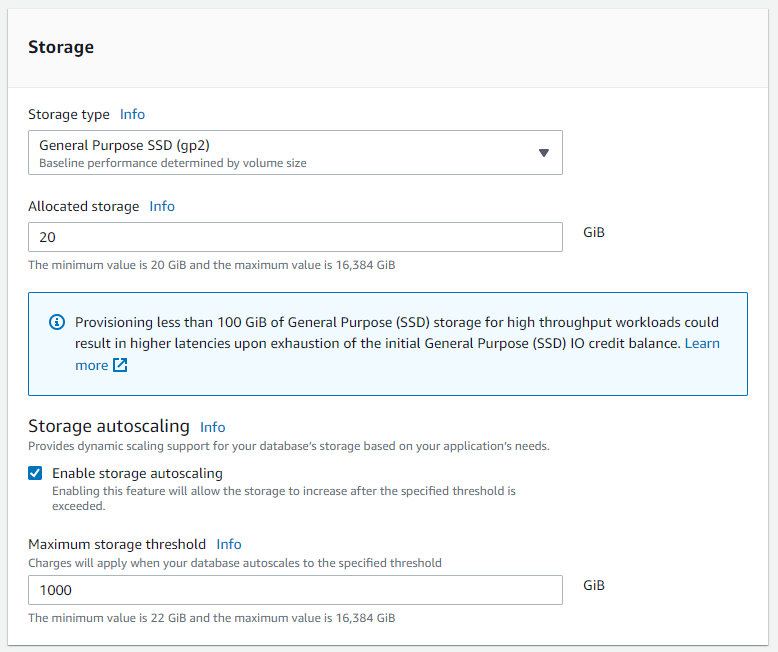

Habilitamos el acceso público a la misma.

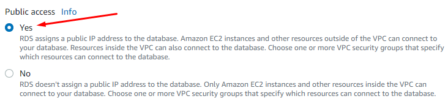

Una vez hecho todo esto, creamos la base de datos.

Si es la primera vez, se producirá un error en la creación. Esto se debe a la configuración del firewall.

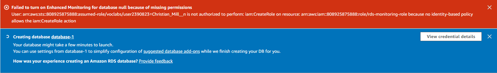

Para arreglar esto, primero debemos entrar al resumen de instalación de la base de datos haciendo clic en la propia base de datos en la lista de bases de datos creadas.

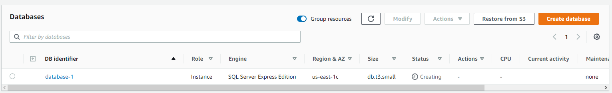

En el apartado de resumen de todos los elementos de la misma, vemos un apartado de seguridad. Entramos a la configuración de seguridad del VPC de nuestra base de datos.

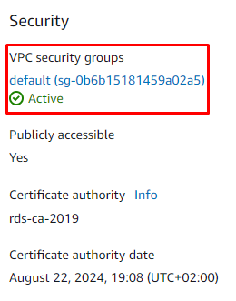

Se nos abre un panel con los grupos de seguridad que existen.

Entramos en la pestaña de "Reglas de entrada" y hacemos clic en el botón de edición.

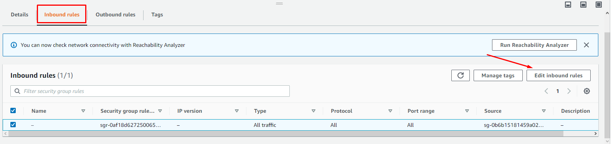

Primero borramos la única regla de seguridad que aparece. Acto seguido creamos una nueva.

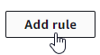

Establecemos conexión con todos los TCP y agregamos el rango de IP general para que pueda establecer conexión con cualquier IP.

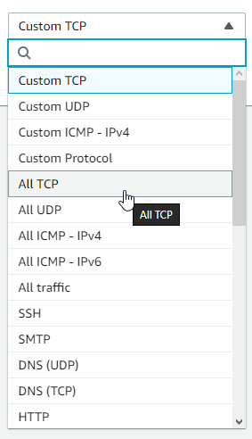

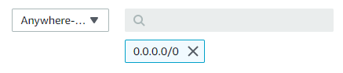

Guardamos los cambios una vez la regla se ve tal que así:

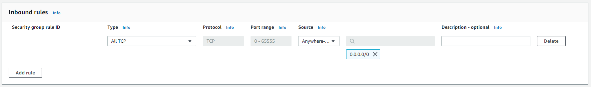

Podemos ver los cambios realizados en la lista nada más guardar:

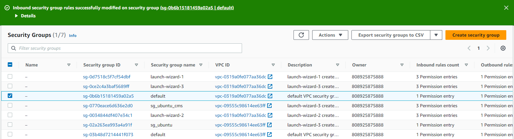

Ahora aparecerá esta nueva regla en el resumen de la base de datos.

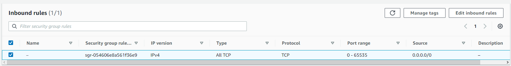

Volvemos al panel de RDS.

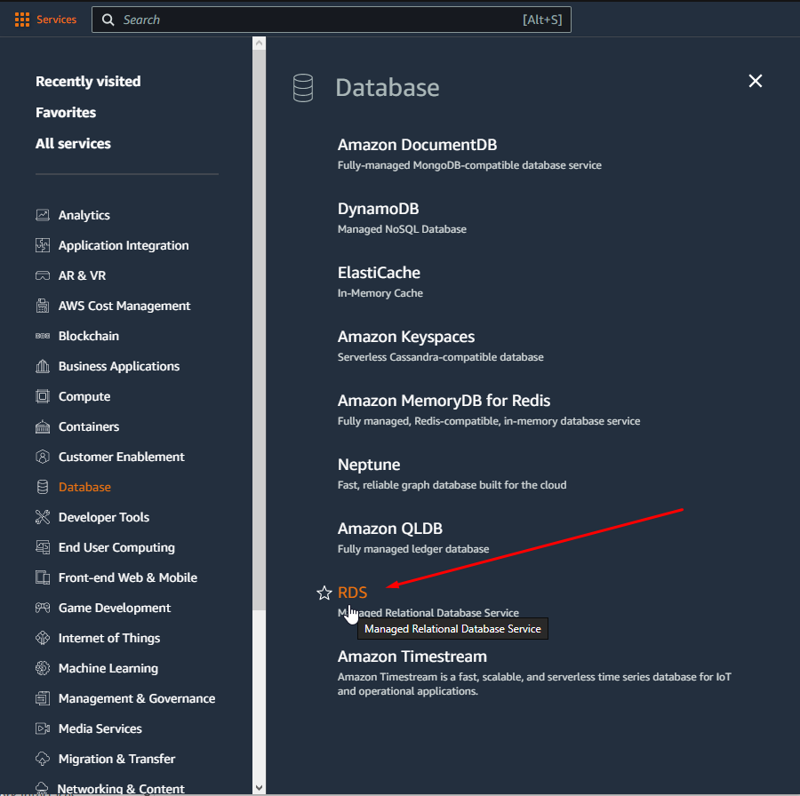

Esta vez entramos en la opción de "Bases de datos" en el menú lateral izquierdo.

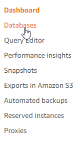

Entramos en nuestra recién creada base de datos.

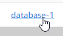

Podemos ver en el resumen de la base de datos que aparecen una credenciales de conexión. Copiamos el token de endpoint.

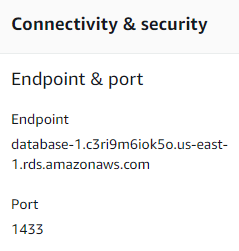

Nos dirigimos a un navegador web y buscamos lo siguiente:

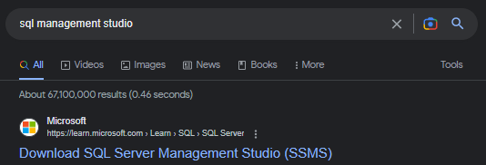

Entramos en el enlace oficial de Microsoft y descargamos el siguiente archivo.

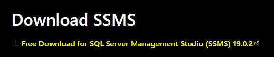

Una vez instalado mediante el archivo con extensión ".exe" que se descarga, ejecutamos el programa.

Se nos presenta un cuadro donde podemos ingresar las credenciales anteriormente copiadas del resumen de la base de datos.

Debemos dejar el tipo de servidor por defecto. En el nombre del servidor ingresamos el token copiado anteriormente y añadimos ",1433" al final, ya que es el puerto de conexión que se nos muestra en el resumen.

En el apartado de autentificación seleccionamos "SQL Server Authentication" y escribimos el usuario administrador que establecimos en la creación de la base de datos y su contraseña.

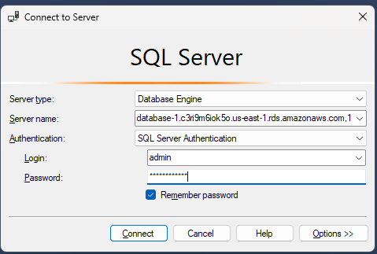

Finalmente, hemos establecido conexión con la base de datos recién creada.

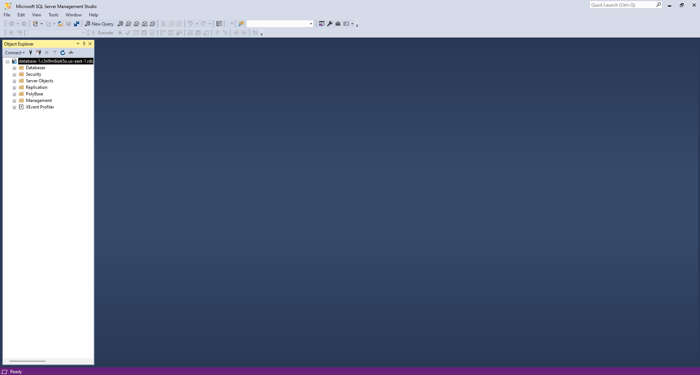

Para detener la base de datos hay que seguir los siguientes paso, debido a que apagar el laboratorio no sirve, ya que se vuelve a encender sola y gasta dinero del que pertenece a nuestra cuenta de AWS:

<li>En el resumen de la base de datos, hacemos clic en la opción "Acciones" en la esquina superior derecha y en la sub-opción "Parar temporalmente".</li>

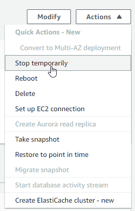

<li>Marcamos las dos casillas del cuadro de aviso que se abre y escribimos el nombre de la base de datos a apagar.</li>

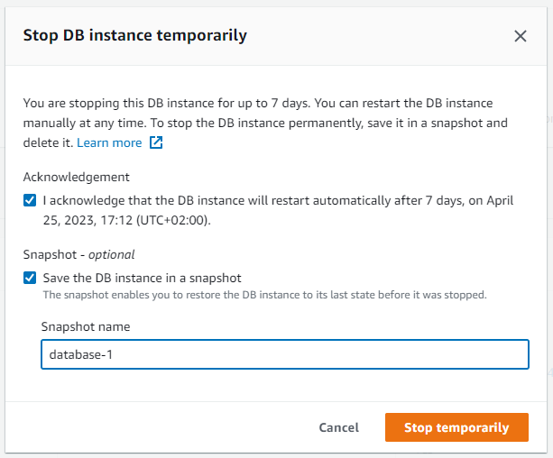

<li>Mientras se queda cargando intentando apagarse, apagamos el laboratorio.</li>

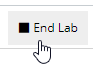

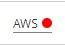