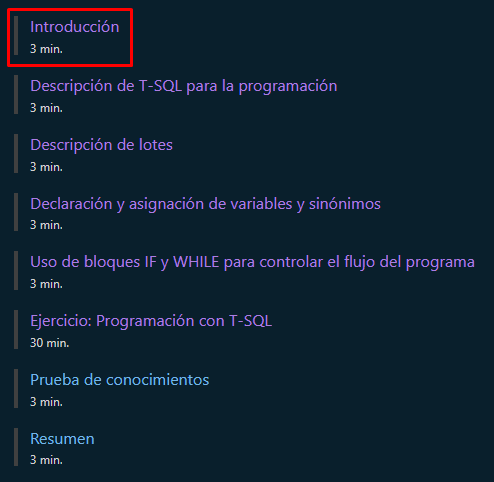
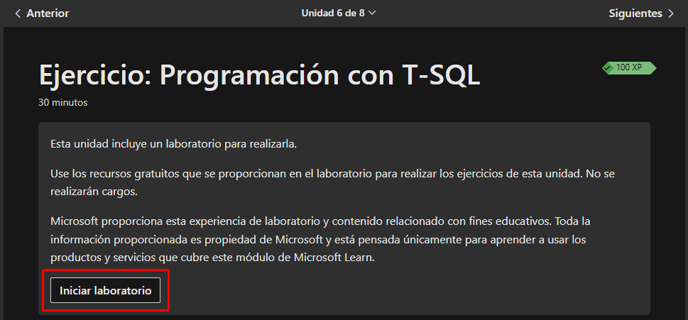
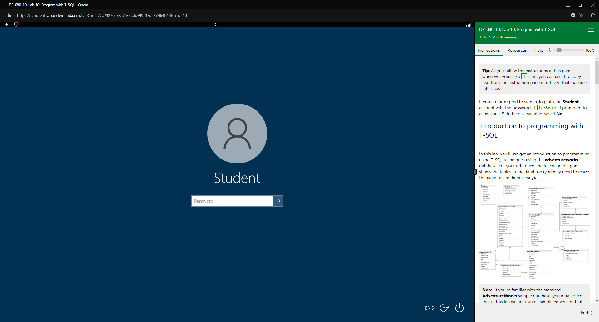
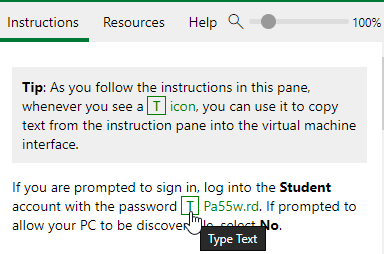
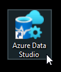
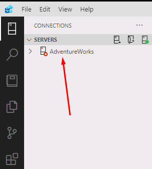
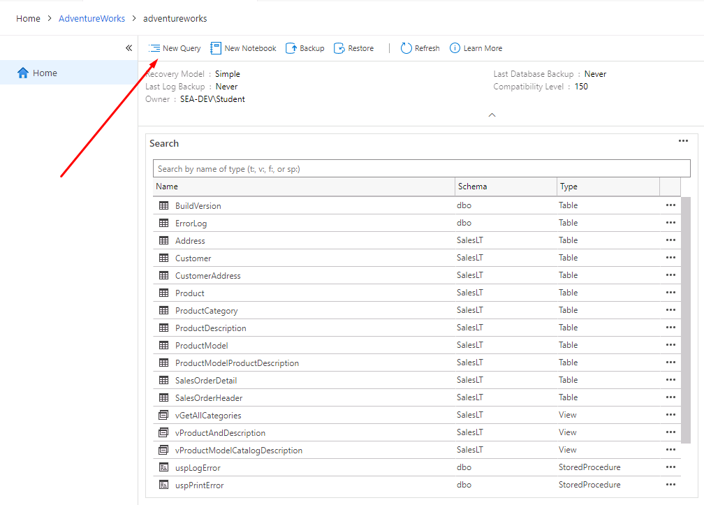

<style>
  h1, h4, h2, h3{
    text-align: center;
    font-weight: bold;
    border: none;
    margin-bottom: 0px;
  }

  p{
    text-align: justify;
  }

  img{
    border: 2px solid black;
  }

  #ex{
    border: none;
  }
</style>

<h1>PRIMER CURSO</h1>

<h4>CHRISTIAN MILLÁN SORIA</h4>

<hr>

<p>Comenzamos entrando en <a href="https://learn.microsoft.com/es-es/training/modules/get-started-transact-sql-programming/">este enlace</a>.</p>

<p>Iniciamos sesión con una cuenta de Hotmail.</p>


<p>Una vez tenemos una cuenta, bajamos y encontramos una serie de apartados. Entramos en el primero.</p>



<hr>

<h2>INTRODUCCIÓN</h2>

<p>Contenido de "Introducción":</p>

```
Transact-SQL (T-SQL) proporciona un lenguaje de programación sólido con características que permiten almacenar temporalmente valores en variables, aplicar la ejecución condicional de comandos, pasar parámetros a procedimientos almacenados y controlar el flujo de los programas.

En este módulo, aprenderá a mejorar el código T-SQL con elementos de programación.

Después de completar este módulo, podrá:

· Describir los elementos de lenguaje de T-SQL para tareas de programación sencillas.
· Describir los lotes y cómo se controlan mediante SQL Server.
· Declarar y asignar variables y sinónimos.
· Usar bloques IF y WHILE para controlar el flujo del programa.
```

<hr>

<h2>DESCRIPCIÓN DE T-SQL PARA LA PROGRAMACIÓN</h2>

<p>Pasamos al siguiente apartado. Contenido de "Descripción de T-SQL para la programación":</p>

```
Transact-SQL (T-SQL) es una extensión propietaria del estándar abierto Lenguaje de consulta estructurado (SQL). Admite variables declaradas, procesamiento de cadenas y datos, control de errores y excepciones y control de transacciones. Aunque SQL es un lenguaje de programación, T-SQL añade compatibilidad con la programación de procedimientos y el uso de variables locales.

Un programa T-SQL normalmente comenzará con una instrucción BEGIN y finalizará con una instrucción END, con las instrucciones que quiera ejecutar entre ambas.

A medida que pase de ejecutar objetos de código a crearlos, deberá comprender cómo interactúan varias instrucciones con el servidor durante la ejecución. A medida que desarrolle programas, deberá almacenar temporalmente los valores. Por ejemplo, es posible que tenga que almacenar temporalmente valores que se usarán como parámetros en procedimientos almacenados.

Por último, es posible que quiera crear alias o punteros a objetos para que pueda hacer referencia a ellos con un nombre diferente o desde una ubicación distinta de donde se definen.

Estas son algunas de las estructuras de programación de T-SQL compatibles:

· IF...ELSE: instrucción condicional que permite decidir qué aspectos del código se ejecutarán.
· WHILE: instrucción de bucle que es ideal para ejecutar iteraciones de instrucciones T-SQL.
· DECLARE: lo usará para definir variables.
· SET: una de las maneras en las que asignará valores a las variables.
· BATCHES: serie de instrucciones T-SQL que se ejecutan como una unidad.
```

<hr>

<h2>DESCRIPCIÓN DE LOTES</h2>

<p>Pasamos al siguiente apartado. Contenido de "Descripción de lotes":</p>

```
Los lotes T-SQL son colecciones de una o varias instrucciones T-SQL que el cliente envía a SQL Server como una sola unidad. SQL Server se ejecuta en todas las instrucciones de un lote al mismo tiempo al analizar, optimizar y ejecutar el código.

Si es un escritor de informes que normalmente escribe consultas mediante instrucciones SELECT y no procedimientos, sigue siendo importante comprender los límites del lote. Estos límites afectarán al trabajo con variables y parámetros en procedimientos almacenados y otras rutinas. Por ejemplo, una variable debe declararse en el mismo lote en el que se le hace referencia. Por lo tanto, es importante reconocer lo que contiene un lote.

La aplicación cliente delimita los lotes. La forma de marcar el final de un lote depende de la configuración del cliente. Para los clientes de Microsoft, incluidos SQL Server Management Studio (SSMS), Azure Data Studio y SQLCMD, la palabra clave es GO.

En este ejemplo, hay dos lotes distintos terminados cada uno en GO:
```

```sql
CREATE NEW <view_name>
AS ...
GO
CREATE PROCEDURE <procedure_name>
AS ...
GO
```

```
El terminador de lotes GO no es una palabra clave de T-SQL, pero SSMS la reconoce para indicar el final de un lote.

Al trabajar con lotes T-SQL, hay dos consideraciones importantes que se deben tener en cuenta:

· Los lotes son límites para el ámbito de variable, lo que significa que solo otro código del mismo lote puede hacer referencia a una variable definida en un lote.
· Es posible que algunas instrucciones, normalmente instrucciones de definición de datos como CREATE VIEW, CREATE FUNCTION y CREATE PROCEDURE, no se combinen con otras del mismo lote.
```

<h3>TRABAJO CON LOTES</h3>

<p>Siguiente sub-apartado (en el mismo apartado). Contenido de "Trabajo con lotes":</p>

```
Un lote es una colección de instrucciones T-SQL enviadas a SQL Server para su análisis y ejecución. Comprender cómo se analizan los lotes será útil para identificar los mensajes de error y el comportamiento. Cuando un cliente envía un lote, como al presionar el botón Ejecutar en SSMS, el motor de SQL Server analiza el lote en busca de errores de sintaxis. Los errores encontrados harán que se rechace todo el lote; no habrá ninguna ejecución parcial de instrucciones dentro del lote.

Si el lote pasa la comprobación de sintaxis, SQL Server ejecuta otros pasos, resuelve nombres de objeto, comprueba permisos y optimiza el código para su ejecución. Una vez que se completa este proceso y se inicia la ejecución, las instrucciones se completan correctamente o se produce un error individualmente. Esto es un contraste importante con la comprobación de sintaxis. Cuando se produce un error en el tiempo de ejecución de una línea, se puede ejecutar la siguiente, a menos que se haya agregado el control de errores al código.

Por ejemplo, el siguiente lote contiene un error de sintaxis:
```

```sql
INSERT INTO dbo.t1 VALUE(1,2,N'abc');
INSERT INTO dbo.t1 VALUES(2,3,N'def');
GO
```

```
Muestra este mensaje de error:
```

```sql
Msg 102, Level 15, State 1, Line 1
Incorrect syntax near 'VALUE'.
```

```
El error se produjo en la línea 1, pero se rechaza todo el lote y la ejecución no continúa con la línea 2. Aunque se invirtiera cada una de las instrucciones INSERT y se produjese el error de sintaxis en la segunda línea, la primera línea no se ejecutaría porque se rechazaría todo el lote.

Con el ejemplo anterior, este lote no contiene ningún error:
```

```sql
INSERT INTO dbo.t1 VALUES(1,2,N'abc');
INSERT INTO dbo.t1 VALUES(2,3,N'def');
GO
```

```
En los ejemplos anteriores, hemos usado instrucciones INSERT en lugar de SELECT porque es más común que las instrucciones de modificación se agrupen en lotes que en instrucciones SELECT.
```

<hr>

<h2>DECLARACIÓN Y ASIGNACIÓN DE VARIABLES Y SINÓNIMOS</h2>

<p>Pasamos al siguiente apartado. Contenido de "Declaración y asignación de variables y sinónimos":</p>

```
En T-SQL, al igual que con otros lenguajes de programación, las variables son objetos que permiten el almacenamiento temporal de un valor para su uso posterior. Ya ha visto variables cuando las ha usado para pasar valores de parámetro a procedimientos almacenados y funciones.

En T-SQL, las variables se deben declarar para poderlas usar. Cuando se declaran, se les puede asignar un valor o inicializarlas. Declarar una variable incluye proporcionar un nombre y un tipo de datos, como se muestra a continuación. Para declarar una variable, debe usar la instrucción DECLARE.
```

```sql
--Declare and initialize the variables.
DECLARE @numrows INT = 3, @catid INT = 2;
--Use variables to pass the parameters to the procedure.
EXEC Production.ProdsByCategory @numrows = @numrows, @catid = @catid;
GO
```

```
Las variables se deben declarar en el mismo lote en el que se hace referencia a ellas. En otras palabras, todas las variables T-SQL son locales en el ámbito del lote, tanto en visibilidad como en duración. Solo otras instrucciones del mismo lote pueden ver una variable declarada en el lote. Una variable se destruye automáticamente cuando finaliza el lote.
```

<h3>TRABAJO CON VARIABLES</h3>

<p>Siguiente sub-apartado (en el mismo apartado). Contenido de "Trabajo con variables":</p>

```
Una vez que haya declarado una variable, debe inicializarla o asignarle un valor. Lo puede hacer de tres maneras:

· En SQL Server 2008 o posterior, puede inicializar una variable mediante la instrucción DECLARE.
· En cualquier versión de SQL Server, puede asignar un valor único (escalar) mediante la instrucción SET.
· En cualquier versión de SQL Server, puede asignar un valor a una variable mediante la instrucción SELECT. Asegúrese de que la instrucción SELECT devuelve exactamente una fila. Si no hay ningún resultado, la variable mantendrá su valor original. Si hay más de un resultado se devolverá el último.

En el ejemplo siguiente se muestran las tres maneras de declarar y asignar valores a variables:
```

```sql
DECLARE @var1 AS INT = 99;
DECLARE @var2 AS NVARCHAR(255);
SET @var2 = N'string';
DECLARE @var3 AS NVARCHAR(20);
SELECT @var3 = lastname FROM HR.Employees WHERE empid=1;
SELECT @var1 AS var1, @var2 AS var2, @var3 AS var3;
GO
```

```
Esto genera los resultados siguientes.

var1                   var2                   var3
99                     string                 Davis
```

<h3>TRABAJO CON SINÓNIMOS</h3>

<p>Siguiente sub-apartado (en el mismo apartado). Contenido de "Trabajo con sinónimos":</p>

```
En SQL Server, los sinónimos proporcionan un método para crear un vínculo, o alias, a un objeto almacenado en la misma base de datos o incluso en otra instancia de SQL Server. Los objetos que pueden tener sinónimos definidos para ellos incluyen tablas, vistas, procedimientos almacenados y funciones definidas por el usuario.

Los sinónimos se pueden usar para que un objeto remoto parezca local o para proporcionar un nombre alternativo para un objeto local. Por ejemplo, se pueden usar sinónimos para proporcionar una capa de abstracción entre el código de cliente y los objetos de la base de datos reales utilizados por el código. El código hace referencia a objetos por sus alias, independientemente del nombre real del objeto.

Para administrar sinónimos, use los comandos del lenguaje de definición de datos (DDL) CREATE SYNONYM, ALTER SYNONYM y DROP SYNONYM, como en el ejemplo siguiente:
```

```sql
CREATE SYNONYM dbo.ProdsByCategory FOR TSQL.Production.ProdsByCategory;
GO
EXEC dbo.ProdsByCategory @numrows = 3, @catid = 2;
```

```
Para crear un sinónimo, debe tener el permiso "CREATE SYNONYM", así como el permiso para modificar el esquema en el que se almacenará el sinónimo.

Un sinónimo es un objeto "vacío" que se resuelve en el objeto de origen cuando se hace referencia a él en tiempo de ejecución.
```

<hr>

<h2>USO DE BLOQUES IF Y WHILE PARA CONTROLAR EL FLUJO DEL PROGRAMA</h2>

<p>Pasamos al siguiente apartado. Contenido de "Uso de bloques IF y WHILE para controlar el flujo del programa":</p>

```
Todos los lenguajes de programación incluyen elementos que le ayudan a determinar el flujo del programa o el orden en el que se ejecutan las instrucciones. Aunque no es tan destacado como lenguajes como C#, T-SQL proporciona un conjunto de palabras clave de control de flujo que puede usar para realizar pruebas lógicas y crear bucles que contengan las instrucciones de manipulación de datos de T-SQL. En esta lección, aprenderá a usar las palabras clave IF y WHILE de T-SQL.
```

<h3>COMPRENSIÓN DEL CONTROL T-SQL DEL LENGUAJE DE FLUJO</h3>

<p>Siguiente sub-apartado (en el mismo apartado). Contenido de "Comprensión del control T-SQL del lenguaje de flujo":</p>

```
SQL Server proporciona elementos de lenguaje que controlan el flujo de ejecución del programa dentro de lotes de T-SQL, procedimientos almacenados y funciones de múltiples instrucciones definidas por el usuario. Estos elementos de control de flujo significan que puede determinar mediante programación si se deben ejecutar instrucciones y el orden en el que se deben ejecutar.

Estos elementos incluyen, entre otros:

· IF...ELSE, que ejecuta código basado en expresiones booleanas.
· WHILE, que crea un bucle que se ejecuta si la condición es verdadera.
· BEGIN...END, que define una serie de instrucciones T-SQL que se deben ejecutar juntas.
· Otras palabras clave, por ejemplo, BREAK, CONTINUE, WAITFOR y RETURN, que se usan para admitir operaciones de control de flujo de T-SQL.

Este es un ejemplo de una instrucción IF:
```

```sql
IF OBJECT_ID('dbo.tl') IS NOT NULL
    DROP TABLE dbo.tl
GO
```

<h3>USO DE LÓGICA CONDICIONAL EN LOS PROGRAMAS MEDIANTE IF...ELSE</h3>

<p>Siguiente sub-apartado (en el mismo apartado). Contenido de "Uso de lógica condicional en los programas mediante IF...ELSE":</p>

```
La estructura IF...ELSE se usa en T-SQL para ejecutar condicionalmente un bloque de código basado en un predicado. La instrucción IF determina si se ejecuta la instrucción o el bloque siguiente (si se usa BEGIN...END). Si el predicado se determina como TRUE, se ejecuta el código del bloque. Cuando el predicado se determina como FALSE o UNKNOWN, el bloque no se ejecuta a menos que se utilice la palabra clave opcional ELSE para identificar otro bloque de código.

En la siguiente instrucción IF, se pregunta a la base de datos si la OBJECT_ID aparece como NULL (nula) y, si es así, devuelve la instrucción PRINT (imprimir). En este ejemplo, el objeto NO es null (nulo) y por lo tanto FALSE (falso), lo que significa que no se ejecutará el código BEGIN/END. La instrucción PRINT solo se ejecutará si el objeto no existe en la base de datos.
```

```sql
USE TSQL;
GO
IF OBJECT_ID('HR.Employees') IS NULL --this object does exist in the sample database
BEGIN
    PRINT 'The specified object does not exist';
END;
```

```
Debido a las limitaciones del código anterior con solo una instrucción IF, esto puede resultar confuso. La combinación de IF y ELSE proporciona más flexibilidad con la lógica del código y puede usar varias instrucciones ELSE. Con el uso de ELSE, tiene otra opción de ejecución cuando el predicado IF se determina como FALSE o UNKNOWN, como en el ejemplo siguiente:
```

```sql
IF OBJECT_ID('HR.Employees') IS NULL --this object does exist in the sample database
BEGIN
    PRINT 'The specified object does not exist';
END
ELSE
BEGIN
    PRINT 'The specified object exists';
END;
```

```
Dentro de las operaciones de manipulación de datos, el uso de IF con la palabra clave EXISTS puede ser una herramienta útil para comprobaciones de existencia eficaces, como en el ejemplo siguiente:
```

```sql
IF EXISTS (SELECT * FROM Sales.EmpOrders WHERE empid =5)
BEGIN
    PRINT 'Employee has associated orders';
END;
```

<h3>COMPRENSIÓN DEL BUCLE MEDIANTE INSTRUCCIONES WHILE</h3>

<p>Siguiente sub-apartado (en el mismo apartado). Contenido de "Comprensión del bucle mediante instrucciones WHILE":</p>

```
La instrucción WHILE se usa para ejecutar código en un bucle basado en un predicado. Del mismo modo que la instrucción IF, la instrucción WHILE determina si se ejecuta la instrucción o el bloque siguientes (si se usa BEGIN...END). El bucle continúa en ejecución siempre que la condición se evalúe como TRUE. Normalmente, el bucle se controla con una variable probada por el predicado y manipulada en el cuerpo del propio bucle.

En el ejemplo siguiente se usa la variable @empid en el predicado y se cambia su valor en el bloque BEGIN...END:
```

```sql
DECLARE @empid AS INT = 1, @lname AS NVARCHAR(20);
WHILE @empid <=5
   BEGIN
	SELECT @lname = lastname FROM HR.Employees
		WHERE empid = @empid;
	PRINT @lname;
	SET @empid += 1;
   END;
```

```
Para opciones adicionales dentro de un bucle WHILE, puede usar las palabras clave CONTINUE y BREAK para controlar el flujo.
```

<hr>

<h2>EJERCICIO</h2>

<p>En el siguiente apartado se realiza un ejercicio de prueba para poner a prueba estos conocimientos.</p>

<p>Hacemos clic en "Iniciar laboratorio" para poner en marcha la máquina virtual con la que vamos a trabajar en este ejercicio</p>



<p>Esto inicia un proceso de creación de la máquina. Cuando termina hacemos clic de nuevo en el botón y se nos abre una ventana donde trabajaremos en este ejercicio.</p>


<p>Una vez se carga la máquina, vemos una interfaz como la siguiente:</p>



<p>Vemos que en la columna de la derecha aparecen unas credenciales para iniciar sesión. Primero debemos situar el cursor en el cuadro donde se debe introducir la contraseña y después pulsamos la "T" que aparece al lado de la contraseña en la columna de la derecha.</p>



<p>Finalmente podemos iniciar sesión en la máquina.</p>

<p>Lo primero que debemos hacer es abrir el entorno de trabajo donde vamos a ejecutar las sentencias.</p>



<p>Adicionalmente, cambiamos el idioma de entrada del teclado en la barra de tareas al idioma deseado:</p>


<p>Una vez dentro del entorno de trabajo, hacemos doble clic en la opción "AdventureWorks".</p>



<p>*Puede que primero sea necesario darle un único clic y cuando se ponga en verde, dar los dos clics.</p>

<p>Se abre una pestaña como la siguiente, en la que debemos entrar en la opción "New Query":</p>



<p>Ahora sí, tenemos el lugar donde vamos a ejecutar las sentencias una a una.</p>