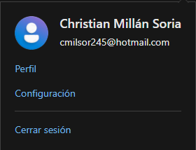

<style>
  h1, h4, h2, h3{
    text-align: center;
    font-weight: bold;
    border: none;
    margin-bottom: 0px;
  }

  p{
    text-align: justify;
  }

  img{
    border: 2px solid black;
  }

  #ex{
    border: none;
  }
</style>

<h1>SEGUNDO CURSO</h1>

<h4>CHRISTIAN MILLÁN SORIA</h4>

<hr>

<p>Comenzamos entrando en <a href="https://learn.microsoft.com/es-es/training/modules/create-stored-procedures-table-valued-functions/">este enlace</a>.</p>

<p>Iniciamos sesión con una cuenta de Hotmail.</p>



<p>Una vez tenemos una cuenta, bajamos y encontramos una serie de apartados. Entramos en el primero.</p>


<hr>

<h2>INTRODUCCIÓN</h2>

```
Los procedimientos almacenados son grupos con nombre de instrucciones Transact-SQL (T-SQL) que se pueden usar y reutilizar siempre que se necesiten. Los procedimientos almacenados pueden devolver resultados, manipular datos y realizar acciones administrativas en el servidor. Es posible que tenga que ejecutar procedimientos almacenados que otra persona haya creado, o bien crear los suyos propios.

El procedimiento almacenado puede contener comandos de definición de datos y comandos de manipulación de datos, lo que proporciona una interfaz limpia entre una base de datos y una aplicación.

El uso de procedimientos almacenados tiene ventajas, entre las que se incluyen:

· Reutilización del código. El procedimiento almacenado se puede escribir, probar y reutilizar según sea necesario. Esto ayuda a eliminar errores y a reducir el tiempo de desarrollo.
· Seguridad. Los procedimientos almacenados permiten a los usuarios y programas realizar determinadas operaciones en objetos de base de datos, sin conceder permisos a las tablas subyacentes. Esto le permite controlar qué procesos y actividades se permiten, lo que mejora la seguridad.
· Mejora de la calidad. También puede incluir el código de control de errores adecuado y asegurarse de que cada procedimiento almacenado se prueba correctamente antes de usarse en un entorno de producción.
· Mejorar el rendimiento. Cuando se ejecutan por primera vez los procedimientos almacenados, se crea un plan de ejecución. Ese plan de ejecución se puede reutilizar cuando se vuelve a ejecutar el procedimiento almacenado. Esto suele ser más rápido que crear un plan de ejecución cada vez que se ejecuta el código.
· Mantenimiento inferior. Los procedimientos almacenados proporcionan una interfaz a la capa de datos. Cuando los cambios en los objetos de base de datos subyacentes son diferentes, solo se actualizan los procedimientos, lo que proporciona una separación limpia entre los datos y las capas de aplicación.

Hay tres tipos de procedimientos almacenados:

· Procedimientos almacenados definidos por el usuario.
· Procedimientos almacenados temporales.
· Procedimientos almacenados del sistema.

Este módulo le mostrará cómo llamar a un procedimiento almacenado, pasar un parámetro a un procedimiento almacenado y crear y modificar procedimientos almacenados. También aprenderá a construir SQL dinámico y escribir funciones con valores de tabla insertadas.

Después de completar este módulo, podrá:

· Devuelva los resultados mediante la ejecución de procedimientos almacenados.
· Pase de parámetros a procedimientos.
· Cree procedimientos almacenados simples que encapsulen una instrucción SELECT.
· Construya y ejecute SQL dinámico con EXEC y sp_executesql.
· Cree funciones definidas por el usuario y escriba consultas con ellas.
```

<hr>

<h2>LLAMADA A PROCEDIMIENTOS ALMACENADOS</h2>

Una aplicación o un usuario pueden llamar a los procedimientos almacenados. También se los puede llamar al iniciarse SQL Server.

<h3>EJECUCIÓN DE UN PROCEDIMIENTO ALMACENADO POR PARTE DE UN USUARIO</h3>

```
Cuando una aplicación o un usuario ejecuta un procedimiento almacenado, se usa el comando EXECUTE o su acceso directo, EXEC, seguido del nombre de dos partes del procedimiento. Por ejemplo:

EXEC dbo.uspGetEmployeeManagers

También se llama a los procedimientos almacenados del sistema mediante la palabra clave EXECUTE o EXEC. La intercalación de base de datos de llamada se usa al comparar los nombres de los procedimientos del sistema. Si la intercalación de base de datos distingue mayúsculas de minúsculas, debe ejecutar el procedimiento almacenado con las letras mayúsculas y minúsculas correctas del nombre del procedimiento.

Si el procedimiento almacenado es la primera instrucción del lote de T-SQL, el procedimiento se puede ejecutar sin la palabra clave EXECUTE o EXEC.

Para comprobar los nombres exactos de los procedimientos del sistema, use las vistas de catálogo:

sys.system_objects

sys.system_parameters

Los procedimientos almacenados del sistema tienen el prefijo sp_. Los usuarios no crean procedimientos almacenados del sistema, pero forman parte de todas las bases de datos definidas por el usuario y por el sistema. No requieren que se ejecute un nombre completo, pero es un procedimiento recomendado incluir el nombre de esquema sys. Por ejemplo:

EXEC sys.sp_who;
```

<h3>EJECUCIÓN AUTOMÁTICA DE UN PROCEDIMIENTO ALMACENADO</h3>

```
Puede ejecutar un procedimiento almacenado cada vez que se inicia SQL Server. Es posible que desee llevar a cabo operaciones de mantenimiento de bases de datos o ejecutar un procedimiento como un proceso en segundo plano. Los procedimientos almacenados que se ejecutan automáticamente no pueden contener parámetros de entrada o salida.

Use sp_procoption para ejecutar un procedimiento almacenado cada vez que se inicia una instancia de SQL Server. La sintaxis es:
```

```sql
sp_procoption [ @ProcName = ] 'procedure'     
    , [ @OptionName = ] 'option'     
    , [ @OptionValue = ] 'value'
```

```
Por ejemplo:
```

```sql
EXEC sp_procoption @ProcName = myProcedure    
    , @OptionName = 'startup'   
    , @OptionValue = 'on';
```

```
Para ejecutar varios procedimientos que no necesitan ejecutarlos en paralelo, use un procedimiento como procedimiento de inicio y llame a los demás procedimientos desde el procedimiento de inicio. Esto usará solo un subproceso de trabajo.

Los procedimientos de inicio deben estar en la base de datos maestra.
```

<hr>

<h2>PASE DE PARÁMETROS A PROCEDIMIENTOS ALMACENADOS</h2>

```
Una de las ventajas de usar procedimientos almacenados es que puede pasarles parámetros en tiempo de ejecución. Los parámetros de entrada se pueden usar para filtrar los resultados de la consulta, como en el predicado de una cláusula WHERE o el valor de un operador TOP. Los parámetros de procedimiento también pueden devolver valores al programa de llamada si el parámetro se marca como OUTPUT. También puede asignar un valor predeterminado a un parámetro.
```

<h3>PARÁMETROS DE ENTRADA</h3>

```
Los procedimientos almacenados declaran sus parámetros de entrada por nombre y tipo de datos en el encabezado de la instrucción CREATE PROCEDURE. A continuación, el parámetro se usa como una variable local dentro del cuerpo del procedimiento. Puede declarar y usar más de un parámetro en un procedimiento almacenado. Los parámetros de entrada son el tipo predeterminado de parámetro.

Los nombres de parámetro deben ir precedidos del carácter @ y ser únicos en el ámbito del procedimiento.

Para pasar un parámetro a un procedimiento almacenado, use la sintaxis siguiente:
```

```sql
EXEC <schema_name>.<procedure_name> @<parameter_name> = 'VALUE'
```

```
Por ejemplo, un procedimiento almacenado denominado ProductsBySupplier en el esquema de productos se ejecutaría con un parámetro denominado supplierid con el código siguiente:
```

```sql
EXEC Products.ProductsBySupplier @supplierid = 5
```

```
Es un procedimiento recomendado pasar valores de parámetro como pares nombre-valor. Varios parámetros se separan con comas. Por ejemplo, si el parámetro se denomina customerid y el valor que se va a pasar es 5, use el código siguiente:
```

```sql
EXEC customers.customerid @customerid=5
```

```
También puede pasar parámetros por posición, omitiendo el nombre del parámetro. Sin embargo, los parámetros se deben pasar por nombre o por posición; no se puede mezclar la forma en que se pasan los parámetros al procedimiento. Si los parámetros se pasan por orden, deben estar en el mismo orden en el que aparecen en la instrucción CREATE PROCEDURE.

Puede pasar valores como una constante o como una variable, como:
```

```sql
EXEC customers.customerid @CustomerID
```

```
Sin embargo, no se puede usar una función para pasar un parámetro. Por ejemplo, el código siguiente generaría un error:
```

```sql
EXEC customers.customerid GETDATE()
```

```
Compruebe que los parámetros son del tipo de datos correcto. Por ejemplo, si un procedimiento acepta un NVARCHAR, realice el pase en el formato de cadena de caracteres Unicode: N'string'.

Puede ver nombres de parámetros y tipos de datos en Azure Data Studio o SQL Server Management Studio (SSMS). Expanda la lista de objetos de base de datos hasta que vea la carpeta Procedimientos almacenados, debajo de la carpeta Programación.
```


```
Se muestran los nombres de dos partes de los procedimientos almacenados, junto con una carpeta Parameters que contiene para cada parámetro:

· Nombre del parámetro.
· Tipo de datos.
· Una flecha de entrada que indica un parámetro de entrada.
· Una flecha de salida que indica un parámetro de salida.

Puede consultar una vista de catálogo del sistema como sys.parameters para recuperar definiciones de parámetros junto con el identificador de objeto.
```

<h3>VALORES PREDETERMINADOS</h3>

```
Si un parámetro se declaró con un valor predeterminado, no tiene que pasar el valor al ejecutarse el procedimiento almacenado. Si se pasa un valor, se usará, pero si no se pasa ningún valor, se usa el valor predeterminado.

Cuando se crea el procedimiento almacenado, los parámetros reciben valores predeterminados mediante el operador = , como:
```

```sql
CREATE PROCEDURE Sales.SalesYTD  
    -- Set NULL as the default value
    @SalesPerson nvarchar(50) = NULL 
    AS ...
```

<h3>PARÁMETROS DE SALIDA</h3>

```
Ha visto cómo pasar un valor a un procedimiento almacenado, conocido como parámetro de entrada.

Sin embargo, también puede devolver un valor al programa que realiza la llamada. Esto se conoce como parámetro OUTPUT. Use la palabra clave OUTPUT o OUT para especificar un parámetro de salida en la instrucción CREATE PROCEDURE. El procedimiento devuelve el valor actual del parámetro de salida al programa de llamada cuando se abandona el procedimiento.

El programa de llamada también debe usar la palabra clave OUTPUT al ejecutar el procedimiento, a fin de guardar el valor del parámetro en una variable que se pueda usar en el programa de llamada.

En el siguiente fragmento de código de T-SQL, dos parámetros se definen como parámetros OUTPUT, @ComparePrice y @ListPrice.
```

```sql
CREATE PROCEDURE Production.uspGetList @Product varchar(40)
    , @MaxPrice money   
    , @ComparePrice money OUTPUT  
    , @ListPrice money OUT  
AS
```

```
A continuación, los valores se asignan a los parámetros OUTPUT en el cuerpo del procedimiento almacenado, por ejemplo, SET @ComparePrice = @MaxPrice;.
```

<hr>

<h2>CREACIÓN DE UN PROCEDIMIENTO ALMACENADO</h2>

```
Los procedimientos almacenados se crean con las palabras clave CREATE PROCEDURE. Para crear un procedimiento almacenado, necesitará los siguientes permisos:

· Permiso CREATE PROCEDURE en la base de datos.
· Permiso ALTER en el esquema en el que se crea el procedimiento.

Escriba y pruebe primero la instrucción SELECT y, cuando compruebe satisfecho que funciona correctamente, agregue las palabras clave CREATE PROCEDURE antes del nombre del procedimiento y esquema.

Por ejemplo, el código siguiente creará un procedimiento almacenado denominado TopProducts en el esquema SalesLT.
```

```sql
CREATE PROCEDURE SalesLT.TopProducts AS
SELECT TOP(10) name, listprice
    FROM SalesLT.Product
    GROUP BY name, listprice
    ORDER BY listprice DESC;
```

```
Para modificar un procedimiento almacenado, use las palabras clave ALTER PROCEDURE. Por ejemplo, el código siguiente modificará el procedimiento almacenado TopProducts para devolver los 100 productos principales.
```

```sql
ALTER PROCEDURE SalesLT.TopProducts AS
    SELECT TOP(100) name, listprice
    FROM SalesLT.Product
    GROUP BY name, listprice
    ORDER BY listprice DESC;
```

```
Al modificar un procedimiento almacenado mediante las palabras clave ALTER PROCEDURE, se conservan los permisos de seguridad asignados al procedimiento almacenado. Después del desarrollo inicial, normalmente es preferible quitar y volver a crear el procedimiento almacenado.

Como alternativa, use DROP PROCEDURE 'procedure_name', como en el código siguiente:
```

```sql
DROP PROCEDURE myProcedure;
```

<hr>

<h2>USO DE SQL DINÁMICO EN EXEC Y SP-EXECUTE-SQL</h2>

```
SQL dinámico permite crear una cadena de caracteres que se puede ejecutar como T-SQL como alternativa a los procedimientos almacenados. SQL dinámico es útil cuando no se conocen determinados valores hasta el tiempo de ejecución.

Hay dos maneras de crear SQL dinámico, ya sea mediante:

· Las palabras clave EXECUTE o EXEC.
· El procedimiento almacenado del sistema sp_executesql.
```

<h3>SQL DINÁMICO MEDIANTE EXECUTE O EXEC</h3>

```
Para escribir una instrucción SQL dinámica con EXECUTE o EXEC, la sintaxis es la siguiente:

EXEC (@string_variable);

En el ejemplo siguiente, declaramos una variable denominada @sqlstring de tipo VARCHAR y, a continuación, le asignamos una cadena.
```

```sql
DECLARE @sqlstring AS VARCHAR(1000);
    SET @sqlstring='SELECT customerid, companyname, firstname, lastname 
    FROM SalesLT.Customer;'
EXEC(@sqlstring);
GO
```

<h3>SQL DINÁMICO MEDIANTE SP_EXECUTESQL</h3>

```
Sp_executesql permite ejecutar una instrucción T-SQL con parámetros. sp_executesql se puede usar en lugar de los procedimientos almacenados cuando se quiere pasar un valor diferente a la instrucción. La instrucción T-SQL sigue igual y solo cambian los valores de parámetros. Al igual que los procedimientos almacenados, que es probable que el optimizador de consultas de SQL Server reutilice el plan de ejecución.

Sp_executesql toma una instrucción T-SQL como argumento, que puede ser una constante Unicode o una variable Unicode. Por ejemplo, ambos ejemplos de código son válidos:
```

```sql
DECLARE @sqlstring1 NVARCHAR(1000);
SET @SqlString1 =
    N'SELECT TOP(10) name, listprice
    FROM SalesLT.Product
    GROUP BY name, listprice
    ORDER BY listprice DESC;'
EXECUTE sp_executesql @SqlString1;

OR

EXECUTE sp_executesql N'SELECT TOP(10) name, listprice
    FROM SalesLT.Product
    GROUP BY name, listprice
    ORDER BY listprice DESC;
```

```
En este ejemplo, se pasa un parámetro a la instrucción T-SQL:
```

```sql
EXECUTE sp_executesql   
          N'SELECT * FROM SalesLT.Customer   
          WHERE CompanyName = @company',  
          N'@company nvarchar(128)',  
          @company = "Sharp Bikes";
```

<hr>

<h2></h2>