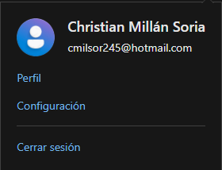
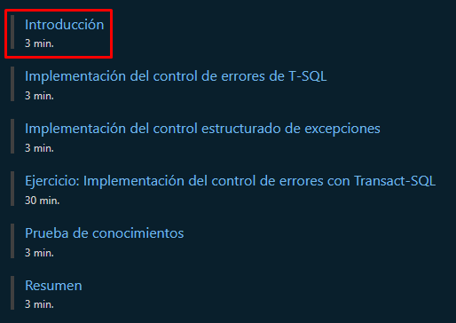

<style>
  h1, h4, h2, h3{
    text-align: center;
    font-weight: bold;
    border: none;
    margin-bottom: 0px;
  }

  p{
    text-align: justify;
  }

  img{
    border: 2px solid black;
  }

  #ex{
    border: none;
  }
</style>

<h1>TERCER CURSO</h1>

<h4>CHRISTIAN MILLÁN SORIA</h4>

<hr>

<p>Comenzamos entrando en <a href="https://learn.microsoft.com/es-es/training/modules/implement-error-handling-transact-sql/">este enlace</a>.</p>

<p>Iniciamos sesión con una cuenta de Hotmail.</p>



<p>Una vez tenemos una cuenta, bajamos y encontramos una serie de apartados. Entramos en el primero.</p>



<hr>

<h2>INTRODUCCIÓN</h2>

```
Transact-SQL (T-SQL) es un poderoso lenguaje declarativo que permite explorar y manipular la base de datos. A medida que aumenta la complejidad de los programas, también lo hace el riesgo de errores, por ejemplo, por falta de coincidencia de los tipos de datos o variables que no contienen los valores esperados. Si no se administran correctamente, estos errores pueden hacer que los programas dejen de ejecutarse o que se produzcan comportamientos inesperados.

Aquí se explica el control básico de errores de T-SQL, incluida la forma en que se pueden generar intencionadamente, y cómo configurar la activación de alertas cuando se produzcan errores.

Después de completar esta unidad, podrá:

· Generar errores mediante la instrucción RAISERROR.
· Generar errores mediante la instrucción THROW.
· Use la variable del sistema @@ERROR.
· Crear errores personalizados.
· Crear alertas que se activen cuando se produzcan errores.
```

<hr>

<h2>IMPLEMENTACIÓN DEL CONTROL DE ERRORES DE T-SQL</h2>

```
Un error indica un problema o una incidencia importante que surge durante una operación de base de datos. Los errores puede generarlos el Motor de base de datos de Microsoft SQL Server en respuesta a un evento o un error a nivel del sistema; o usted puede generar errores de aplicación en el código de Transact-SQL.
```

<h3>ELEMENTOS DE LOS ERRORES DEL MOTOR DE BASE DE DATOS</h3>

```
Sea cual sea la causa, cada error se compone de los siguientes elementos:

· Número de error: número único que identifica el error específico.
· Mensaje de error: texto que describe el error.
· Gravedad: indicación numérica de la gravedad de 1 a 25.
· Estado: código de estado interno de la condición del motor de base de datos.
· Procedimiento: nombre del procedimiento almacenado o desencadenador en que se produjo el error.
· Número de línea: la instrucción del lote o procedimiento que generó el error.
```

<h3>ERRORES DEL SISTEMA</h3>

```
Los errores del sistema están predefinidos y se pueden ver en la vista del sistema sys.messages. Cuando se produce un error del sistema, SQL Server puede tomar medidas correctivas automáticas, dependiendo de la gravedad del error. Por ejemplo, cuando se produce un error de gravedad alta, SQL Server puede desconectar una base de datos o incluso detener el servicio del motor de base de datos.
```

<h3>ERRORES PERSONALIZADOS</h3>

```
Puede generar errores en el código de Transact-SQL para responder a condiciones específicas de la aplicación o para personalizar la información enviada a las aplicaciones cliente en respuesta a errores del sistema. Estos errores de aplicación se pueden definir en línea donde se generan, o puede predefinirlos en la tabla sys.messages junto con los errores proporcionados por el sistema. Los números de error utilizados para los errores personalizados deben ser a partir de 50001, inclusive.

Para agregar un mensaje de error personalizado a sys.messages, use sp_addmessage. El usuario del mensaje debe ser miembro de los roles fijos de servidor sysadmin o serveradmin.

Esta es la sintaxis de sp_addmessage:
```

```sql
sp_addmessage [ @msgnum= ] msg_id , [ @severity= ] severity , [ @msgtext= ] 'msg' 
     [ , [ @lang= ] 'language' ] 
     [ , [ @with_log= ] { 'TRUE' | 'FALSE' } ] 
     [ , [ @replace= ] 'replace' ]
```

```
Este es un ejemplo de un mensaje de error personalizado que usa esta sintaxis:
```

```sql
sp_addmessage 50001, 10, N’Unexpected value entered’;
```

```
Además, puede definir mensajes de error personalizados; los miembros del rol de servidor sysadmin también pueden usar un parámetro adicional, @with_log. Cuando se establece en TRUE, el error también se registrará en el registro de aplicaciones de Windows. Los mensajes escritos en el registro de aplicaciones de Windows también se escriben en el registro de errores de SQL Server. Sea precavido con el uso de la opción @with_log, ya que a los administradores de red y del sistema no les suelen gustar las aplicaciones "charlatanas" en los registros del sistema. Sin embargo, si el error debe capturarse con una alerta, primero debe escribirse en el registro de aplicaciones de Windows.

Los mensajes se pueden reemplazar sin eliminarlos primero mediante la opción @replace= "replace".

Los mensajes son personalizables y se pueden agregar otros diferentes para el mismo número de error en varios idiomas, según el valor de language_id.
```

<h3>GENERACIÓN DE ERRORES MEDIANTE RAISERROR</h3>

```
Tanto PRINT como RAISERROR se pueden usar para devolver información o mensajes de advertencia a las aplicaciones. RAISERROR permite que las aplicaciones generen un error que luego puede capturar el proceso de llamada.
```

<h3>RAISERROR</h3>

```
La posibilidad de generar errores en T-SQL facilita el control de errores en la aplicación, ya que se envía como cualquier otro error del sistema. RAISERROR se usa para:

· Ayudar a solucionar problemas con el código de T-SQL.
· Comprobar los valores de los datos.
· Devolver mensajes que contengan texto variable.

Este es un ejemplo de un mensaje de error personalizado que usa RAISERROR.
```

```sql
RAISERROR (N'%s %d', -- Message text,
    10, -- Severity,
    1, -- State,
    N'Custom error message number',
    2)
```

```
Cuando se desencadena, devuelve:
```

```sql
Custom error message number 2
```

```
En el ejemplo anterior, %d es un marcador de posición de un número y %s es un marcador de posición de una cadena. Además, debe advertir que no se ha mencionado un número de mensaje. Cuando se producen errores con las cadenas de mensaje que usan esta sintaxis, el número de error es siempre 50000.
```

<h3>GENERACIÓN DE ERRORES MEDIANTE THROW</h3>

```
La instrucción THROW ofrece un método más sencillo de generar errores en el código. Los errores deben tener un número de error mínimo de 50000.
```

<h3>THROW</h3>

```
THROW se diferencia de RAISERROR de varias maneras:

· Los errores generados por THROW siempre son de gravedad 16.
· Los mensajes devueltos por THROW no están relacionados con ninguna entrada de sys.sysmessages.
· Los errores generados por THROW solo provocan la anulación de transacciones cuando se usan junto con SET XACT_ABORT ON y la sesión se termina.
```

```sql
THROW 50001, 'An Error Occured',0
```

<h3>CAPTURA DE CÓDIGOS DE ERROR CON @@ERROR</h3>

```
El código de control de errores más tradicional de las aplicaciones de SQL Server se ha creado mediante @@ERROR. El control estructurado de excepciones se introdujo en SQL Server 2005 y proporciona una muy buena alternativa al uso de @@ERROR. Este tema se tratará en la lección siguiente. Una gran cantidad del código de control de errores de SQL Server existente se basa en @@ERROR, por lo que es importante comprender cómo usarlo.
```

<h3>@@ERROR</h3>

```
@@ERROR es una variable del sistema que contiene el número del último error que se ha producido. Un problema importante con @@ERROR es que el valor que contiene se restablece rápidamente a medida que se ejecuta cada instrucción adicional.

Por ejemplo, considere el siguiente código:
```

```sql
RAISERROR(N'Message', 16, 1);
IF @@ERROR <> 0
PRINT 'Error=' + CAST(@@ERROR AS VARCHAR(8));
GO
```

```
Cabría esperar que, cuando se ejecute el código, el número de error se devuelva en una cadena impresa. Sin embargo, cuando se ejecuta el código, se devuelve:
```

```sql
Msg 50000, Level 16, State 1, Line 1
Message
Error=0
```

```
El error se ha generado, pero le mensaje impreso ha sido "Error=0". En la primera línea de la salida, puede ver que, como se esperaba, el error era realmente 50000, con un mensaje pasado a RAISERROR. Esto se debe a que la instrucción IF que sigue a la instrucción RAISERROR se ha ejecutado correctamente y ha provocado el restablecimiento del valor @@ERROR. Por este motivo, al trabajar con @@ERROR, es importante capturar el número de error en una variable tan pronto como se genere y, luego, continuar el procesamiento con la variable.

El código siguiente muestra este escenario:
```

```sql
DECLARE @ErrorValue int;
RAISERROR(N'Message', 16, 1);
SET @ErrorValue = @@ERROR;
IF @ErrorValue <> 0
PRINT 'Error=' + CAST(@ErrorValue AS VARCHAR(8));
```

```
Cuando se ejecuta este código, se devuelve la salida siguiente:
```

```sql
Msg 50000, Level 16, State 1, Line 2
Message
Error=50000
```

```
El número de error se notifica ahora correctamente.
```

<h3>CENTRALIZACIÓN DEL CONTROL DE ERRORES</h3>

```
Otro problema importante con el uso de @@ERROR para el control de errores es que es difícil centralizarlo dentro del código de T-SQL. El control de errores tiende a terminar disperso por todo el código. Sería posible centralizar el control de errores mediante @@ERROR hasta cierto punto, por medio de etiquetas e instrucciones GOTO. Sin embargo, la mayoría de los desarrolladores lo desaprobaría hoy en día al considerarlo una mala práctica en la creación de código.
```

<h3>CREACIÓN DE ALERTAS DE ERROR</h3>

```
Con determinadas categorías de errores, los administradores pueden crear alertas de SQL Server, ya que quieren recibir una notificación en cuanto se produzcan. Esto puede aplicarse incluso a los mensajes de error definidos por el usuario. Por ejemplo, es posible que quiera generar una alerta cada vez que se rellene un registro de transacciones. Las alertas se usan normalmente para llamar la atención de los administradores sobre los errores de gravedad alta (por ejemplo, gravedad 19 o superior).
```

<h3>GENERACIÓN DE ALERTAS</h3>

```
Se pueden crear alertas para mensajes de error específicos. El servicio de alertas lo que hace es registrarse como un servicio de devolución de llamada con el servicio de registro de eventos. Esto significa que las alertas solo funcionan en los errores registrados.

Hay dos maneras de que un error genere una alerta: puede usar la opción WITH LOG al generar el error o se puede alterar el mensaje para que se registre ejecutando sp_altermessage. La opción WITH LOG solo afecta a la instrucción actual. El uso de sp_altermessage cambia el comportamiento del error en todo el uso futuro. La modificación de errores del sistema mediante sp_altermessage solo es posible desde SQL Server 2005 SP3 o SQL Server 2008 SP1 en adelante.
```

<hr>

<h2>IMPLEMENTACIÓN DEL CONTROL ESTRUCTURADO DE ESCEPCIONES</h2>

```
Ahora que conoce la naturaleza de los errores y el control de errores básico en T-SQL, es el momento de ver una forma más avanzada de control de errores. El control estructurado de excepciones se introdujo en SQL Server 2005.

Aquí verá cómo usarlo y evaluar sus ventajas y limitaciones. Se describe el bloque TRY CATCH, el rol de las funciones de control de errores y la diferencia entre los errores detectables y no detectables. Por último, verá cómo se pueden administrar y mostrar los errores cuando sea necesario.
```

<h3>QUÉ ES LA PROGRAMACIÓN DE BLOQUES TRY/CATCH</h3>

```
El control estructurado de excepciones es más eficaz que el control de errores basado en la variable del sistema @@ERROR. Impide que el código quede plagado de código de control de errores y permite centralizar este. La centralización del código de control de errores también significa que puede centrarse más en el propósito del código que en el control de errores que contiene.
```

<h3>BLOQUE TRY Y BLOQUE CATCH</h3>

```
Cuando se usa el control estructurado de excepciones, el código que podría generar un error se coloca dentro de un bloque TRY. Los bloques TRY están encerrados entre instrucciones BEGIN TRY y END TRY.

Si se produce un error detectable (la mayoría de los errores se pueden detectar), el control de ejecución se mueve al bloque CATCH. El bloque CATCH es una serie de instrucciones T-SQL encerradas entre instrucciones BEGIN CATCH y END CATCH.
```

<h3>LIMITACIONES ACTUALES</h3>

```
Los lenguajes de alto nivel suelen ofrecer una construcción try/catch/finally, y a menudo se usan para liberar recursos implícitamente. No hay ningún bloque FINALLY equivalente en T-SQL.
```

<h3>DIFERENCIA ENTRE LOS ERRORES DETECTABLES Y NO DETECTABLES</h3>

```
Es importante tener en cuenta que, aunque los bloques TRY/CATCH le permiten detectar una gama mucho más amplia de errores que @@ERROR, no se pueden detectar todos los tipos.
```

<h3>ERRORES DETECTABLES FRENTE A ERRORES NO DETECTABLES</h3>

```
Los bloques TRY/CATCH no pueden detectar todos los errores dentro del mismo ámbito donde existe el bloque TRY/CATCH. Con frecuencia, los errores que no se pueden detectar en el mismo ámbito se pueden detectar en un ámbito circundante. Por ejemplo, es posible que no pueda detectar un error en el procedimiento almacenado que contiene el bloque TRY/CATCH. Sin embargo, es probable que pueda detectarlo en un bloque TRY/CATCH en el código que llamó al procedimiento almacenado donde se produjo el error.
```

<h3>ERRORES COMUNES QUE NO SE PUEDEN DETECTAR</h3>

```
Algunos ejemplos comunes de errores que no se pueden detectar son:

· Errores de compilación, como errores de sintaxis que impiden que un lote se compile.
· Problemas de recompilación de nivel de instrucción que suelen estar relacionados con la resolución de nombres diferida. Por ejemplo, podría crear un procedimiento almacenado que haga referencia a una tabla desconocida. Solo se produce un error cuando el procedimiento intenta resolver el nombre de la tabla en un elemento objectid.
```

<h3>CÓMO VOLVER A PRODUCIR ERRORES MEDIANTE THROW</h3>

```
Si la instrucción THROW se usa en un bloque CATCH sin parámetros, volverá a producir el error que provocó que el código entrara en el bloque CATCH. Puede usar esta técnica para implementar el registro de errores en la base de datos; para ello, se detectan los errores y se registran sus detalles y, luego, se produce el error original en la aplicación cliente, para que se pueda controlar allí.

Este es un ejemplo de cómo volver a producir un error.
```

```sql
BEGIN TRY
    -- code to be executed
END TRY
BEGIN CATCH
    PRINT ERROR_MESSAGE0.
    THROW
END CATCH
```

```
En algunas de las versiones anteriores de SQL Server, no había ningún método para producir un error del sistema. Aunque THROW no puede especificar que se genere un error del sistema, cuando este bloque se usa sin parámetros en un bloque CATCH, se volverán a producir los errores del sistema y del usuario.
```

<h3>¿QUÉ SON LAS FUNCIONES DE CONTROL DE ERRORES?</h3>

```
Los bloques CATCH hacen que la información relacionada con los errores esté disponible mientras dura el bloque. Esto incluye los subámbitos, como los procedimientos almacenados, que se ejecutan desde el bloque CATCH.
```

<h3>FUNCIONES DE CONTROL DE ERRORES</h3>

```
Debe recordar que, al programar con @@ERROR, el valor mantenido por la variable del sistema @@ERROR se ha restablecido en cuanto se ha ejecutado la instrucción siguiente.

Otra ventaja importante del control estructurado de excepciones en T-SQL es que se ha proporcionado una serie de funciones de control de errores que mantienen sus valores en todo el bloque CATCH. Distintas funciones proporcionan cada una de las propiedades de los errores que se han generado.

Esto significa que puede escribir procedimientos almacenados genéricos de control de errores que todavía pueden acceder a la información relacionada con el error.

· Los bloques CATCH hacen que la información relacionada con los errores esté disponible mientras dura el bloque.
· @@ERROR se restablece cuando se ejecuta la instrucción siguiente.
```

<h3>ADMINISTRACIÓN DE ERRORES EN EL CÓDIGO</h3>

```
La integración de CLR de SQL permite la ejecución de código administrado dentro de SQL Server. Los lenguajes .NET de alto nivel, como C# y VB, cuentan con un control detallado de excepciones. Los errores se pueden detectar mediante bloques try/catch/finally estándar de .NET.
```

<h3>ERRORES EN EL CÓDIGO ADMINISTRADO</h3>

```
En general, es posible que desee detectar los errores dentro del código administrado lo más posible. Sin embargo, es importante tener en cuenta que los errores que no se controlan en el código administrado se pasan al código T-SQL de llamada. Siempre que cualquier error que ocurra en el código administrado se devuelva a SQL Server, aparecerá como un error 6522. Los errores se pueden anidar y ese error concreto encerrará la causa real del error.

Otra causa poco frecuente, pero posible, de errores en el código administrado sería que el código pudiera ejecutar una instrucción T-SQL RAISERROR a través de un objeto SqlCommand.
```

<hr>

<h2>EJERCICIO</h2>

<h3></h3>