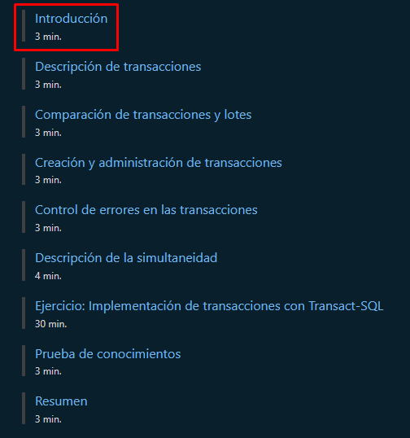
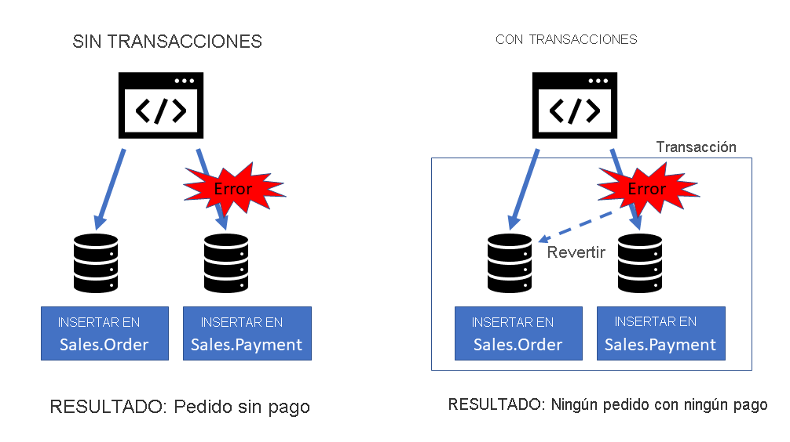

<style>
  h1, h4, h2, h3{
    text-align: center;
    font-weight: bold;
    border: none;
    margin-bottom: 0px;
  }

  p{
    text-align: justify;
  }

  img{
    border: 2px solid black;
  }

  #ex{
    border: none;
  }
</style>

<h1>CUARTO CURSO</h1>

<h4>CHRISTIAN MILLÁN SORIA</h4>

<hr>

<p>Comenzamos entrando en <a href="https://learn.microsoft.com/es-es/training/modules/implement-transactions-transact-sql/">este enlace</a>.</p>

<p>Iniciamos sesión con una cuenta de Hotmail.</p>


<p>Una vez tenemos una cuenta, bajamos y encontramos una serie de apartados. Entramos en el primero.</p>



<hr>

<h2>INTRODUCCIÓN</h2>

```
En este módulo, aprenderá a construir transacciones para controlar el comportamiento de varias instrucciones Transact-SQL (T-SQL). Aprenderá a determinar si se ha producido algún error y cuándo revertir instrucciones.

Después de completar este módulo, podrá:

· Describir transacciones
· Comparar transacciones y lotes
· Crear y administrar transacciones
· Controlar errores en las transacciones
· Describir la simultaneidad
```

<hr>

<h2>DESCRIPCIÓN DE TRANSACCIONES</h2>

```
Una transacción se refiere a una o varias instrucciones T-SQL que se tratan como una unidad. Si se produce un error en una sola transacción, se producirá un error en todas las instrucciones. Si una transacción se completa correctamente, sabrá que todas las instrucciones de modificación de datos de la transacción se realizaron de manera correcta y que se confirmaron en la base de datos.

Las transacciones garantizan que todas las instrucciones dentro de una transacción se completen correctamente o que se producirá un error en todas: no se permite ninguna finalización parcial. Las transacciones encapsulan las operaciones que deben producirse de forma lógica, como varias entradas en tablas relacionadas que forman parte de una sola operación.

Considere una empresa que almacena las compras en una tabla Sales.Order y los pagos en una tabla Sales.Payment. Cuando alguien compra algo, ambas tablas deben actualizarse. Si esto se implementa sin transacciones y se produce un error cuando el pago se escribe en la base de datos, se seguirá confirmando la inserción Sales.Order, dejando la tabla de pago sin una entrada.

Cuando se implementa con transacciones, se realizan ambas entradas o no se realiza ninguna entrada. Si se produce un error al escribir el pago en la tabla, también se revertirá la inserción del pedido. Esto significa que la base de datos siempre está en un estado coherente.
```



```
Se debe tener en cuenta que esto hace referencia a errores graves, como errores de hardware o de red. Los errores en instrucciones SQL solo harían que la transacción se revierta en circunstancias determinadas y es importante revisar las unidades posteriores de este módulo a fin de comprender completamente lo que implica el uso de transacciones.

Hay varios tipos de transacciones:
```

<h3>TRANSACCIONES EXPLÍCITAS</h3>

```
Las palabras clave BEGIN TRANSACTION y COMMIT o ROLLBACK inician y finalizan cada lote de instrucciones. Esto le permite especificar qué instrucciones se deben confirmar o revertir en conjunto.
```

<h3>TRANSACCIONES IMPLÍCITAS</h3>

```
Una transacción se inicia cuando se completa la transacción anterior. Cada transacción se completa explícitamente con una instrucción COMMIT o ROLLBACK.
```

<h3>CARACTERÍSTICAS ACID</h3>

```
Los sistemas de procesamiento de transacciones en línea (OLTP) requieren transacciones para cumplir las características "ACID":

· Atomicidad: cada transacción se trata como una unidad única, la cual se completa correctamente o produce un error general. Por ejemplo, una transacción que conlleve el adeudo de fondos de una cuenta y el abono de la misma cantidad en otra debe completar ambas acciones. Si alguna de las acciones no se puede completar, se debe producir un error en la otra.
· Coherencia: las transacciones solo pueden pasar los datos de la base de datos de un estado válido a otro. Para continuar con el ejemplo anterior del adeudo y el abono, el estado completado de la transacción debe reflejar la transferencia de fondos de una cuenta a la otra.
· Aislamiento: las transacciones simultáneas no pueden interferir entre sí y deben dar lugar a un estado coherente de la base de datos. Por ejemplo, mientras la transacción para transferir fondos de una cuenta a otra está en proceso, otra transacción que comprueba el saldo de las cuentas debe devolver resultados coherentes. Es decir, la transacción de comprobación del saldo no puede recuperar un valor para una cuenta que refleje el saldo antes de la transferencia y un valor para la otra cuenta que refleje el saldo después de la transferencia.
· Durabilidad: cuando se ha confirmado una transacción, permanece confirmada. Una vez que la transacción de transferencia de la cuenta se ha completado, los saldos revisados de las cuentas se conservan, de modo que, incluso si el sistema de base de datos se desactiva, la transacción confirmada se refleje cuando se vuelva a activar.
```

<hr>

<h2>COMPARACIÓN DE TRANSACCIONES Y LOTES</h2>

```
Resulta útil comparar el comportamiento de los lotes de T-SQL, incluidos dentro de un bloque TRY/CATCH, con el comportamiento de las transacciones.

Tenga en cuenta el código siguiente que inserta dos pedidos de cliente y que requiere una fila en la tabla SalesLT.SalesOrderHeader y una o varias filas en la tabla SalesLT.SalesOrderDetail. Todas las instrucciones INSERT se incluyen dentro del bloque TRY.

· Si se produce un error en la primera inserción, la ejecución pasa al bloque CATCH y no se ejecuta más código.
· Si se produce un error en la segunda inserción, la ejecución pasa al bloque CATCH y no se ejecuta más código. Sin embargo, la primera inserción se realizó correctamente y no se revierte, lo que deja la base de datos en un estado incoherente. Se insertó una fila para el pedido, pero no para los detalles del pedido.
```

```sql
BEGIN TRY
	INSERT INTO dbo.Orders(custid, empid, orderdate) 
		VALUES (68, 9, '2021-07-12');
	INSERT INTO dbo.Orders(custid, empid, orderdate) 
		VALUES (88, 3, '2021-07-15');
	INSERT INTO dbo.OrderDetails(orderid,productid,unitprice,qty) 
		VALUES (1, 2, 15.20, 20);
	INSERT INTO dbo.OrderDetails(orderid,productid,unitprice,qty) 
		VALUES (999, 77, 26.20, 15);
END TRY
BEGIN CATCH
	SELECT ERROR_NUMBER() AS ErrNum, ERROR_MESSAGE() AS ErrMsg;
END CATCH;
```

```
Compare esto con la implementación del código dentro de una transacción. El bloque TRY/CATCH se sigue utilizando para el control de errores; sin embargo, las instrucciones INSERT de las tablas Orders y OrderDetails se incluyen dentro de las palabras clave BEGIN TRANSACTION/COMMIT TRANSACTION. Esto garantiza que todas las instrucciones se tratan como una transacción única, que puede completarse correctamente o generar un error. Una fila se escribe tanto en la tabla Orders como en la tabla OrderDetails, o bien no se inserta ninguna fila. De esta manera, la base de datos nunca puede estar en un estado incoherente.
```

```sql
BEGIN TRY
 BEGIN TRANSACTION;
	INSERT INTO dbo.Orders(custid, empid, orderdate) 
		VALUES (68,9,'2006-07-15');
	INSERT INTO dbo.OrderDetails(orderid,productid,unitprice,qty) 
		VALUES (99, 2,15.20,20);
	COMMIT TRANSACTION;
END TRY
BEGIN CATCH
 SELECT ERROR_NUMBER() AS ErrNum, ERROR_MESSAGE() AS ErrMsg;
 ROLLBACK TRANSACTION;
END CATCH;
```

<hr>

<h2>CREACIÓN Y ADMINISTRACIÓN DE TRANSACCIONES</h2>

```
Para iniciar explícitamente una transacción, use BEGIN TRANSACTION o la versión abreviada, BEGIN TRAN.

Una vez que se inicia una transacción, debe finalizar con:

· COMMIT TRANSACTION o
· ROLLBACK TRANSACTION.

Esto garantiza que todas las instrucciones de la transacción se confirman juntas o, si se produce un error, se revierten juntas.

Las transacciones duran hasta que se emite un comando COMMIT TRANSACTION o ROLLBACK TRANSACTION o se descarta la conexión. Si la conexión se descarta en el transcurso de una transacción, se revierte toda la transacción.

Las transacciones pueden estar anidadas, en cuyo caso las transacciones internas se revertirán si la transacción externa se revierte.
```

<h3>NO SE DETECTA NINGÚN ERROR</h3>

```
Cuando las instrucciones de la transacción se completen sin errores, use COMMIT TRANSACTION, que algunas veces se abrevia como COMMIT TRAN. De este modo, los datos se confirman en la base de datos. Esto también liberará recursos, como bloqueos, retenidos durante la transacción.
```

<h3>SÍ SE DETECTA UN ERROR</h3>

```
Si se produjo un error dentro de la transacción, use el comando ROLLBACK.

ROLLBACK deshace las modificaciones realizadas en los datos durante la transacción y los deja en el estado que tenían antes de que se iniciara la transacción. ROLLBACK también libera recursos, como bloqueos, retenidos para la transacción.
```

<h3>XACT_ABORT</h3>

```
Cuando el estado de SET XACT_ABORT es ON, si SQL Server genera un error, se revierte toda la transacción. Cuando el estado de SET XACT_ABORT es OFF, solo se revierte la instrucción que produjo el error si la gravedad del error es baja.

Por ejemplo, cuando el estado de SET XACT_ABORT es OFF, una transacción tiene tres instrucciones. Dos no tienen ningún error, pero la tercera interrumpe una restricción CHECK. En este ejemplo, aunque las tres instrucciones estén en una transacción, se confirman dos de ellas. En el mismo ejemplo, si el error se hubiera producido por un tipo de datos incorrecto, habría sido lo suficientemente grave como para emitir una reversión y no se habría confirmado ninguna de las instrucciones.

Como no siempre está claro si la transacción se confirma o se revierte, es esencial agregar el control de errores a las transacciones.
```

<hr>

<h2>CONTROL DE ERRORES EN LAS TRANSACCIONES</h2>

```
El control estructurado de excepciones usa la construcción TRY/CATCH para comprobar si hay errores y, si los hay, controlarlos. Cuando usa el control de excepciones con transacciones, es importante colocar las palabras clave COMMIT o ROLLBACK en el lugar correcto en relación con los bloques TRY/CATCH.
```

<h3>CONFIRMACIÓN DE TRANSACCIONES</h3>

```
Cuando use transacciones con control estructurado de excepciones, coloque la palabra clave COMMIT de la transacción dentro del bloque TRY, como se muestra en el ejemplo de código siguiente:
```

```sql
BEGIN TRY
 BEGIN TRANSACTION
 	INSERT INTO dbo.Orders(custid, empid, orderdate)
	VALUES (68,9,'2006-07-12');
	INSERT INTO dbo.OrderDetails(orderid,productid,unitprice,qty)
	VALUES (1, 2,15.20,20);
 COMMIT TRANSACTION
END TRY
```

<h3>REVERSIÓN DE TRANSACCIÓN</h3>

```
Cuando use transacciones con control estructurado de excepciones, coloque la palabra clave ROLLBACK de la transacción dentro del bloque CATCH, como se muestra en el ejemplo de código siguiente:
```

```sql
BEGIN TRY
 BEGIN TRANSACTION;
 	INSERT INTO dbo.Orders(custid, empid, orderdate)
	VALUES (68,9,'2006-07-12');
	INSERT INTO dbo.OrderDetails(orderid,productid,unitprice,qty)
	VALUES (1, 2,15.20,20);
 COMMIT TRANSACTION;
END TRY
BEGIN CATCH
	SELECT ERROR_NUMBER() AS ErrNum, ERROR_MESSAGE() AS ErrMsg;
	ROLLBACK TRANSACTION;
END CATCH;
```

<h3>XACT_STATE</h3>

```
Para evitar la reversión de una transacción activa, use la función XACT_STATE. XACT_STATE devuelve estos valores:

Valor devuelto                              Significado
1                                           La solicitud actual tiene una transacción de usuario activa y confirmable.
0                                           No hay ninguna transacción activa.
-1                                          La solicitud actual tiene una transacción de usuario activa, pero se ha producido un error por el cual la transacción se clasificó como no confirmable.

XACT_State se puede usar antes del comando ROLLBACK para comprobar si la transacción está activa.

En el código siguiente se muestra la función XACT_STATE que se usa dentro del bloque CATCH, de manera que la transacción solo se revierte si hay una transacción de usuario activa.
```

```sql
BEGIN TRY
 BEGIN TRANSACTION;
 	INSERT INTO dbo.SimpleOrders(custid, empid, orderdate) 
	VALUES (68,9,'2006-07-12');
	INSERT INTO dbo.SimpleOrderDetails(orderid,productid,unitprice,qty) 
	VALUES (1, 2,15.20,20);
 COMMIT TRANSACTION;
END TRY
BEGIN CATCH
	SELECT ERROR_NUMBER() AS ErrNum, ERROR_MESSAGE() AS ErrMsg;
	IF (XACT_STATE()) <> 0
    	BEGIN
        ROLLBACK TRANSACTION;
    	END;
	ELSE .... -- provide for other outcomes of XACT_STATE()
END CATCH;
```

<hr>

<h2>DESCRIPCIÓN DE LA SIMULTANEIDAD</h2>

```

```