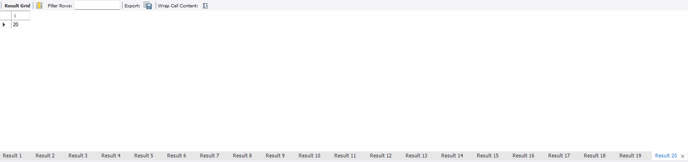
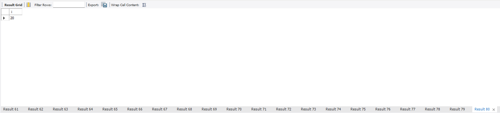
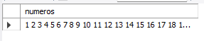
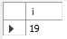
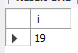
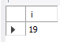
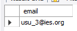
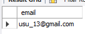
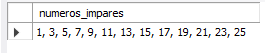

<style>
  h1, h2, h3, h4, h5, h6{
    text-align: center;
    font-weight: bold;
    border: none;
    margin-bottom: 0px;
  }

  p{
    text-align: justify;
  }

  img{
    border: 2px solid black;
  }
</style>

<h1>PROCEDIMIENTOS CON EXPRESIONES REPETITIVAS</h1>

<h4>CHRISTIAN MILLÁN SORIA</h4>

<hr>

<p><b>1.</b></p>

<p><b>a. Procedimiento "numeros" que muestre los 20 primeros números enteros.</b></p>

```sql
drop procedure if exists numeros;
delimiter //
create procedure numeros()
begin
declare i int default 1;
while i<=20 do
select i;
set i=i+1;
end while;
end//
delimiter ;
call numeros();
```



<p><b>b. Realiza un procedimiento "numeros" que muestre los 20 primeros números enteros pero con la opción "repeat".</b></p>

```sql
drop procedure if exists numeros;
delimiter //
create procedure numeros()
begin
declare i int default 1;
repeat
select i;
set i=i+1;
until i>20 end repeat;
end//
delimiter ;
call numeros();
```



<p><b>c. Explica qué está realizando este código.</b></p>

```sql
drop procedure if exists numeros;
delimiter //
create procedure numeros()
begin
declare i integer default 1;
declare nums varchar(100) default "";
while i<=20 DO
set nums=CONCAT(nums, " ", i);
set i=i+1;
end while;
select nums as numeros;
end//
delimiter ;
```

<p>Crea un procedimiento llamado "numeros" que genera una cadena de texto que contiene los números del 1 al 20 separados por un espacio.</p>

<p>El procedimiento comienza eliminando cualquier versión anterior del procedimiento "numeros" si existe. Luego, establece el delimitador en "//" para indicar el final del procedimiento y permitir el uso de múltiples sentencias SQL.</p>

<p>Después, se define una variable i con un valor inicial de 1 y otra variable llamada "nums" que se utilizará para almacenar los números. A continuación, se inicia un bucle WHILE que se ejecutará hasta que i sea mayor que 20.</p>

<p>Dentro del bucle, se concatena el valor actual de i a la variable "nums" utilizando la función "concat" y se establece el valor de i en i+1.</p>

<p>Una vez que el bucle se ha completado y se han agregado todos los números a la variable "nums", se selecciona la variable "nums" y se le da un alias de "numeros".</p>

<p>Por último, se restablece el delimitador a su valor predeterminado ";" para indicar el final de la sentencia "sql create procedure".</p>



<p><b>2.</b></p>

<p><b>a. Opción de "repeat".</b></p>

```sql
drop procedure if exists impares;
delimiter //
create procedure impares()
begin
declare i integer; -- opción alternativa: declare i integer default 0;
set i=0;
repeat
set i=i+1;
if mod(i,2)<>0 then
select i;
end if;
until i>=20
end repeat;
end//
delimiter ;
```

```sql
call impares();
```



<p><b>b. Opción de "while".</b></p>

```sql
drop procedure if exists impares;
delimiter //
create procedure impares()
begin
declare i integer default 1;
declare count integer default 0;
while count<10 do
if mod(i, 2)<>0 then
select i;
set count=count+1;
end if;
set i=i+1;
end while;
end//
delimiter ;
call impares();
```



<p><b>c. Usando cadena. Explica el siguiente código:</b></p>

```sql
drop procedure if exists impares;
delimiter //
create procedure impares()
begin
declare i integer;
declare impar varchar(100) default "";
set i=1;
while i<=20 do
if mod(i,2)< 0 then
set impar=concat(impar," ",i);
end if;
set i=i+1;
end while;
select impar as numeros_impares;
end//
delimiter ;
```

```sql
call impares();
```

<p>Crea un procedimiento llamado "impares" que utiliza una cadena de texto para almacenar los números impares del 1 al 20 y luego muestra esta cadena como resultado.</p>

<p>Primero, se elimina cualquier versión anterior del procedimiento "impares" si existe y se establece el delimitador en "//" para permitir el uso de múltiples sentencias SQL.</p>

<p>Luego, se declaran dos variables: i, que se inicializa en 1, y "impar", que se utiliza para almacenar los números impares.</p>

<p>Después, se inicia un bucle "while" que se ejecutará hasta que i sea mayor que 20.</p>

<p>Dentro del bucle, se verifica si i es un número impar utilizando la función MOD. Si es impar, se agrega a la cadena "impar" utilizando la función "concat" para concatenar el número al final de la cadena.</p>

<p>Después, se incrementa el valor de i en 1 y se continúa con la siguiente iteración del bucle "while".</p>

<p>Finalmente, se selecciona la variable "impar" y se le da un alias de "numeros_impares" como resultado de la ejecución del procedimiento.</p>



<p><b>3. Crear un procedimiento llamado "generar_cuentas" que, dado un número "n" y su nombre de dominio, permita obtener n cuentas del tipo "usu_1@dominio", usu_2@dominio", etc. Se deberá comprobar que el dominio no esté vacío y el número n sea entero positivo. Ejemplo de llamada: call generar_cuentas(3, "ies.org");</b></p>

<p><b>a. Opción de "while".</b></p>

```sql
drop procedure if exists generar_cuentas;
delimiter //
create procedure generar_cuentas(n integer, dominio varchar(50))
begin
declare i integer default 0;
if(n>0) then
if(dominio is not null and CHAR_LENGTH(dominio)>0) then
while(i<n) DO
set i=i+1;
select concat('usu_', i, '@', dominio) as email;
end while;
else
signal sqlstate '45000' set message_text='El dominio no debe ser vacío';
end if;
else
signal sqlstate '45000' set message_text='N debe ser un valor positivo';
end if;
end//
delimiter ;
call generar_cuentas(3, "ies.org");
```



<p><b>Opción de "repeat".</b></p>

```sql
drop procedure if exists generar_cuentas;
delimiter //
create procedure generar_cuentas(n integer, dominio varchar(50))
begin
declare i integer default 0;
if(n>0) then
if(dominio is not null and char_length(dominio)>0) then
repeat
set i=i+1;
select concat('usu_', i, '@', dominio) AS email;
until i=n end repeat;
else
signal sqlstate '45000' set message_text='El dominio no debe ser vacío';
end if;
else
signal sqlstate '45000' set message_text='N debe ser un valor positivo';
end if;
end//
delimiter ;
call generar_cuentas(13, 'gmail.com');
```



<p><b>4. Realiza un procedimiento "nimpares" que, dado un parámetro "n", muestre los n primeros números impares en el siguiente formato: 1, 3, 5, 7, ...</b></p>

```sql
drop procedure if exists nimpares;
delimiter //
create procedure nimpares(n int)
begin
declare i int default 1;
declare contador int default 0;
declare impares varchar(255) default "";
while contador<n do
if i%2=1 then
if contador>0 then
set impares=concat(impares, ", ");
End if;
set impares=concat(impares, i);
set contador=contador + 1;
end if;
set i=i+1;
end while;
select impares as numeros_impares;
end//
delimiter ;
call nimpares(13);
```

