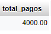

<style>
  h1, h2, h3, h4, h5, h6{
    text-align: center;
    font-weight: bold;
    border: none;
    margin-bottom: 0px;
  }

  p{
    text-align: justify;
  }

  img{
    border: 2px solid black;
  }
</style>

<h1>JARDINERÍA</h1>

<h4>CHRISTIAN MILLÁN SORIA</h4>

<h4>1º DAW TARDE</h4>

<hr>

<p><b>1. Mostrar el nombre de un cliente dado su código.</b></p>

```sql
drop procedure if exists nombre_cliente;
delimiter //
create procedure nombre_cliente(codigo int)
begin
select nombre_cliente, codigo_cliente from cliente where codigo_cliente=codigo;
end//
delimiter ;
call nombre_cliente(1);
```


<p><b>2. Mostrar el precioVenta y la gama de un producto dado su código.</b></p>

```sql
drop procedure if exists precio_venta;
delimiter //
create procedure precio_venta(codigo int)
begin
select precio_venta from producto where codigo_producto=codigo;
end//
delimiter ;
call precio_venta(21636);
```


<p><b>3. Mostrar toda la información de un pedido dado su código (fechaEsperada, fechaEntrega, fechaPedido, estado y comentarios).</b></p>

```sql
drop procedure if exists info_pedido;
delimiter //
create procedure info_pedido(codigo int)
begin
select * from pedido where codigo_pedido=codigo;
end//
delimiter ;
call info_pedido(1);
```


<p><b>4. Realizar una función que me devuelva la suma de pagos que ha realizado un cliente. Pasa el código por parámetro.</b></p>

```sql
drop procedure if exists suma_pagos_cliente;
delimiter //
create procedure suma_pago_cliente(codigo int)
begin
select sum(total) from pago inner join cliente on pago.codigo_cliente=cliente.codigo_cliente where codigo_cliente=codigo;
end//
delimiter ;
call suma_pago_cliente(1);
```



<p><b>5. Realizar un método o procedimiento que muestre el total en euros de un pedido. Pasa el código por parámetro.</b></p>

```sql
drop procedure if exists total_euros;
delimiter //
create procedure total_euros(codigo int)
begin
select 
end//
delimiter ;
call total_euros();
```


<p><b>6. Mostrar el nombre de un cliente dado su código. Controla en caso de que no se encuentre, mostrando un mensaje por ejemplo.</b></p>

```sql
drop procedure if exists nombre_cliente_controlado;
delimiter //
create procedure nombre_cliente_controlado(codigo int)
begin
if not exists(select 1 from cliente where codigo_cliente=codigo) then
select 'Error: El cliente no existe.' as mensaje;
else
select nombre_cliente from cliente where codigo_cliente=codigo;
end if;
end //
delimiter ;
call nombre_cliente_controlado(2);
```


<p><b>7. Realizar una función que me devuelva la suma de pagos que ha realizado un cliente. Pasa el código por parámetro. Controla en caso de que no se encuentre, en ese caso devuelve un -1.</b></p>

```sql
drop procedure if exists ;
delimiter //
create procedure ()
begin

end//
delimiter ;
call ();
```


<p><b>8. Realizar un método o procedimiento que muestre el total en euros de un pedido. Pasa el código por parámetro. Controla en caso de que no se encuentre, devolviendo un 0. Pasa otro parámetro como límite, si lo supera, se lanza una excepción propia y devuelve un 0.</b></p>

```sql
drop procedure if exists ;
delimiter //
create procedure ()
begin

end//
delimiter ;
call ();
```


<p><b>9. Realiza un resumen con informe de las estadísticas de los pedidos realizados por meses y por años.</b></p>

```sql
drop procedure if exists ;
delimiter //
create procedure ()
begin

end//
delimiter ;
call ();
```

