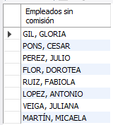
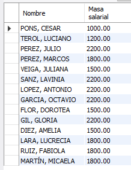
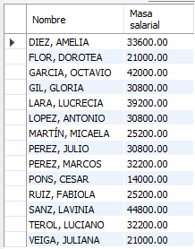
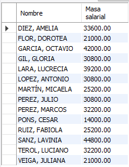
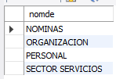
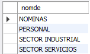
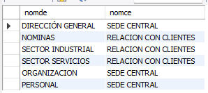

<style>
  h1, h2, h3, h4, h5, h6{
    text-align: center;
    font-weight: bold;
    border: none;
    margin-bottom: 0px;
  }

  p{
    text-align: justify;
  }

  img{
    border: 2px solid black;
  }
</style>

<h1>030609</h1>

<h4>CHRISTIAN MILLÁN SORIA</h4>

<h4>1º DAW TARDE</h4>

<hr>

<p><b>Crear en cada una de las tablas un disparador que registre los movimientos en la tabla para cada una de las siguientes circunstancias:</b></p>

<li><b>Antes de un INSERT.</b></li>

<li><b>Antes de un UPDATE.</b></li>

<li><b>Antes de un DELETE.</b></li>

<p><b>Para ello, se deberá insertar, actualizar y borrar datos para demostrar su correcto funcionamiento.</b></p>

<p>Creo una tabla secundaria para cada una de las tablas de la base de datos, donde se almacenarán los movimientos de su tabla correspondiente.</p>

```sql
create table `tcentr_triggers`(
  `id` int not null auto_increment,
  `tipo` varchar(45) null,
  `fecha` datetime null default current_timestamp,
  primary key (`id`)
);

/******************************************************/

create table `tdepto_triggers`(
  `id` int not null auto_increment,
  `tipo` varchar(45) null,
  `fecha` datetime null default current_timestamp,
  primary key (`id`)
);

/******************************************************/

create table `temple_triggers`(
  `id` int not null auto_increment,
  `tipo` varchar(45) null,
  `fecha` datetime null default current_timestamp,
  primary key (`id`)
);
```


<p>Ahora creo los triggers de cada tipo para cada tabla.</p>

```sql
delimiter //
create trigger registro1_tcentr after insert on tcentr
for each row
  begin
    insert into tcentr_triggers(tipo) value('after insert');
  end//
delimiter ;

/*********************************************************************/

delimiter //
create trigger registro2_tcentr before insert on tcentr
for each row
  begin
    insert into tcentr_triggers(tipo) value('before insert');
  end//
delimiter ;

/*********************************************************************/

delimiter //
create trigger registro3_tcentr after update on tcentr
for each row
  begin
    insert into tcentr_triggers(tipo) value('after update');
  end//
delimiter ;

/*********************************************************************/

delimiter //
create trigger registro4_tcentr before update on tcentr
for each row
  begin
    insert into tcentr_triggers(tipo) value('before update');
  end//
delimiter ;

/*********************************************************************/

delimiter //
create trigger registro5_tcentr after delete on tcentr
for each row
  begin
    insert into tcentr_triggers(tipo) value('after delete');
  end//
delimiter ;

/*********************************************************************/

delimiter //
create trigger registro6_tcentr before delete on tcentr
for each row
  begin
    insert into tcentr_triggers(tipo) value('before delete');
  end//
delimiter ;

/*********************************************************************/

-- igual para las tablas "tdepto" y "temple"...
```

<p>Prueba de comportamiento correcto:</p>

```sql
insert into tcentr values(30, 'test', 'test');
```


```sql
update tcentr set numce=40 where numce=30;
```


```sql
delete from tcentr where numce=40;
```


<p><b>Además, para cada una de las preguntas se deberá hacer lo siguiente (siempre que sea posible):</b></p>

<li><b>Crear una vista.</b></li>

<li><b>Crear un procedimiento.</b></li>

<li><b>Crear una función.</b></li>

<p><b>*Utilizar cursores y bucles siempre que sea posible.</b></p>

<hr>

<h2>BLOQUE 1</h2>

<p><b>1. Hallar, por orden alfabético, los nombres de los departamentos cuyo director lo es en funciones y no en propiedad.</b></p>

```sql
drop view if exists ej1b1;
create view ej1b1 as 
select nomde from tdepto where tidir='f' order by 1;

/******************************/

select * from empresa.ej1b1;
```


```sql
drop procedure if exists procedure_ej1b1;
delimiter //
create procedure procedure_ej1b1()
begin
  select nomde from tdepto where tidir='f' order by 1;
end //
delimiter ;

/******************************/

call empresa.procedure_ej1b1();
```


<p><b>2. Obtener un listín telefónico de los empleados del departamento 121, incluyendo nombre del empleado, número del empleado y extensión telefónica. Por orden alfabético descendente.</b></p>

```sql
drop view if exists ej2b1;
create view ej2b1 as
select nomem, numem, extel from temple where numde=121 order by 1 desc;

/******************************/

select * from empresa.ej2b1;
```


```sql
drop procedure if exists procedure_ej2b1;
delimiter //
create procedure procedure_ej2b1(in numde_param int)
begin
  select nomem, numem, extel from temple where numde=numde_param order by nomem desc;
end //
delimiter ;

/******************************/

call empresa.procedure_ej2b1(121);
```


<p><b>3. Obtener por orden creciente una relación de todos los números de extensiones telefónicas de los empleados. Elimina las repeticiones.</b></p>

```sql
drop view if exists ej3b1;
create view ej3b1 as
select distinct extel from temple order by 1;

/******************************/

select * from empresa.ej3b1;
```


```sql
drop procedure if exists procedure_ej3b1;
delimiter //
create procedure procedure_ej3b1()
begin
  select distinct extel from temple order by 1;
end //
delimiter ;

/******************************/

call empresa.procedure_ej3b1();
```


<p><b>4. Hallar la comisión, nombre y salario de los empleados con más de un hijo, clasificados por comisión, y dentro de la comisión por orden alfabético. El listado debe incluir también los empleados con más de un hijo aunque no tengan comisión.</b></p>

```sql
drop view if exists ej4b1;
create view ej4b1 as
select ifnull(comis, 0), nomem, salar from temple where numhi>1 order by 1, 2;

/******************************/

select * from empresa.ej4b1;
```


```sql
drop procedure if exists procedure_ej4b1;
delimiter //
create procedure procedure_ej4b1()
begin
  declare finalizado int default false;
  declare comision decimal(10, 2);
  declare nombre_empleado varchar(50);
  declare salario decimal(10, 2);

  declare cursor_datos_temple cursor for 
    select ifnull(comis, 0), nomem, salar 
    from temple 
    where numhi>1 
    order by 1, 2;

  declare continue handler for not found set finalizado = true;

  open cursor_datos_temple;

  while not finalizado do
    fetch cursor_datos_temple into comision, nombre_empleado, salario;
    if not finalizado then
      select comision, nombre_empleado, salario;
    end if;
  end while;

  close cursor_datos_temple;
end //
delimiter ;

/******************************/

call empresa.procedure_ej4b1();
```


<p><b>5. Obtener salario y nombre de los empleados con dos hijos por orden decreciente de salario y por orden alfabético dentro del salario.</b></p>

```sql
drop view if exists ej5b1;
create view ej5b1 as
select salar, nomem from temple where numhi=2 order by 1 desc, 2;

/******************************/

select * from empresa.ej5b1;
```


```sql
drop procedure if exists procedure_ej5b1;
delimiter //
create procedure procedure_ej5b1()
begin
  declare salario decimal(10,2);
  declare nombre_empleado varchar(50);
  declare var_count int;

  declare cur_datos cursor for
    select salar, nomem
    from temple
    where numhi=2
    order by salar desc, nomem;

  select count(*) into var_count from temple where numhi=2;

  open cur_datos;
  fetch cur_datos into salario, nombre_empleado;

  while var_count>0 do
    select salario, nombre_empleado;
    fetch cur_datos into salario, nombre_empleado;
    set var_count=var_count-1;
  end while;

  close cur_datos;
end //
delimiter ;

/******************************/

call empresa.procedure_ej5b1();
```


<p><b>6. Obtener el nombre de los empleados cuya comisión es superior o igual al 50% de su salario, por orden alfabético.</b></p>

```sql
drop view if exists ej6b1;
create view ej6b1 as
select nomem from temple where comis>=salar*0.5 order by 1;

/******************************/

select * from empresa.ej6b1;
```


```sql
drop procedure if exists procedure_ej6b1;
delimiter //
create procedure procedure_ej6b1()
begin
  select nomem from temple where comis>=salar*0.5 order by 1;
end //
delimiter ;

/******************************/

call empresa.procedure_ej6b1();
```


<p><b>7. En una campaña de ayuda familiar se ha decidido dar a los empleados una paga extra de 30 euros por hijo a partir del tercero inclusive. Obtener por orden alfabético para estos empleados: nombre y salario total que van a cobrar incluyendo esta paga extra.</b></p>

```sql
drop view if exists ej7b1;
create view ej7b1 as
select nomem, salar+30*(numhi-2) from temple where numhi>2 order by 1;

/******************************/

select * from empresa.ej7b1;
```


```sql
drop procedure if exists procedure_ej7b1;
delimiter //
create procedure procedure_ej7b1()
begin
  select nomem, salar+30*(numhi-2) from temple where numhi>2 order by 1;
end //
delimiter ;

/******************************/

call empresa.procedure_ej7b1();
```


<p><b>7.1. En una campaña de ayuda familiar se ha decidido dar a los empleados una paga extra de 30 euros por hijo a partir del tercero inclusive. Obtener por orden alfabético para estos empleados: nombre y salario total que van a cobrar incluyendo esta paga extra. Para el resto de los empleados se debe mostrar el nombre y el salario que reciben siempre. Hacer este ejercicio de dos formas diferentes: con el operador "union" y con la expresión "case".</b></p>

```sql
drop view if exists ej71b1;
create view ej71b1 as
select nomem, salar+30*(numhi-2) from temple where numhi>2 union select nomem, salar from temple where numhi<=2 order by 1;

/******************************/

select * from empresa.ej71b1;
```


```sql
drop procedure if exists procedure_ej71b1;
delimiter //
create procedure procedure_ej71b1()
begin
  declare nom_em varchar(50);
  declare salario decimal(10,2);
  declare num_em int;

  declare cur_empleados cursor for select nomem, salar, numhi from temple;

  declare continue handler for not found set @fin=1;

  set @fin=0;

  create temporary table empleados_temp(
    nom_empleado varchar(50),
    salario_nuevo decimal(10,2)
  );

  open cur_empleados;

  fetch cur_empleados into nom_em, salario, num_em;

  while(@fin=0) do
    if(num_em>2) then
      set salario=salario+(30*(num_em-2));
    end if;

    insert into empleados_temp (nom_empleado, salario_nuevo)
    values (nom_em, salario);
    
    fetch cur_empleados into nom_em, salario, num_em;
  end while;

  close cur_empleados;

  select nom_empleado, salario_nuevo
  from empleados_temp
  where salario_nuevo is not null
  order by 1;

  drop temporary table if exists empleados_temp;
end //
delimiter ;

/******************************/

call empresa.procedure_ej71b1();
```


```sql
drop view if exists ej72b1;
create view ej72b1 as
select nomem, case when numhi>2 then salar+30*(numhi-2) else salar end as nuevo_salario from temple order by nomem;

/******************************/

select * from empresa.ej72b1;
```


```sql
drop procedure if exists procedure_ej72b1;
delimiter //
create procedure procedure_ej72b1()
begin
  declare nombre_empleado varchar(50);
  declare salario_actual float;
  declare horas_extras int;
  declare nuevo_salario float;

  declare cur_empleados cursor for select nomem, salar, numhi from temple;

  open cur_empleados;

  fetch cur_empleados into nombre_empleado, salario_actual, horas_extras;

  while(select count(*)) do
    if horas_extras>2 then
      set nuevo_salario=salario_actual+(30*(horas_extras-2));
    else
      set nuevo_salario=salario_actual;
    end if;

    select nombre_empleado, nuevo_salario;

    fetch cur_empleados into nombre_empleado, salario_actual, horas_extras;
  end while;

  close cur_empleados;
end //
delimiter ;

/******************************/

call empresa.procedure_ej72b1();
```


<p><b>8. Hallar por orden alfabético los nombres de los empleados tales que, si se les da una gratificación de 60 euros por hijo, el total de esta gratificación no supera a la décima parte de su salario.</b></p>

```sql
drop view if exists ej8b1;
create view ej8b1 as
select nomem from temple where 60*numhi<=salar/10 order by 1;

/******************************/

select * from empresa.ej8b1;
```


```sql
drop procedure if exists procedure_ej8b1;
delimiter //
create procedure procedure_ej8b1()
begin
  select nomem from temple where 60*numhi<=salar/10 order by 1;
end //
delimiter ;

/******************************/

call empresa.procedure_ej8b1();
```


<p><b>9. Obtener para los departamentos con un presupuesto superior a 5000 euros, su nombre junto con el nombre del centro donde está ubicado.</b></p>

```sql
drop view if exists ej9b1;
create view ej91b1 as
select d.nomde, c.nomce from tcentr c, tdepto d where c.numce=d.numce and d.presu>5000;

/******************************/

select * from empresa.ej91b1;
```


```sql
drop procedure if exists procedure_ej9b1;
delimiter //
create procedure procedure_ej9b1()
begin
  select d.nomde, c.nomce from tcentr c, tdepto d where c.numce=d.numce and d.presu>5000;
end //
delimiter ;

/******************************/

call empresa.procedure_ej9b1();
```


```sql
drop view if exists ej92b1;
create view ej92b1 as
select d.nomde, c.nomce  from tcentr c, tdepto d  where c.numce=d.numce and d.presu>5000
union
select d.nomde, c.nomce from tcentr c join tdepto d on c.numce=d.numce  where d.presu>5000 and c.nomce not in (select c.nomce from tcentr c, tdepto d where c.numce=d.numce and d.presu>5000);

/******************************/

select * from empresa.ej92b1;
```


```sql
drop procedure if exists procedure_ej92b1;
delimiter //
create procedure procedure_ej92b1()
begin
  select d.nomde, c.nomce  from tcentr c, tdepto d  where c.numce=d.numce and d.presu>5000
  union
  select d.nomde, c.nomce from tcentr c join tdepto d on c.numce=d.numce  where d.presu>5000 and c.nomce not in (select c.nomce from tcentr c, tdepto d where c.numce=d.numce and d.presu>5000);
end //
delimiter ;

/******************************/

call empresa.procedure_ej92b1();
```


<p><b>10. Para los empleados del departamento de Nóminas, obtener el nombre, salario y número de hijos. Hacer el ejercicio de dos formas: utilizando un producto cartesiano y con la cláusula "join".</b></p>

```sql
drop view of exists ej101b1;
create view ej101b1 as
select e.nomem, e.salar, e.numhi from temple e, tdepto d  where e.numde=d.numde and d.nomde='nominas';

/******************************/

select * from empresa.ej101b1;
```


```sql
drop procedure if exists procedure_ej10b1;
delimiter //
create procedure procedure_ej101b1()
begin
  select e.nomem, e.salar, e.numhi from temple e, tdepto d  where e.numde=d.numde and d.nomde='nominas';
end //
delimiter ;

/******************************/

call empresa.procedure_ej101b1();
```


```sql
drop view if exists ej102b1;
create view ej102b1 as
select e.nomem, e.salar, e.numhi from temple e join tdepto d on e.numde=d.numde where d.nomde='nominas';

/******************************/

select * from empresa.ej102b1;
```


```sql
drop procedure if exists procedure_ej102b1;
delimiter //
create procedure procedure_ej102b1()
begin
  select e.nomem, e.salar, e.numhi from temple e join tdepto d on e.numde=d.numde where d.nomde='nominas';
end //
delimiter ;

/******************************/

call empresa.procedure_ej102b1();
```


<hr>

<h2>BLOQUE 2</h2>

<p><b>1. Hallar el nombre de los empleados que no tienen comisión, clasificados de manera que aparezcan primero aquellos nombres que son más cortos.</b></p>

```sql
drop view if exists ej1b2;
create view ej1b2 as
select nomem as 'Empleados sin comisión' from temple where comis is null order by length(nomem), 1;

/******************************/

select * from empresa.ej1b2;
```



```sql
drop procedure if exists procedure_ej1b2;
delimiter //
create procedure procedure_ej1b2()
begin
  select nomem as 'Empleados sin comisión' from temple where comis is null order by length(nomem), 1;
end //
delimiter ;

/******************************/

call empresa.procedure_ej1b2();
```


<p><b>2. Hallar, por orden alfabético, los nombres de los empleados suprimiendo las dos últimas letras.</b></p>

```sql
drop view if exists ej2b2;
create view ej2b2 as
select substring(nomem, 1, length(nomem)-2) as 'Nombre recortado' from temple order by 1;

/******************************/

select * from empresa.ej2b2;
```


```sql
drop procedure if exists procedure_ej2b2;
delimiter //
create procedure procedure_ej2b2()
begin
  select substring(nomem, 1, length(nomem)-2) as 'Nombre recortado' from temple order by 1;
end //
delimiter ;

/******************************/

call empresa.procedure_ej2b2();
```


<p><b>3. Hallar cuántos departamentos hay y el presupuesto anual medio de ellos.</b></p>

```sql
drop view if exists ej3b2;
create view ej3b2 as
select count(distinct nomde)as 'Nº de departamentos', round(sum(presu)/count(distinct nomde), 2) as 'Presupuesto anual medio' from tdepto;

/******************************/

select * from empresa.ej3b2;
```


```sql
drop procedure if exists procedure_ej3b2;
delimiter //
create procedure procedure_ej3b2()
begin
  select count(distinct nomde)as 'Nº de departamentos', round(sum(presu)/count(distinct nomde), 2) as 'Presupuesto anual medio' from tdepto;
end //
delimiter ;

/******************************/

call empresa.procedure_ej3b2();
```


<p><b>4. Hallar la masa salarial anual (salario más comisión) de la empresa (se suponen 14 pagas anuales).</b></p>

```sql
drop view if exists ej4b2;
create view ej4b2 as
select sum((salar+comis)*14) as 'Masa salarial' from temple;

/******************************/

select * from empresa.ej4b2;
```


```sql
drop procedure if exists procedure_ej4b2;
delimiter //
create procedure procedure_ej4b2()
begin
  select sum((salar+comis)*14) as 'Masa salarial' from temple;
end //
delimiter ;

/******************************/

call empresa.procedure_ej4b2();
```


<p><b>5. Hallar la masa salarial anual (salario más comisión) de cada empleado (se suponen 14 pagas anuales). Hacer el ejercicio de diferentes maneras: con el operador "union", con la función "ifnull", con la función "if" y con la expresión "case".</b></p>

```sql
drop view if exists ej5b2;
create view ej5b2 as
select nomem as 'Nombre', masa as 'Masa salarial' from(select nomem, salar as 'masa' from temple union select nomem, comis as 'masa' from temple) as temp_salarios group by nomem;

/******************************/

select * from empresa.ej5b2;
```



```sql
drop procedure if exists procedure_ej5b2;
delimiter //
create procedure procedure_ej5b2()
begin
  select nomem as 'Nombre', masa as 'Masa salarial' from(select nomem, salar as 'masa' from temple union select nomem, comis as 'masa' from temple) as temp_salarios group by nomem;
end //
delimiter ;

/******************************/

call empresa.procedure_ej5b2();
```


<p>"ifnull":</p>

```sql
drop view if exists ej51b2;
create view ej51b2 as
select nomem as 'Nombre', (salar+ifnull(comis, 0)*14) as 'Masa salarial' from temple order by 1;

/******************************/

select * from empresa.ej51b2;
```


```sql
drop procedure if exists procedure_ej51b2;
delimiter //
create procedure procedure_ej51b2()
begin
  select nomem as 'Nombre', (salar+ifnull(comis, 0)*14) as 'Masa salarial' from temple order by 1;
end //
delimiter ;

/******************************/

call empresa.procedure_ej51b2();
```


<p>"if":</p>

```sql
drop view if exists ej52b2;
create view ej52b2 as
select nomem as 'Nombre', (salar+if(comis is null, 0, comis))*14 as 'Masa salarial' from temple order by 1;

/******************************/

select * from empresa.ej52b2;
```


```sql
drop procedure if exists procedure_ej52b2;
delimiter //
create procedure procedure_ej52b2()
begin
  select nomem as 'Nombre', (salar+if(comis is null, 0, comis))*14 as 'Masa salarial' from temple order by 1;
end //
delimiter ;

/******************************/

call empresa.procedure_ej52b2();
```



<p>"case":</p>

```sql
drop view if exists ej53b2;
create view ej53b2 as
select nomem as 'Nombre', case when comis is null then salar*14 else(salar+comis)*14 end as 'Masa salarial' from temple order by 1;

/******************************/

select * from empresa.ej53b2;
```


```sql
drop procedure if exists procedure_ej53b2;
delimiter //
create procedure procedure_ej53b2()
begin
  select nomem as 'Nombre', case when comis is null then salar*14 else(salar+comis)*14 end as 'Masa salarial' from temple order by 1;
end //
delimiter ;

/******************************/

call empresa.procedure_ej53b2();
```



<p><b>6. Hallar cuántos empleados han ingresado en el año actual. Utiliza la función "year".</b></p>

```sql
drop view if exists ej6b2;
create view ej6b2 as
select count(distinct nomem) as 'Nº de empleados este año' from temple where year(fecin)=2022;

/******************************/

select * from empresa.ej6b2;
```


```sql
drop procedure if exists procedure_ej6b2;
delimiter //
create procedure procedure_ej6b2()
begin
  select count(distinct nomem) as 'Nº de empleados este año' from temple where year(fecin)=2022;
end //
delimiter ;

/******************************/

call empresa.procedure_ej6b2();
```


<p>También se puede obtener el año actual según la fecha del sistema donde se ejecuta la base de datos, en este caso mi propio ordenador, por lo que la fecha actual es 2023. El resultado es este:</p>

```sql
drop view if exists ej61b2;
create view ej61b2 as
select count(distinct nomem) as 'Nº de empleados este año' from temple where year(fecin)=year(now());

/******************************/

select * from empresa.ej61b2;
```


```sql
drop procedure if exists procedure_ej61b2;
delimiter //
create procedure procedure_ej61b2()
begin
  select count(distinct nomem) as 'Nº de empleados este año' from temple where year(fecin)=year(now());
end //
delimiter ;

/******************************/

call empresa.procedure_ej61b2();
```


<p><b>7. Hallar la diferencia entre el salario más alto y el salario más bajo.</b></p>

```sql
drop view if exists ej7b2;
create view ej7b2 as
select max(salar)-min(salar) as 'Diferencia' from temple;

/******************************/

select * from empresa.ej7b2;
```


```sql
drop procedure if exists procedure_ej7b2;
delimiter //
create procedure procedure_ej7b2()
begin
  select max(salar)-min(salar) as 'Diferencia' from temple;
end //
delimiter ;

/******************************/

call empresa.procedure_ej7b2();
```


<hr>

<h2>BLOQUE 3</h2>

<p><b>1. Obtener, por orden alfabético, los nombres de los empleados cuyos salarios superen la mitad del salario del empleado 180.</b></p>

```sql
drop view if exists ej1b3;
create view ej1b3 as
select nomem from temple where salar>(select salar/2 from temple where numem=180) order by nomem asc;

/******************************/

select * from empresa.ej1b3;
```


```sql
drop procedure if exists procedure_ej1b3;
delimiter //
create procedure procedure_ej1b3(in numem_intr int)
begin
  select nomem from temple where salar>(select salar/2 from temple where numem=numem_intr) order by nomem asc;
end //
delimiter ;

/******************************/

call empresa.procedure_ej1b3(180);
```


<p><b>2. Obtener, por orden alfabético, los nombres de los empleados cuyos salarios superen dos veces al mínimo salario de los empleados del departamento 121.</b></p>

```sql
drop view if exists ej2b3;
create view ej2b3 as
select e.nomem from temple e inner join tdepto d on e.numde=d.numde where d.numde=121 and e.salar>(2*(select min(salar) from temple where numde=121)) order by e.nomem asc;

/******************************/

select * from empresa.ej2b3;
```


```sql
drop procedure if exists procedure_ej2b3;
delimiter //
create procedure procedure_ej2b3(in numde_intr int)
begin
  select e.nomem from temple e inner join tdepto d on e.numde=d.numde where d.numde=numde_intr and e.salar>(2*(select min(salar) from temple where numde=numde_intr)) order by e.nomem asc;
end //
delimiter ;

/******************************/

call empresa.procedure_ej2b3(121);
```


<p><b>3. Obtener, por orden alfabético, los nombres y los salarios de los empleados cuyo salario es inferior a tres veces la comisión más baja existente distinta de null.</b></p>

```sql
drop view if exists ej3b3;
create view ej3b3 as
select nomem, salar from temple where comis is not null and salar<(select min(comis)*3 from temple where comis is not null)order by nomem asc;

/******************************/

select * from empresa.ej3b3;
```


```sql
drop procedure if exists procedure_ej3b3;
delimiter //
create procedure procedure_ej3b3()
begin
  select nomem, salar from temple where comis is not null and salar<(select min(comis)*3 from temple where comis is not null)order by nomem asc;
end //
delimiter ;

/******************************/

call empresa.procedure_ej3b3();
```


<p><b>4. Obtener, utilizando el predicado "between", por orden alfabético, los nombres y los salarios de los empleados con hijos cuyo salario dividido por su número de hijos cumpla una, o ambas, de las dos condiciones siguientes:</b></p>

<li><b>Que sea inferior a 1200 euros.</b></li>

<li><b>Que sea superior al doble de su comisión.</b></li>

```sql
drop view if exists ej4b3;
create view ej4b3 as
select nomem, salar from temple where numhi>0 and salar/numhi between 0 and 1200 or salar/numhi>comis*2 order by nomem asc;

/******************************/

select * from empresa.ej4b3;
```


```sql
drop procedure if exists procedure_ej4b3;
delimiter //
create procedure procedure_ej4b3()
begin
  select nomem, salar from temple where numhi>0 and salar/numhi between 0 and 1200 or salar/numhi>comis*2 order by nomem asc;
end //
delimiter ;

/******************************/

call empresa.procedure_ej4b3();
```


<p><b>5. Obtener, por orden alfabético, los nombres de los empleados cuyo primer apellido es "Mora" o empieza por "Mora".</b></p>

```sql
drop view if exists ej5b3;
create view ej5b3 as
select nomem from temple where nomem like 'mora%' or nomem like '% mora%' order by nomem asc;

/******************************/

select * from empresa.ej5b3;
```


```sql
drop procedure if exists procedure_ej5b3;
delimiter //
create procedure procedure_ej5b3()
begin
  select nomem from temple where nomem like 'mora%' or nomem like '% mora%' order by nomem asc;
end //
delimiter ;

/******************************/

call empresa.procedure_ej5b3();
```


<p><b>6. Obtener, por orden alfabético, los nombres de los empleados cuyo primer apellido termina en "ez" y su nombre de pila termina en "o" y tiene al menos tres letras.</b></p>

```sql
insert into temple (numem, nomem, fecna, fecin, numhi, salar, comis, extel, numde) 
values(1, 'Diego Perez Rodriguez', '1990-01-01', '2019-01-01', 2, 2500.00, NULL, '1234', 1);

insert into temple (numem, nomem, fecna, fecin, numhi, salar, comis, extel, numde) 
values(2, 'Hugo Sanchez Martinez', '1995-05-12', '2020-01-01', 1, 3000.00, 200.00, '5678', 2);

insert into temple (numem, nomem, fecna, fecin, numhi, salar, comis, extel, numde) 
values(3, 'Pedro Jimenez Perez', '1993-07-20', '2018-01-01', 0, 2000.00, NULL, '4321', 2);

insert into temple (numem, nomem, fecna, fecin, numhi, salar, comis, extel, numde) 
values(4, 'Fernando Ramirez Velez', '1989-02-28', '2015-01-01', 3, 4000.00, 500.00, '8765', 3);
```

```sql
drop view if exists ej6b3;
create view ej6b3 as
select nomem from temple where substring_index(nomem,' ', -1) like '%o' and substring_index(nomem,' ', 1) like '%ez%' and char_length(substring_index(nomem,' ', 1))>=3 order by nomem asc;

/******************************/

select * from empresa.ej6b3;
```


```sql
drop procedure if exists procedure_ej6b3;
delimiter //
create procedure procedure_ej6b3()
begin
  select nomem from temple where substring_index(nomem,' ', -1) like '%o' and substring_index(nomem,' ', 1) like '%ez%' and char_length(substring_index(nomem,' ', 1))>=3 order by nomem asc;
end //
delimiter ;

/******************************/

call empresa.procedure_ej6b3();
```


<p><b>7. Obtener, utilizando el predicado "in", por orden alfabético, los nombres de los empleados del departamento 111 cuyo salario es igual a alguno de los salarios del departamento 112. ¿Cómo lo obtendrías con el predicado "any"?</b></p>

<p>"in":</p>

```sql
drop view if exists ej7b3;
create view ej7b3 as
select nomem from temple where numde=111 and salar in(select salar from temple where numde=112) order by nomem asc;

/******************************/

select * from empresa.ej7b3;
```


```sql
drop procedure if exists procedure_ej7b3;
delimiter //
create procedure procedure_ej7b3()
begin
  select nomem from temple where numde=111 and salar in(select salar from temple where numde=112) order by nomem asc;
end //
delimiter ;

/******************************/

call empresa.procedure_ej7b3();
```


<p>"any":</p>

```sql
drop view if exists ej71b3;
create view ej71b3 as
select nomem from temple where numde=111 and salar=any(select salar from temple where numde = 112) order by nomem asc;

/******************************/

select * from empresa.ej71b3;
```


```sql
drop procedure if exists procedure_ej71b3;
delimiter //
create procedure procedure_ej71b3()
begin
  select nomem from temple where numde=111 and salar=any(select salar from temple where numde = 112) order by nomem asc;
end //
delimiter ;

/******************************/

call empresa.procedure_ej71b3();
```


<p><b>8.a. Obtener, por orden alfabético, los nombres y comisiones de los empleados del departamento 110 si hay en él algún empleado que tenga comisión.</b></p>

```sql
drop view if exists ej81b3;
create view ej81b3 as
select nomem, comis from temple where numde=110 and comis is not null order by nomem asc;

/******************************/

select * from empresa.ej81b3;
```


```sql
drop procedure if exists procedure_ej81b3;
delimiter //
create procedure procedure_ej81b3(in numde_intr int)
begin
  select nomem, comis from temple where numde=numde_intr and comis is not null order by nomem asc;
end //
delimiter ;

/******************************/

call empresa.procedure_ej81b3(110);
```


<p><b>8.b. Obtener, por orden alfabético, los nombres de los departamentos que tienen algún empleado con comisión.</b></p>

```sql
drop view if exists ej82b3;
create view ej82b3 as
select distinct tdepto.nomde from tdepto join temple on temple.numde=tdepto.numde where temple.comis is not null order by tdepto.nomde asc;

/******************************/

select * from empresa.ej82b3;
```


```sql
drop procedure if exists procedure_ej82b3;
delimiter //
create procedure procedure_ej82b3()
begin
  select distinct tdepto.nomde from tdepto join temple on temple.numde=tdepto.numde where temple.comis is not null order by tdepto.nomde asc;
end //
delimiter ;

/******************************/

call empresa.procedure_ej82b3();
```


<p><b>9. Obtener el nombre de cada departamento, junto con el nombre del centro al que pertenece.</b></p>

```sql
drop view if exists ej9b3;
create view ej9b3 as
select tdepto.nomde, tcentr.nomce from tdepto join tcentr on tdepto.numce=tcentr.numce;

/******************************/

select * from empresa.ej9b3;
```


```sql
drop procedure if exists procedure_ej9b3;
delimiter //
create procedure procedure_ej9b3()
begin
  select tdepto.nomde, tcentr.nomce from tdepto join tcentr on tdepto.numce=tcentr.numce;
end //
delimiter ;

/******************************/

call empresa.procedure_ej9b3();
```


<p><b>10. Obtener el nombre de cada empleado, el número y el nombre del departamento al que pertenece y el nombre del correspondiente centro.</b></p>

```sql
drop view if exists ej10b3;
create view ej10b3 as
select
  temple.nomem as empleado, 
  temple.numem as numero_empleado, 
  tdepto.nomde as departamento, 
  tdepto.numde as numero_departamento, 
  tcentr.nomce as centro 
from temple join tdepto on temple.numde=tdepto.numde join tcentr on tdepto.numce=tcentr.numce;

/******************************/

select * from empresa.ej10b3;
```


```sql
drop procedure if exists procedure_ej10b3;
delimiter //
create procedure procedure_ej10b3()
begin
  select
    temple.nomem as empleado, 
    temple.numem as numero_empleado, 
    tdepto.nomde as departamento, 
    tdepto.numde as numero_departamento, 
    tcentr.nomce as centro 
  from temple join tdepto on temple.numde=tdepto.numde join tcentr on tdepto.numce=tcentr.numce;
end //
delimiter ;

/******************************/

call empresa.procedure_ej10b3();
```


<p><b>11. Obtener, para el departamento 110, su nombre, nombre del centro y dirección, junto con el nombre del empleado que sea el director.</b></p>

```sql
drop view if exists ej11b3;
create view ej11b3 as
select d.nomde, c.nomce, c.señas, e.nomem from tdepto d join tcentr c on d.numce=c.numce join temple e on d.direc=e.numem where d.numde=110;

/******************************/

select * from empresa.ej11b3;
```


```sql
drop procedure if exists procedure_ej11b3;
delimiter //
create procedure procedure_ej11b3(in numde_intr int)
begin
  select d.nomde, c.nomce, c.señas, e.nomem from tdepto d join tcentr c on d.numce=c.numce join temple e on d.direc=e.numem where d.numde=numde_intr;
end //
delimiter ;

/******************************/

call empresa.procedure_ej11b3(110);
```


<hr>

<h2>BLOQUE 4</h2>

<p><b>1. Hallar, por departamentos, la edad en años cumplidos del empleado más mayor, así como la edad media del mismo (el empleado debe tener comisión). Ordenar el resultado por edades.</b></p>

```sql
drop view if exists ej1b4;
create view ej1b4 as
select
  tdepto.nomde,
  max(datediff(current_date, temple.fecna)/365) as edad_mas_viejo,
  avg(datediff(current_date, temple.fecna)/365) as edad_media
from tdepto join temple on tdepto.numde=temple.numde where temple.comis is not null group by tdepto.nomde order by edad_mas_viejo desc;

/******************************/

select * from empresa.ej1b4;
```


<p>Alternativa (creo que más correcta) para que los números salgan redondeados:</p>

```sql
drop view if exists ej102b4;
create view ej102b4 as
select
  tdepto.nomde,
  round(max(datediff(current_date, temple.fecna)/365),0) as edad_mas_viejo,
  round(avg(datediff(current_date, temple.fecna)/365),0) as edad_media
from tdepto join temple on tdepto.numde=temple.numde where temple.comis is not null group by tdepto.nomde order by edad_mas_viejo desc;

/******************************/

select * from empresa.ej102b4;
```


```sql
drop procedure if exists procedure_ej1b4;
delimiter //
create procedure procedure_ej1b4()
begin
  select
    tdepto.nomde, 
    round(max(datediff(current_date, temple.fecna)/365),0) as edad_mas_viejo, 
    round(avg(datediff(current_date, temple.fecna)/365),0) as edad_media
  from tdepto join temple on tdepto.numde=temple.numde where temple.comis is not null group by tdepto.nomde order by edad_mas_viejo desc;
end //
delimiter ;

/******************************/

call empresa.procedure_ej1b4();
```


<p><b>2. Agrupando por departamento y número de hijos, hallar cuántos empleados hay en cada grupo.</b></p>

```sql
drop view if exists ej2b4;
create view ej2b4 as
select tdepto.nomde, temple.numhi, count(*) as numempleados from temple inner join tdepto on temple.numde=tdepto.numde group by tdepto.nomde, temple.numhi;

/******************************/

select * from empresa.ej2b4;
```


```sql
drop procedure if exists procedure_ej2b4;
delimiter //
create procedure procedure_ej2b4()
begin
  select tdepto.nomde, temple.numhi, count(*) as numempleados from temple inner join tdepto on temple.numde=tdepto.numde group by tdepto.nomde, temple.numhi;
end //
delimiter ;

/******************************/

call empresa.procedure_ej2b4();
```


<p><b>3. Para cada extensión telefónica, hallar cuántos empleados la usan y el salario medio de estos.</b></p>

```sql
drop view if exists ej3b4;
create view ej3b4 as
select extel, count(*) as numempleados, avg(salar) as salariomedio from temple group by extel;

/******************************/

select * from empresa.ej3b4;
```


```sql
drop procedure if exists procedure_ej3b4;
delimiter //
create procedure procedure_ej3b4()
begin
  select extel, count(*) as numempleados, avg(salar) as salariomedio from temple group by extel;
end //
delimiter ;

/******************************/

call empresa.procedure_ej3b4();
```


<p><b>4. Para los departamentos cuyo salario medio supera al de la empresa, hallar cuántas extensiones telefónicas tienen. Se debe mostrar el número de departamento ("numde") y el número de extensiones telefónicas distintas que tiene cada uno de ellos.</b></p>

```sql
drop view if exists ej4b4;
create view ej4b4 as
select tdepto.numde, count(distinct temple.extel) as numextensiones from tdepto join temple on tdepto.numde=temple.numde where temple.salar>(select avg(salar) from temple) group by tdepto.numde having avg(temple.salar)>(select avg(salar) from temple);

/******************************/

select * from empresa.ej4b4;
```


```sql
drop procedure if exists procedure_ej4b4;
delimiter //
create procedure procedure_ej4b4()
begin
  select tdepto.numde, count(distinct temple.extel) as numextensiones from tdepto join temple on tdepto.numde=temple.numde where temple.salar>(select avg(salar) from temple) group by tdepto.numde having avg(temple.salar)>(select avg(salar) from temple);
end //
delimiter ;

/******************************/

call empresa.procedure_ej4b4();
```


<p><b>5. Hallar el máximo valor de la suma de los salarios de los departamentos. Queremos obtener el número de departamentos ("numde") y la suma de sus salarios, pero del departamento cuya suma de salarios es la mayor de todas.</b></p>

```sql
drop view if exists ej5b4;
create view ej5b4 as
select numde, sum(salar) as suma_salarios from temple where numde=(select numde from temple group by numde order by sum(salar) desc limit 1) group by numde;

/******************************/

select * from empresa.ej5b4;
```


```sql
drop procedure if exists procedure_ej5b4;
delimiter //
create procedure procedure_ej5b4()
begin
  select numde, sum(salar) as suma_salarios from temple where numde=(select numde from temple group by numde order by sum(salar) desc limit 1) group by numde;
end //
delimiter ;

/******************************/

call empresa.procedure_ej5b4();
```


<p><b>6. Para cada departamento con presupuesto inferior a 10000 euros, hallar el nombre del centro donde está ubicado y el máximo salario de sus empleados, sólo si este excede 1500 euros. Clasificar alfabéticamente por nombre de departamento. Hacer el ejercicio de dos maneras, con producto cartesiano y con "join".</b></p>

<p>Producto cartesiano:</p>

```sql
drop view if exists ej61b4;
create view ej61b4 as
select tc.nomce, td.nomde, max(te.salar) from tcentr tc, tdepto td, temple te where tc.numce=td.numce and td.numde=te.numde and td.presu<10000 and te.salar>1500 group by tc.nomce, td.nomde order by td.nomde asc;

/******************************/

select * from empresa.ej61b4;
```


```sql
drop procedure if exists procedure_ej61b4;
delimiter //
create procedure procedure_ej61b4()
begin
  select tc.nomce, td.nomde, max(te.salar) from tcentr tc, tdepto td, temple te where tc.numce=td.numce and td.numde=te.numde and td.presu<10000 and te.salar>1500 group by tc.nomce, td.nomde order by td.nomde asc;
end //
delimiter ;

/******************************/

call empresa.procedure_ej61b4();
```


<p>"join":</p>

```sql
drop view if exists ej62b4;
create view ej62b4 as
select tc.nomce, td.nomde, max(te.salar) from tcentr tc join tdepto td on tc.numce=td.numce join temple te on td.numde=te.numde where td.presu<10000 and te.salar>1500 group by tc.nomce, td.nomde order by td.nomde asc;

/******************************/

select * from empresa.ej62b4;
```


```sql
drop procedure if exists procedure_ej62b4;
delimiter //
create procedure procedure_ej62b4()
begin
  select tc.nomce, td.nomde, max(te.salar) from tcentr tc join tdepto td on tc.numce=td.numce join temple te on td.numde=te.numde where td.presu<10000 and te.salar>1500 group by tc.nomce, td.nomde order by td.nomde asc;
end //
delimiter ;

/******************************/

call empresa.procedure_ej62b4();
```


<p><b>7. Hallar, por orden alfabético, los nombres de los departamentos que dependen de los que tienen un presupuesto inferior a 10000 euros. Realizar la consulta de cuatro formas distintas: con predicado "in", con predicado "any", con producto cartesiano y con "join".</b></p>

<p>"in":</p>

```sql
drop view if exists ej71b4;
create view ej71b4 as
select nomde from tdepto where presu<10000 and depde in(select numde from tdepto) order by nomde asc;

/******************************/

select * from empresa.ej71b4;
```



```sql
drop procedure if exists ej71b4;
delimiter //
create procedure procedure_ej71b4()
begin
  select nomde from tdepto where presu<10000 and depde in(select numde from tdepto) order by nomde asc;
end //
delimiter ;

/******************************/

call empresa.procedure_ej71b4();
```


<p>"any":</p>

```sql
drop view if exists ej72b4;
create view ej72b4 as
select nomde from tdepto where presu<10000 and depde=any(select numde from tdepto) order by nomde asc;

/******************************/

select * from empresa.ej72b4;
```


```sql
drop procedure if exists ej72b4;
delimiter //
create procedure procedure_ej72b4()
begin
  select nomde from tdepto where presu<10000 and depde=any(select numde from tdepto) order by nomde asc;
end //
delimiter ;

/******************************/

call empresa.procedure_ej72b4();
```


<p>Producto cartesiano:</p>

```sql
drop view if exists ej73b4;
create view ej73b4 as
select distinct t2.nomde from tdepto t1, tdepto t2 where t1.presu<10000 and t1.numde=t2.depde order by t2.nomde asc;

/******************************/

select * from empresa.ej73b4;
```


```sql
drop procedure if exists ej73b4;
delimiter //
create procedure procedure_ej73b4()
begin
  select distinct t2.nomde from tdepto t1, tdepto t2 where t1.presu<10000 and t1.numde=t2.depde order by t2.nomde asc;
end //
delimiter ;

/******************************/

call empresa.procedure_ej73b4();
```



<p>"join":</p>

```sql
drop view if exists ej74b4;
create view ej74b4 as
select distinct t2.nomde from tdepto t1 join tdepto t2 on t1.numde=t2.depde where t1.presu<10000 order by t2.nomde asc;

/******************************/

select * from empresa.ej74b4;
```


```sql
drop procedure if exists ej74b4;
delimiter //
create procedure procedure_ej74b4()
begin
  select distinct t2.nomde from tdepto t1 join tdepto t2 on t1.numde=t2.depde where t1.presu<10000 order by t2.nomde asc;
end //
delimiter ;

/******************************/

call empresa.procedure_ej74b4();
```


<p><b>8. Obtener, por orden alfabético, los nombres de los departamentos cuyo presupuesto es inferior al 10% de la suma de los salarios anuales (14 pagas) de sus empleados.</b></p>

```sql
drop view if exists ej8b4;
create view ej8b4 as
select tdepto.nomde from tdepto inner join(select numde, sum(salar*14) as sum_salar from temple group by numde) as salarios on tdepto.numde=salarios.numde where tdepto.presu<salarios.sum_salar*0.1 order by tdepto.nomde asc;

/******************************/

select * from empresa.ej8b4;
```


```sql
drop procedure if exists procedure_ej8b4;
delimiter //
create procedure procedure_ej8b4()
begin
  select tdepto.nomde from tdepto inner join(select numde, sum(salar*14) as sum_salar from temple group by numde) as salarios on tdepto.numde=salarios.numde where tdepto.presu<salarios.sum_salar*0.1 order by tdepto.nomde asc;
end //
delimiter ;

/******************************/

call empresa.procedure_ej8b4();
```


<p><b>*Los ejercicios 9, 10 y 11 son los mismos que los del bloque 3, pero ahora debemos utilizar bien las cláusulas "right" y "left" en el "join" para obtener un resultado válido en todos los casos.</b></p>

<p><b>9. Obtener el nombre de cada departamento, junto con el nombre del centro al que pertenece.</b></p>

```sql
drop view if exists ej9b4;
create view ej9b4 as
select tdepto.nomde, tcentr.nomce from tdepto left join tcentr on tdepto.numce=tcentr.numce;

/******************************/

select * from empresa.ej9b4;
```



```sql
drop procedure if exists procedure_ej9b4;
delimiter //
create procedure procedure_ej9b4()
begin
  select tdepto.nomde, tcentr.nomce from tdepto left join tcentr on tdepto.numce=tcentr.numce;
end //
delimiter ;

/******************************/

call empresa.procedure_ej9b4();
```


<p><b>10. Obtener el nombre de cada empleado, el número y el nombre del departamento al que pertenece y el nombre del correspondiente centro.</b></p>

```sql
drop view if exists ej10b4;
create view ej10b4 as
select
  temple.nomem as empleado,
  temple.numem as numero_empleado,
  tdepto.nomde as departamento,
  tdepto.numde as numero_departamento,
  tcentr.nomce as centro
from temple left join tdepto on temple.numde=tdepto.numde left join tcentr on tdepto.numce=tcentr.numce;

/******************************/

select * from empresa.ej10b4;
```


```sql
drop procedure if exists procedure_ej10b4;
delimiter //
create procedure procedure_ej10b4()
begin
  select
    temple.nomem as empleado,
    temple.numem as numero_empleado,
    tdepto.nomde as departamento,
    tdepto.numde as numero_departamento,
    tcentr.nomce as centro
  from temple left join tdepto on temple.numde=tdepto.numde left join tcentr on tdepto.numce=tcentr.numce;
end //
delimiter ;

/******************************/

call empresa.procedure_ej10b4();
```


<p><b>11. Obtener, para el departamento 110, su nombre, nombre del centro y dirección, junto con el nombre del empleado que sea el director.</b></p>

```sql
drop view if exists ej11b4;
create view ej11b4 as
select d.nomde, c.nomce, c.señas, e.nomem from tdepto d join tcentr c on d.numce=c.numce left join temple e on d.direc=e.numem where d.numde=110;

/******************************/

select * from empresa.ej11b4;
```


```sql
drop procedure if exists procedure_ej11b4;
delimiter //
create procedure procedure_ej11b4(in numde_intr int)
begin
  select d.nomde, c.nomce, c.señas, e.nomem from tdepto d join tcentr c on d.numce=c.numce left join temple e on d.direc=e.numem where d.numde=numde_intr;
end //
delimiter ;

/******************************/

call empresa.procedure_ej11b4(110);
```

