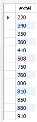
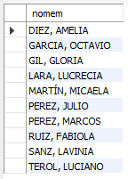

<style>
  h1, h2, h3, h4, h5, h6{
    text-align: center;
    font-weight: bold;
    border: none;
    margin-bottom: 0px;
  }

  p{
    text-align: justify;
  }

  img{
    border: 2px solid black;
  }
</style>

<h1>030609</h1>

<h4>CHRISTIAN MILLÁN SORIA</h4>

<h4>1º DAW TARDE</h4>

<hr>

<p><b>Crear en cada una de las tablas un disparador que registre los movimientos en la tabla para cada una de las siguientes circunstancias:</b></p>

<li><b>Antes de un INSERT.</b></li>

<li><b>Antes de un UPDATE.</b></li>

<li><b>Antes de un DELETE.</b></li>

<p><b>Para ello, se deberá insertar, actualizar y borrar datos para demostrar su correcto funcionamiento.</b></p>

<p>Creo una tabla secundaria para cada una de las tablas de la base de datos, donde se almacenarán los movimientos de su tabla correspondiente.</p>

```sql
create table `tcentr_triggers`(
  `id` int not null auto_increment,
  `tipo` varchar(45) null,
  `fecha` datetime null default current_timestamp,
  primary key (`id`)
);

/******************************************************/

create table `tdepto_triggers`(
  `id` int not null auto_increment,
  `tipo` varchar(45) null,
  `fecha` datetime null default current_timestamp,
  primary key (`id`)
);

/******************************************************/

create table `temple_triggers`(
  `id` int not null auto_increment,
  `tipo` varchar(45) null,
  `fecha` datetime null default current_timestamp,
  primary key (`id`)
);
```


<p>Ahora creo los triggers de cada tipo para cada tabla.</p>

```sql
delimiter //
create trigger registro1_tcentr after insert on tcentr
for each row
  begin
    insert into tcentr_triggers(tipo) value('after insert');
  end//
delimiter ;

/*********************************************************************/

delimiter //
create trigger registro2_tcentr before insert on tcentr
for each row
  begin
    insert into tcentr_triggers(tipo) value('before insert');
  end//
delimiter ;

/*********************************************************************/

delimiter //
create trigger registro3_tcentr after update on tcentr
for each row
  begin
    insert into tcentr_triggers(tipo) value('after update');
  end//
delimiter ;

/*********************************************************************/

delimiter //
create trigger registro4_tcentr before update on tcentr
for each row
  begin
    insert into tcentr_triggers(tipo) value('before update');
  end//
delimiter ;

/*********************************************************************/

delimiter //
create trigger registro5_tcentr after delete on tcentr
for each row
  begin
    insert into tcentr_triggers(tipo) value('after delete');
  end//
delimiter ;

/*********************************************************************/

delimiter //
create trigger registro6_tcentr before delete on tcentr
for each row
  begin
    insert into tcentr_triggers(tipo) value('before delete');
  end//
delimiter ;

/*********************************************************************/

-- igual para las tablas "tdepto" y "temple"...
```

<p>Prueba de comportamiento correcto:</p>

```sql
insert into tcentr values(30, 'test', 'test');
```


```sql
update tcentr set numce=40 where numce=30;
```


```sql
delete from tcentr where numce=40;
```


<p><b>Además, para cada una de las preguntas se deberá hacer lo siguiente (siempre que sea posible):</b></p>

<li><b>Crear una vista.</b></li>

<li><b>Crear un procedimiento.</b></li>

<li><b>Crear una función.</b></li>

<p><b>*Utilizar cursores y bucles siempre que sea posible.</b></p>

<hr>

<h2>BLOQUE 1</h2>

<p><b>1. Hallar, por orden alfabético, los nombres de los departamentos cuyo director lo es en funciones y no en propiedad.</b></p>

```sql
drop view if exists ej1b1;
create view ej1b1 as 
select nomde from tdepto where tidir='f' order by 1;

/******************************/

select * from empresa.ej1b1;
```


```sql
drop procedure if exists procedure_ej1b1;
delimiter //
create procedure procedure_ej1b1()
begin
  select nomde from tdepto where tidir='f' order by 1;
end //
delimiter ;

/******************************/

call empresa.procedure_ej1b1();
```


<p><b>2. Obtener un listín telefónico de los empleados del departamento 121, incluyendo nombre del empleado, número del empleado y extensión telefónica. Por orden alfabético descendente.</b></p>

```sql
drop view if exists ej2b1;
create view ej2b1 as
select nomem, numem, extel from temple where numde=121 order by 1 desc;

/******************************/

select * from empresa.ej2b1;
```


```sql
drop procedure if exists procedure_ej2b1;
delimiter //
create procedure procedure_ej2b1(in numde_param int)
begin
  select nomem, numem, extel from temple where numde=numde_param order by nomem desc;
end //
delimiter ;

/******************************/

call empresa.procedure_ej2b1(121);
```


<p><b>3. Obtener por orden creciente una relación de todos los números de extensiones telefónicas de los empleados. Elimina las repeticiones.</b></p>

```sql
drop view if exists ej3b1;
create view ej3b1 as
select distinct extel from temple order by 1;

/******************************/

select * from empresa.ej3b1;
```


```sql
drop procedure if exists procedure_ej3b1;
delimiter //
create procedure procedure_ej3b1()
begin
  select distinct extel from temple order by 1;
end //
delimiter ;

/******************************/

call empresa.procedure_ej3b1();
```



<p><b>4. Hallar la comisión, nombre y salario de los empleados con más de un hijo, clasificados por comisión, y dentro de la comisión por orden alfabético. El listado debe incluir también los empleados con más de un hijo aunque no tengan comisión.</b></p>

```sql
drop view if exists ej4b1;
create view ej4b1 as
select ifnull(comis, 0), nomem, salar from temple where numhi>1 order by 1, 2;

/******************************/

select * from empresa.ej4b1;
```


```sql
drop procedure if exists procedure_ej4b1;
delimiter //
create procedure procedure_ej4b1()
begin
  declare finalizado int default false;
  declare comision decimal(10, 2);
  declare nombre_empleado varchar(50);
  declare salario decimal(10, 2);

  declare cursor_datos_temple cursor for 
    select ifnull(comis, 0), nomem, salar 
    from temple 
    where numhi>1 
    order by 1, 2;

  declare continue handler for not found set finalizado = true;

  open cursor_datos_temple;

  while not finalizado do
    fetch cursor_datos_temple into comision, nombre_empleado, salario;
    if not finalizado then
      select comision, nombre_empleado, salario;
    end if;
  end while;

  close cursor_datos_temple;
end //
delimiter ;

/******************************/

call empresa.procedure_ej4b1();
```


<p><b>5. Obtener salario y nombre de los empleados con dos hijos por orden decreciente de salario y por orden alfabético dentro del salario.</b></p>

```sql
drop view if exists ej5b1;
create view ej5b1 as
select salar, nomem from temple where numhi=2 order by 1 desc, 2;

/******************************/

select * from empresa.ej5b1;
```


```sql
drop procedure if exists procedure_ej5b1;
delimiter //
create procedure procedure_ej5b1()
begin
  declare salario decimal(10,2);
  declare nombre_empleado varchar(50);
  declare var_count int;

  declare cur_datos cursor for
    select salar, nomem
    from temple
    where numhi=2
    order by salar desc, nomem;

  select count(*) into var_count from temple where numhi=2;

  open cur_datos;
  fetch cur_datos into salario, nombre_empleado;

  while var_count>0 do
    select salario, nombre_empleado;
    fetch cur_datos into salario, nombre_empleado;
    set var_count=var_count-1;
  end while;

  close cur_datos;
end //
delimiter ;

/******************************/

call empresa.procedure_ej5b1();
```


<p><b>6. Obtener el nombre de los empleados cuya comisión es superior o igual al 50% de su salario, por orden alfabético.</b></p>

```sql
drop view if exists ej6b1;
create view ej6b1 as
select nomem from temple where comis>=salar*0.5 order by 1;

/******************************/

select * from empresa.ej6b1;
```


```sql
drop procedure if exists procedure_ej6b1;
delimiter //
create procedure procedure_ej6b1()
begin
  select nomem from temple where comis>=salar*0.5 order by 1;
end //
delimiter ;

/******************************/

call empresa.procedure_ej6b1();
```


<p><b>7. En una campaña de ayuda familiar se ha decidido dar a los empleados una paga extra de 30 euros por hijo a partir del tercero inclusive. Obtener por orden alfabético para estos empleados: nombre y salario total que van a cobrar incluyendo esta paga extra.</b></p>

```sql
drop view if exists ej7b1;
create view ej7b1 as
select nomem, salar+30*(numhi-2) from temple where numhi>2 order by 1;

/******************************/

select * from empresa.ej7b1;
```


```sql
drop procedure if exists procedure_ej7b1;
delimiter //
create procedure procedure_ej7b1()
begin
  select nomem, salar+30*(numhi-2) from temple where numhi>2 order by 1;
end //
delimiter ;

/******************************/

call empresa.procedure_ej7b1();
```


<p><b>7.1. En una campaña de ayuda familiar se ha decidido dar a los empleados una paga extra de 30 euros por hijo a partir del tercero inclusive. Obtener por orden alfabético para estos empleados: nombre y salario total que van a cobrar incluyendo esta paga extra. Para el resto de los empleados se debe mostrar el nombre y el salario que reciben siempre. Hacer este ejercicio de dos formas diferentes: con el operador "union" y con la expresión "case".</b></p>

```sql
drop view if exists ej71b1;
create view ej71b1 as
select nomem, salar+30*(numhi-2) from temple where numhi>2 union select nomem, salar from temple where numhi<=2 order by 1;

/******************************/

select * from empresa.ej71b1;
```


```sql
drop procedure if exists procedure_ej71b1;
delimiter //
create procedure procedure_ej71b1()
begin
  declare nom_em varchar(50);
  declare salario decimal(10,2);
  declare num_em int;

  declare cur_empleados cursor for select nomem, salar, numhi from temple;

  declare continue handler for not found set @fin=1;

  set @fin=0;

  create temporary table empleados_temp(
    nom_empleado varchar(50),
    salario_nuevo decimal(10,2)
  );

  open cur_empleados;

  fetch cur_empleados into nom_em, salario, num_em;

  while(@fin=0) do
    if(num_em>2) then
      set salario=salario+(30*(num_em-2));
    end if;

    insert into empleados_temp (nom_empleado, salario_nuevo)
    values (nom_em, salario);
    
    fetch cur_empleados into nom_em, salario, num_em;
  end while;

  close cur_empleados;

  select nom_empleado, salario_nuevo
  from empleados_temp
  where salario_nuevo is not null
  order by 1;

  drop temporary table if exists empleados_temp;
end //
delimiter ;

/******************************/

call empresa.procedure_ej71b1();
```


```sql
drop view if exists ej72b1;
create view ej72b1 as
select nomem, case when numhi>2 then salar+30*(numhi-2) else salar end as nuevo_salario from temple order by nomem;

/******************************/

select * from empresa.ej72b1;
```


```sql
drop procedure if exists procedure_ej72b1;
delimiter //
create procedure procedure_ej72b1()
begin
  declare nombre_empleado varchar(50);
  declare salario_actual float;
  declare horas_extras int;
  declare nuevo_salario float;

  declare cur_empleados cursor for select nomem, salar, numhi from temple;

  open cur_empleados;

  fetch cur_empleados into nombre_empleado, salario_actual, horas_extras;

  while(select count(*)) do
    if horas_extras>2 then
      set nuevo_salario=salario_actual+(30*(horas_extras-2));
    else
      set nuevo_salario=salario_actual;
    end if;

    select nombre_empleado, nuevo_salario;

    fetch cur_empleados into nombre_empleado, salario_actual, horas_extras;
  end while;

  close cur_empleados;
end //
delimiter ;

/******************************/

call empresa.procedure_ej72b1();
```


<p><b>8. Hallar por orden alfabético los nombres de los empleados tales que, si se les da una gratificación de 60 euros por hijo, el total de esta gratificación no supera a la décima parte de su salario.</b></p>

```sql
drop view if exists ej8b1;
create view ej8b1 as
select nomem from temple where 60*numhi<=salar/10 order by 1;

/******************************/

select * from empresa.ej8b1;
```


```sql
drop procedure if exists procedure_ej8b1;
delimiter //
create procedure procedure_ej8b1()
begin
  select nomem from temple where 60*numhi<=salar/10 order by 1;
end //
delimiter ;

/******************************/

call empresa.procedure_ej8b1();
```



<p><b>9. Obtener para los departamentos con un presupuesto superior a 5000 euros, su nombre junto con el nombre del centro donde está ubicado.</b></p>

```sql
drop view if exists ej9b1;
create view ej91b1 as
select d.nomde, c.nomce from tcentr c, tdepto d where c.numce=d.numce and d.presu>5000;

/******************************/

select * from empresa.ej91b1;
```


```sql
drop procedure if exists procedure_ej9b1;
delimiter //
create procedure procedure_ej9b1()
begin
  select d.nomde, c.nomce from tcentr c, tdepto d where c.numce=d.numce and d.presu>5000;
end //
delimiter ;

/******************************/

call empresa.procedure_ej9b1();
```


```sql
drop view if exists ej92b1;
create view ej92b1 as
select d.nomde, c.nomce  from tcentr c, tdepto d  where c.numce=d.numce and d.presu>5000
union
select d.nomde, c.nomce from tcentr c join tdepto d on c.numce=d.numce  where d.presu>5000 and c.nomce not in (select c.nomce from tcentr c, tdepto d where c.numce=d.numce and d.presu>5000);

/******************************/

select * from empresa.ej92b1;
```


```sql
drop procedure if exists procedure_ej92b1;
delimiter //
create procedure procedure_ej92b1()
begin
  select d.nomde, c.nomce  from tcentr c, tdepto d  where c.numce=d.numce and d.presu>5000
  union
  select d.nomde, c.nomce from tcentr c join tdepto d on c.numce=d.numce  where d.presu>5000 and c.nomce not in (select c.nomce from tcentr c, tdepto d where c.numce=d.numce and d.presu>5000);
end //
delimiter ;

/******************************/

call empresa.procedure_ej92b1();
```


<p><b>10. Para los empleados del departamento de Nóminas, obtener el nombre, salario y número de hijos. Hacer el ejercicio de dos formas: utilizando un producto cartesiano y con la cláusula "join".</b></p>

```sql
drop view of exists ej101b1;
create view ej101b1 as
select e.nomem, e.salar, e.numhi from temple e, tdepto d  where e.numde=d.numde and d.nomde='nominas';

/******************************/

select * from empresa.ej101b1;
```


```sql
drop procedure if exists procedure_ej10b1;
delimiter //
create procedure procedure_ej101b1()
begin
  select e.nomem, e.salar, e.numhi from temple e, tdepto d  where e.numde=d.numde and d.nomde='nominas';
end //
delimiter ;

/******************************/

call empresa.procedure_ej101b1();
```


```sql
drop view if exists ej102b1;
create view ej102b1 as
select e.nomem, e.salar, e.numhi from temple e join tdepto d on e.numde=d.numde where d.nomde='nominas';

/******************************/

select * from empresa.ej102b1;
```


```sql
drop procedure if exists procedure_ej102b1;
delimiter //
create procedure procedure_ej102b1()
begin
  select e.nomem, e.salar, e.numhi from temple e join tdepto d on e.numde=d.numde where d.nomde='nominas';
end //
delimiter ;

/******************************/

call empresa.procedure_ej102b1();
```


<hr>

<h2>BLOQUE 2</h2>

<p><b>1. Hallar el nombre de los empleados que no tienen comisión, clasificados de manera que aparezcan primero aquellos nombres que son más cortos.</b></p>

```sql
drop view if exists ej1b2;
create view ej1b2 as
select nomem as 'Empleados sin comisión' from temple where comis is null order by length(nomem), 1;

/******************************/

select * from empresa.ej1b2;
```


```sql
drop procedure if exists procedure_ej1b2;
delimiter //
create procedure procedure_ej1b2()
begin
  select nomem as 'Empleados sin comisión' from temple where comis is null order by length(nomem), 1;
end //
delimiter ;

/******************************/

call empresa.procedure_ej1b2();
```


<p><b>2. Hallar, por orden alfabético, los nombres de los empleados suprimiendo las dos últimas letras.</b></p>

```sql
drop view if exists ej2b2;
create view ej2b2 as
select substring(nomem, 1, length(nomem)-2) as 'Nombre recortado' from temple order by 1;

/******************************/

select * from empresa.ej2b2;
```


```sql
drop procedure if exists procedure_ej2b2;
delimiter //
create procedure procedure_ej2b2()
begin
  select substring(nomem, 1, length(nomem)-2) as 'Nombre recortado' from temple order by 1;
end //
delimiter ;

/******************************/

call empresa.procedure_ej2b2();
```


<p><b>3. Hallar cuántos departamentos hay y el presupuesto anual medio de ellos.</b></p>

```sql
drop view if exists ej3b2;
create view ej3b2 as
select count(distinct nomde)as 'Nº de departamentos', round(sum(presu)/count(distinct nomde), 2) as 'Presupuesto anual medio' from tdepto;

/******************************/

select * from empresa.ej3b2;
```


```sql

```

