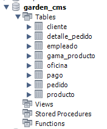

<style>
  h1, h2, h3, h4, h5, h6{
    text-align: center;
    font-weight: bold;
    border: none;
    margin-bottom: 0px;
  }

  p{
    text-align: justify;
  }

  img{
    border: 2px solid black;
  }
</style>

<h1>EXAMEN TERCER TRIMESTRE</h1>

<h4>CHRISTIAN MILLÁN SORIA</h4>

<h4>1º DAW TARDE</h4>

<hr>

<p><b>1. Creación del entorno de trabajo.</b></p>

<p>Una vez he cambiado todo los campos necesarios añadiendo mis iniciales, he importado la base de datos con dichos cambios.</p>



<p><b>2. Vamos a mejorar nuestra base de datos incorporando algunos controles de seguridad.</b></p>

<li><b>Crear un trigger que controle la entrada de nuevos productos, de manera que lleve el registro de los campos que se insertan. Estos logs deben llevarse en una nueva tabla llamada "logs", que incluya los campos "id", "info" y "fecha", siendo "id" la PK y autoincremental. La fecha se debe generar automáticamente cada vez que se cree un nuevo campo. El campo "info" debe contener la mayor cantidad de información posible.</b></li>

```sql
drop table if exists logs;

/**************************************/

create table logs(
  id int unsigned auto_increment primary key,
  info varchar(100) not null,
  fecha datetime null default current_timestamp
);

/**************************************/

drop trigger if exists entrada_nuevos_productos;

/**************************************/

delimiter //
create trigger entrada_nuevos_productos after insert on producto
for each row
begin
  insert into logs(info) value(concat('se insertó el producto con el id ',new.codigo_producto_cms,' , de nombre <',new.nombre,'>, cuya gama es <',new.gama,'>, tiene unas dimensiones de ',new.dimensiones,', su stock es de ',new.cantidad_en_stock,', con un precio de venta de ',new.precio_venta,', un precio de proveedor de ',new.precio_proveedor,' y una descripción que dice lo siguiente: <',new.descripcion,'>.'));
end //
delimiter ;
```

<li><b>Crear un trigger que controle la cantidad de stock, de manera que, en caso de superar las 1000 unidades, lo pase a 1000 (ya tenemos un límite de gestión de almacén).</b></li>

```sql
drop trigger if exists limit_stock;

/**************************************/

delimiter //
create trigger limit_stock before update on producto
for each row
begin
  if new.cantidad_en_stock>1000 then
    set new.cantidad_en_stock=1000;
  end if;
end //
delimiter ;
```

<li><b>Crear un trigger que verifique que el precio de venta siempre es superior al precio del proveedor en un 25%, si no fuese así, se modifica el precio de venta en un 25% sobre el precio del proveedor.</b></li>

```sql
drop trigger if exists check_price;

/**************************************/

delimiter //
create trigger check_price before insert on producto
for each row
begin
  declare cost_price numeric(15,2);
  set cost_price=new.precio_proveedor*1.25;
  if new.precio_venta<cost_price then
    set new.precio_venta=cost_price;
  end if;
end //
delimiter ;
```

<li><b>Insertar los datos que encontrarás en el archivo "datos plantas".</b></li>

```sql
insert into producto
  values
    ('OR-300','Geranium columbinum L.','Ornamentales','0.3','Viveros Guzman','Este tipo de geranio es conocido comúnmente como geranio pie de paloma. Quizás, el nombre común venga por la semejanza de sus tallos que se tornan de color rojizo y la parte del tallo en la que empieza a salir la flor con la pata de estas aves. Además, sus tallos están cubiertos por una especie de capa repleta de pelo casi invisible al ojo humano.',50,2,1),
    ('OR-301','Geranium dissectum L.','Ornamentales','0.25','Viveros Guzman','Al igual que la mayoría de los geranios pertenecientes a la familia Geranium, esta planta de tipo anual llega a alcanzar los 40 cm de altura. El Geranium dissectum L. es bastante reconocible por sus flores de color púrpura, siempre dispuestas por parejas y sus hojas de color verde intenso.',70,1,1),
    ('OR-302','Geranium dolomiticum L.','Ornamentales','0.23','Viveros Guzman','Es una de las especies en peligro de extinción, ya que solo es propia de las comarcas de Ponferrada y de Priaranza del Bierzo, en León, España. Esta especie suele reproducirse con facilidad sobre bloques de calizas y que desprende semillas sin ninguna regularidad. De ahí, que el Geranium dolomiticum L. se trate de reproducir actualmente en invernaderos. Esta herbácea perenne produce flores de color púrpura azulado y aisladas durante los meses de verano.',1300,0.8,1),
    ('OR-303','Geranium lucidum L.','Ornamentales','0.21','Viveros Guzman','También originario de Europa, este es uno de los tipos de geranio que se caracteriza por tallos rojizos que llegan a alcanzar más de 30 cm de altura y por sus hojas de color verde brillante, dispuestas de forma dividida. Su época de floración es primavera y sus flores son pequeñas y de color rosado. Conoce plantas que florecen en primavera como el Geranium lucidum L. en este otro post de EcologíaVerde sobre 22 flores de primavera.',2700,1.1,1),
    ('OR-304','Geranium molle L.','Ornamentales','0.33','Viveros Guzman','Es una de las especies más utilizadas en jardinería ya que puede plantarse con facilidad y ser usada como planta tapizante para jardines frondoso, gracias al color verde de sus hojas. El Geranium molle L. también es conocido como geranio muelle o alfilerillo. Esta herbácea anual es capaz de sobrevivir al invierno de ahí su utilización como elemento de color en muchos parterres y jardines. Su época de floración es en verano y da flores individuales de color morado o azulado.',400,1.2,1),
    ('FR-300','Kiwi','Frutales','0.8','Trops','Las especiales condiciones subtropicales de la Costa Tropical favorecen la producción de un mango de excelente calidad con más aroma y sabor, con una pulpa jugosa y carnosa sin presencia de fibras.',20,23,20),
    ('FR-301','Mango','Frutales','1.4','Trops','España y más concretamente la Costa Tropical, es el primer productor mundial de chirimoya con el 80% de la producción repartida por más de 3.000 hectáreas. La Chirimoya de la Costa Tropical se cultiva en la costa occidental de Granada (Ítrabo, Jete, Molvizar, Lobres…)  y en la costa este de Málaga, gracias a sus condiciones climáticas subtropicales.',30,30,40),
    ('FR-302','Aguacate','Frutales','1.7','Trops','El aguacate es una especie subtropical que necesita para su cultivo temperaturas superiores a 15º pero que nunca superen los 35 grados, por lo que la Costa Tropical, ofrece a los agricultores las mejores condiciones para su producción.',25,30,15);
```


<p>Comprobaciones de los datos:</p>

```sql
select * from producto where codigo_producto_cms="OR-300";
```


```sql
select * from producto where codigo_producto_cms="OR-301";
```


```sql
select * from producto where codigo_producto_cms="OR-302";
```


```sql
select * from producto where codigo_producto_cms="OR-303";
```


```sql
select * from producto where codigo_producto_cms="OR-304";
```


```sql
select * from producto where codigo_producto_cms="FR-300";
```


```sql
select * from producto where codigo_producto_cms="FR-301";
```


```sql
select * from producto where codigo_producto_cms="FR-302";
```


<p><b>3. Crea las siguientes vistas:</b></p>

<li><b>Obtener todos los datos de los clientes que superen en un 5% la media del límite de crédito de todos los clientes, ordenados descendentemente por la ciudad, ascendentemente por la región.</b></li>

```sql
create view clientes_limite_credito as
select c.* from cliente c where c.limite_credito>(select avg(limite_credito)*1.05 from cliente) order by c.ciudad desc, c.region asc;

/**********************************************/

select * from clientes_limite_credito;
```


<li><b>Muestra para todos los pedidos cuyo estado no esté entregado el nombre del cliente, ciudad y la fecha en la que se realizó el pedido, estado del pedido y precio total del pedido. Ordénalos descendientemente por el precio total del pedido.</b></li>

```sql
create view vista_pedidos_pendientes as 
select cliente.nombre_cliente, cliente.ciudad, pedido.fecha_pedido, pedido.fecha_esperada, pedido.estado, sum(detalle_pedido.cantidad*detalle_pedido.precio_unidad) as precio_total from cliente join pedido on cliente.codigo_cliente_cms=pedido.codigo_cliente_cms join detalle_pedido on pedido.codigo_pedido_cms=detalle_pedido.codigo_pedido_cms where pedido.estado<>'Entregado' group by pedido.codigo_pedido_cms order by precio_total desc;

/**********************************************/

select * from vista_pedidos_pendientes;
```


<p><b>4. Crea los siguiente procedimientos:</b></p>

<li><b>Que muestre todos los datos de un cliente cuando le pasamos su código. En caso de que no se encuentre, mostrar un mensaje de error.</b></li>

```sql
delimiter //
create procedure mostrar_datos_cliente(in codigo_cliente int)
begin
  select * from cliente where codigo_cliente_cms=codigo_cliente;
  if(select row_count()=0) then
    select 'Cliente no encontrado' as error;
  end if;
end //
delimiter ;

/**********************************************/

call mostrar_datos_cliente(1);
```


<li><b>Realizar un método o procedimiento que muestre el total en euros de un pedido, pásale el código por parámetro. Controla en caso de que no se encuentre. En ese caso, devuelve un 0. Pásale otro parámetro, si supera ese límite (segundo parámetro), lanzaremos una excepción propia y devolveremos un 0.</b></li>

```sql
delimiter //
create procedure obtener_total_euros_pedido(in codigo_pedido int, in limite_total decimal(15,2), out total_euros decimal(15,2))
begin
  declare total_pedido decimal(15,2);
  select sum(precio_unidad*cantidad) into total_pedido from detalle_pedido where codigo_pedido_cms=codigo_pedido;
  if total_pedido is null then
    set total_euros=0;
  elseif total_pedido>limite_total then
    signal sqlstate '45000' set message_text='El total del pedido supera el límite permitido.';
  else
    set total_euros=total_pedido*0.85;
  end if;
end //
delimiter ;

/**********************************************/

call obtener_total_euros_pedido(codigo_pedido, limite_total, @total_euros);
select @total_euros;
```


<p><b>5. Realiza procedimiento que haga un informe de las estadísticas de los pedidos realizados por meses y por años, que incluya el total del numero de pedidos y la suma de los importes Ordenados descendientemente por años, y ascendente por meses. Se agrupan por meses.</b></p>

```sql
delimiter //
create procedure estadisticas_pedidos()
begin
  select year(fecha_pedido) as anio, month(fecha_pedido) as mes, count(*) as total_pedidos, sum(precio_unidad*cantidad) as total_importe from pedido join detalle_pedido on pedido.codigo_pedido_cms=detalle_pedido.codigo_pedido_cms group by anio, mes order by anio desc, mes asc;
end //
delimiter ;

/**********************************************/

call estadisticas_pedidos();
```


<p><b>6. Realizar un procedimiento que, a partir del código del cliente, muestre nombre del cliente, ciudad, los productos que ha comprado agrupados por pedidos, nombre de producto, unidades, precio,  precio final, cod pedido.</b></p>

```sql
delimiter //
create procedure mostrar_compras_cliente(in codigo_cliente int)
begin
  select c.nombre_cliente, c.ciudad, p.nombre, dp.cantidad, p.precio_venta, dp.cantidad*p.precio_venta as precio_final, pe.codigo_pedido_cms from cliente c join pedido pe on c.codigo_cliente_cms=pe.codigo_cliente_cms join detalle_pedido dp on pe.codigo_pedido_cms=dp.codigo_pedido_cms join producto p on dp.codigo_producto_cms=p.codigo_producto_cms where c.codigo_cliente_cms=codigo_cliente;
end //
delimiter ;

/**********************************************/

call mostrar_compras_cliente(1);
```


<p><b>7. Realiza una función que calcule el % del límite de crédito (expresado en 4 dígitos con 2 decimales), que tiene un cliente con respecto al total de todos los clientes a partir de pasarle el código del cliente.</b></p>

```sql
delimiter //
create function porcentaje_limite_credito(codigo_cliente int) returns decimal(6,2)
begin
  declare total_limite_credito decimal(15,2);
  declare limite_credito_cliente decimal(15,2);
  select sum(limite_credito) into total_limite_credito from cliente;
  select limite_credito into limite_credito_cliente from cliente where codigo_cliente_cms = codigo_cliente;

  return (limite_credito_cliente/total_limite_credito)*100;
end //
delimiter ;

/**********************************************/

select porcentaje_limite_credito(1) as porcentaje_limite_credito;
```


<p><b>8. Calcula cuántos pagos hemos necesitado para superar el 50% de la facturación total, si comenzamos por los de menor importe.</b></p>

```sql

```

